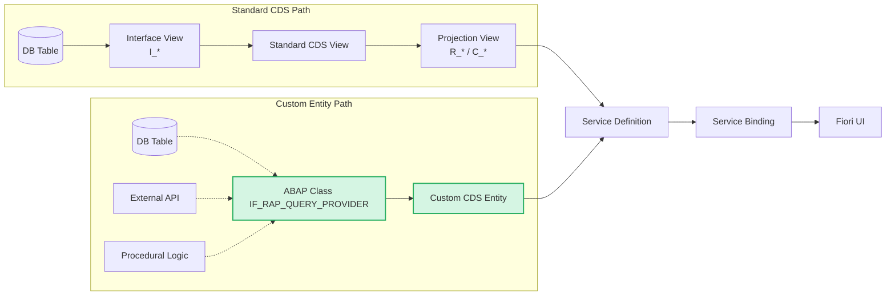
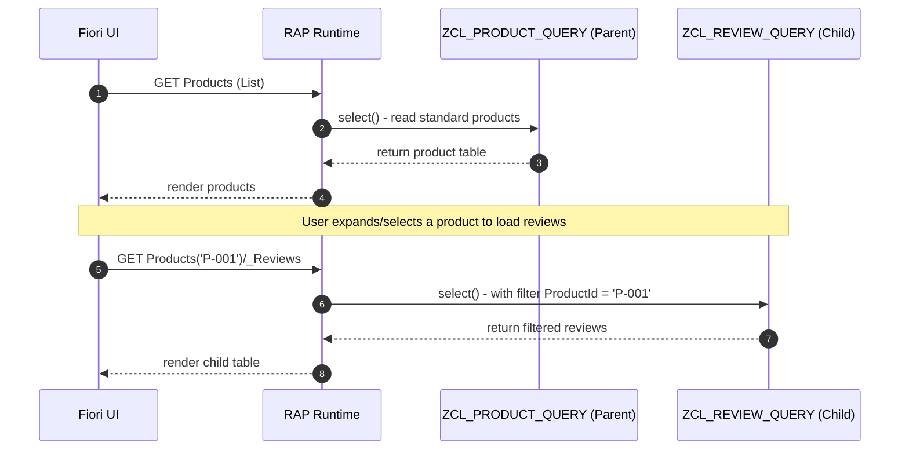

Core data services (CDS) are the backbone of the ABAP RESTful Application Programming Model (RAP). They define our data models, push logic down to the SAP HANA database, and cleanly express relationships. When data lives in standard tables, a standard CDS view stack (interface/projection views) combined with standard managed query capabilities works beautifully.

But what if your data does not live in a standard table? What if it requires a web service API call, complex procedural computation, or access to Clean-Core-restricted objects via legacy function modules?

This is where standard CDS views fall short, and where **Custom CDS Entities** combined with **Unmanaged Queries** come to the rescue.

---

## When Standard CDS Gets Complex (And Why We Go Custom)

We all love standard CDS views. They give us strong typing, annotations, reusability, direct OData exposure, and high-performance push-down directly to HANA.

But standard views always expect a **persisted table or database view** as their source. When you try to force complex procedural calculations or multi-source merges into a SQL-based CDS view, you often end up with real database development nightmares:

```sql
@AccessControl.authorizationCheck: #NOT_REQUIRED
define view entity ZC_OrderInsightMess
  as select from snwd_so as so
  association [0..1] to snwd_bpa as _bp
    on so.buyer_guid = _bp.node_key
{
  key so.so_id,
      case when so.gross_amount > 100000
           then case when _bp.bp_role = '01'
                     then case when so.currency_code = 'EUR'
                               then 'VIP-EU' else 'VIP-XX' end
                     else 'BIG' end
           else 'STD' end                                  as segment,
      cast( so.gross_amount * 0.19 as abap.dec(15,2) )     as vat,
      /* ... pages of nested CASE WHEN statements ... */
      _bp.company_name
}
```


Every ABAPer knows the temptation: *"I'll just add one more CASE WHEN to this CDS..."* Five minutes later, you are staring at a massive SQL block that is impossible to debug, slow to execute, and painful to extend.


Instead of building 200-line CASE WHEN cascades, a Custom CDS Entity lets you delegate core data retrieval and processing to a dedicated **ABAP class** implementing the query provider interface. This gives you:

- **No static DB source requirement:** Data can be generated dynamically at runtime or fetched from external APIs.
- **Freestyle calculations:** Utilize full ABAP power (loops, classes, RTTI, internal tables, and legacy modules) to build results.
- **Flexible integrations:** Bring in Clean Core-compliant API data or wrap external microservice endpoints under a single OData structure.

---

## The Architecture of Custom CDS Entities

A standard RAP path builds on interface views and database projection views before reaching the service definition. By contrast, a **Custom CDS Entity** bypasses the standard view and projection stack entirely. Its structure maps directly to an ABAP class, which is then handled as a top-level entity by the RAP service:



Because custom entities are not statically bound to database objects, you **cannot** write standard projection views on top of them (e.g., `select from ZC_MyCustomEntity` is invalid). If you need an annotation layer or alternative mapping, you must define another custom entity or layer annotations inside the service or metadata extensions.

---

## Defining the Custom Entity

Developing a custom entity starts in Core Data Services. We use the keyword `define root custom entity` and annotate it with `@ObjectModel.query.implementedBy` to reference our query provider class:

```abap
@EndUserText.label: 'Demo Custom Entity'
@ObjectModel.query.implementedBy: 'ABAP:ZCL_DEMO_PRODUCT_QUERY'
@UI.headerInfo.typeName: 'Product'
define root custom entity ZC_DemoProduct
{
  key ProductId   : abap.char(10);
      Name        : abap.char(40);
      @Semantics.amount.currencyCode: 'Currency'
      Price       : abap.dec(15,2);
      Currency    : abap.cuky;
      Stock       : abap.int4;
}
```

Notice that there is **no `select from` clause**. The custom entity does not reference database structures; it merely specifies the structural contract (fields, key declarations, and types) that your ABAP code will fulfill.

---

## Implementing IF_RAP_QUERY_PROVIDER

The specified provider class must implement the `IF_RAP_QUERY_PROVIDER` interface. This interface contains a single method: `select`.

```abap
CLASS zcl_demo_product_query DEFINITION PUBLIC FINAL
  CREATE PUBLIC.
  PUBLIC SECTION.
    INTERFACES if_rap_query_provider.
ENDCLASS.

CLASS zcl_demo_product_query IMPLEMENTATION.
  METHOD if_rap_query_provider~select.
    DATA lt_result TYPE TABLE OF ZC_DemoProduct.

    " 1. Retrieve instructions (filter, sorting, paging) via io_request
    " 2. Fetch/Prepare data (DB, API, calculations)
    " 3. Return results via io_response

    lt_result = VALUE #(
      ( ProductId = 'P-001' Name = 'Coffee' Price = '3.50' Currency = 'EUR' Stock = 42 )
      ( ProductId = 'P-002' Name = 'Tea'    Price = '2.80' Currency = 'EUR' Stock = 17 )
    ).

    " Inform the framework of the total number of matching records in the entire dataset
    io_response->set_total_number_of_records( lines( lt_result ) ).
    
    " Send the current page of data back to the client
    io_response->set_data( lt_result ).
  ENDMETHOD.
ENDCLASS.
```


For production-grade pagination, `set_data(...)` should only receive the current page slice, while `set_total_number_of_records(...)` must receive the size of the *entire filtered dataset* (e.g., via a separate `SELECT COUNT(*)` on the DB).


---

## Watch Out: The Framework Holds You Accountable

The RAP framework tracks which configuration values and query filters you request inside `select`. If the OData request submits a filter or paging instruction, and your provider class completes execution **without ever fetching them**, the system will throw a runtime dump instead of returning silently incomplete results.

> *"You returned data, but you never checked what was requested - how could this possibly be right?"*
>
> — The RAP framework (effectively)

To avoid dumps, retrieve and process these values from the `io_request` object:

| Request Option | How to Retrieve |
| :--- | :--- |
| **`$filter`** | `io_request->get_filter()` |
| **`$orderby`** | `io_request->get_sort_elements()` |
| **`$top` / `$skip`** | `io_request->get_paging()` |
| **`$select`** | `io_request->get_requested_elements()` |
| **`$search`** | `io_request->get_search_expression()` |

### Handling Pagination (Paging)

```abap
DATA(lo_paging) = io_request->get_paging( ).
DATA(lv_skip)   = lo_paging->get_offset( ).     " equivalent to $skip
DATA(lv_top)    = lo_paging->get_page_size( ).  " equivalent to $top

SELECT FROM zproduct
  FIELDS productid, name, price
  ORDER BY productid  "<-- Paging requires a stable sort key!
  INTO TABLE @DATA(lt_data)
  UP TO @lv_top ROWS
  OFFSET @lv_skip.
```

### Free-Text Search ($search)

When a Fiori elements table triggers a search query via the global search field, it passes a `$search` flat string. To support this on your Custom Entity, you must denote the entity as searchable and annotate matching default elements:

```abap
@Search.searchable: true
define root custom entity ZCE_Weather
{
  @Search.defaultSearchElement: true
  key City        : abap.string;
      Temperature : abap.dec(5,2);
}
```

In your select implementation, gather the raw search terms using `get_search_expression()`:

```abap
METHOD if_rap_query_provider~select.
  DATA(lv_search) = io_request->get_search_expression( ).

  " Handle search logic, such as calling an external Weather API or querying with LIKE
  IF lv_search IS NOT INITIAL.
    " fetch_weather_by_city( iv_search = lv_search )
  ENDIF.
ENDMETHOD.
```

---

## Smart Filtering: Range Tables vs SQL Where String

When processing filters, you have two primary options:

### 1. The Dynamic SQL String Shortcut

If your custom entity fields map 1:1 to database column names, you can request a pre-constructed dynamic `WHERE` string straight from the framework:

```abap
" Transforms OData tree filters into a clean ABAP SQL WHERE statement
DATA(lv_where) = io_request->get_filter( )->get_as_sql_string( ).

SELECT FROM zproduct
  FIELDS *
  WHERE (lv_where)
  INTO TABLE @DATA(lt_data).
```

### 2. Standard Range Table Parsing

If your field names differ or if you are not querying a standard database table, fetch filters as range tables:

```abap
DATA(lo_filter) = io_request->get_filter( ).
DATA(lt_ranges) = lo_filter->get_as_ranges( ).

LOOP AT lt_ranges INTO DATA(ls_range) WHERE name = 'PRODUCTID'.
  DATA(lt_prod_range) = ls_range-range.
ENDLOOP.
```

---

## Pro Tip: Type-Safe Filter Extraction with RTTI

Looping manually over filter ranges gets verbose very quickly. We can write a dynamic, type-safe extractor using Run-Time Type Identification (RTTI) and field symbol assignments.

In your query provider, define a private key/filter structure matching your entity's properties:

```abap
CLASS zcl_my_query_provider DEFINITION PUBLIC FINAL CREATE PUBLIC.
  PUBLIC SECTION.
    INTERFACES if_rap_query_provider.
  PROTECTED SECTION.
    DATA mo_request TYPE REF TO if_rap_query_request.
    
    TYPES:
      BEGIN OF ty_filter,
        productid TYPE RANGE OF ZCE_DemoProduct-ProductId,
      END OF ty_filter.

    METHODS extract_filters
      RETURNING VALUE(rs_filter) TYPE ty_filter
      RAISING   cx_rap_query_provider.
ENDCLASS.
```

Next, implement a generic loop that utilizes RTTI to dynamically map ranges onto your typed structure components:

```abap
METHOD extract_filters.
  " Reflect on the target return structure
  DATA(lo_struct) = CAST cl_abap_structdescr(
    cl_abap_typedescr=>describe_by_data( rs_filter )
  ).
  DATA(lt_filter_cond) = mo_request->get_filter( )->get_as_ranges( ).

  LOOP AT lo_struct->components INTO DATA(ls_comp).
    ASSIGN COMPONENT ls_comp-name OF STRUCTURE rs_filter TO FIELD-SYMBOL(<fs_value>).

    READ TABLE lt_filter_cond WITH KEY name = ls_comp-name ASSIGNING FIELD-SYMBOL(<fs_cond>).
    IF sy-subrc = 0.
      " If a range is provided, assign the filter structure directly
      <fs_value> = <fs_cond>-range.
    ENDIF.
  ENDLOOP.
ENDMETHOD.
```

This structural assignment means that adding a filter or key to your retrieval method simply requires adding a line to `ty_filter`. The extractor maps it automatically, bringing full autocomplete power directly to your IDE!

---

## Custom Entities with Parameters

Parameters are mandatory inputs supplied by the caller (such as key dates, target currencies, or language parameters) that govern how custom logic behaves:

```abap
define root custom entity ZCE_DemoProductP
  with parameters
    P_TargetCurrency : abap.cuky;
    P_KeyDate        : abap.dats;
{
  key ProductId : abap.char(10);
      Name      : abap.char(40);
      Price     : abap.dec(15,2);
      Currency  : abap.cuky;
}
```

In your provider, read them with `get_parameters()`:

```abap
METHOD if_rap_query_provider~select.
  DATA(lt_param) = io_request->get_parameters( ).

  LOOP AT lt_param INTO DATA(ls_param).
    CASE ls_param-parameter_name.
      WHEN 'P_TARGETCURRENCY'.
        DATA(lv_target_curr) = ls_param-value.
      WHEN 'P_KEYDATE'.
        DATA(lv_key_date) = ls_param-value.
    ENDCASE.
  ENDLOOP.
  
  " Implement currency translation or historic value queries with your parameters...
ENDMETHOD.
```

---

## Navigation & Associations: The Runtime Process

When linking custom entities together via associations (e.g., linking `ZC_DemoProduct` to a child list of `ZC_DemoReview`), keep in mind that **the framework does not merge queries**.

Drilling down into or expanding navigation paths triggers separate, independent calls to the target query providers:



In the child table's provider class, the parent key is made available via filter constraints. Treat child navigation lookups exactly like range-filtered list requests:

```abap
METHOD if_rap_query_provider~select.
  DATA(lo_filter) = io_request->get_filter( ).
  DATA(lt_ranges) = lo_filter->get_as_ranges( ).

  " The parent key (ProductId) arrives as a filter range name = 'PRODUCTID'
  SELECT FROM zreview
    FIELDS productid, reviewid, rating, comment
    WHERE productid IN @( VALUE #( FOR r IN lt_ranges WHERE ( name = 'PRODUCTID' ) ( r-range ) ) )
    INTO TABLE @DATA(lt_reviews).

  io_response->set_data( lt_reviews ).
ENDMETHOD.
```

---

## Supporting Behavior: Unmanaged Create, Update, & Delete (CUD)

To make custom entities write-capable under RAP, define an **unmanaged behavior definition** pointing to an unmanaged behavior pool:

```abap
define behavior for ZC_DemoProduct
implementation in class zbp_demo_product unique
{
  create;
  update;
  delete;

  field ( readonly ) ProductId;
}
```

In your behavior execution class, implement the required mutation logic:

```abap
METHOD create FOR MODIFY
  IMPORTING entities FOR CREATE Product.

  LOOP AT entities INTO DATA(ls_entity).
    DATA(lv_new_id) = |P-{ cl_system_uuid=>create_uuid_c22_static( ) }|.

    INSERT zproduct FROM @( VALUE #(
      productid = lv_new_id
      name      = ls_entity-Name
      price     = ls_entity-Price
      currency  = ls_entity-Currency ) ).

    APPEND VALUE #(
      %cid      = ls_entity-%cid
      ProductId = lv_new_id ) TO mapped-product.
  ENDLOOP.
ENDMETHOD.
```

---

## Summary: When to Pick Which CDS Type?

While Custom CDS Views provide complete freedom, they demand extra manual implementation. Use wisely by assessing your use case against this guide:

| Metric / Scenario | Standard CDS View | Custom CDS View |
| :--- | :--- | :--- |
| **Data Source** | Pure DB Table or standard DB Views | External API, calculation, Clean-Core proxy |
| **Logic Layer** | Push-down SQL, HANA engine | Procedural ABAP, class calls, function modules |
| **Annotations** | Flexible projection layers on top | Extended structures or direct exposure only |
| **Effort** | Low (Declarative code) | Medium/High (Manual pagination, filters, and CUD) |
| **Analytics/KPIs** | Automated aggregation engine | Custom manual aggregations required |

Custom CDS entities represent a powerful tool inside the modern ABAP Clean Core toolbox. By transferring data retrieval and processing logic to custom query classes, we gain full developer control over RAP services while maintaining strict platform boundaries.

---

## Frequently Asked Questions


  
  To enforce consistency and ensure APIs do not silently ignore criteria. If a caller requests a specific dynamic filter or expects a certain count/paging, but your unmanaged query implementation returns data without checking those values, the API could return unreliable or incomplete datasets. Therefore, RAP validates your query execution and dumps if required variables/methods aren't interacted with.
  

  
  No. Standard projection views or database selects (e.g. `select from ZC_DemoProduct`) cannot be written on top of a custom entity because there is no static database source behind it. If you need navigation or custom metadata projections, you should define them via additional custom entities or embed metadata annotations directly in the service metadata extension.
  

  
  Associations are evaluated through independent execution paths. When a user requests parent entities and drills down or expands into child navigation paths, the RAP framework does not perform a database JOIN query. Instead, it triggers a separate call to the child's query provider class, presenting the parent key as a standard range table injection (i.e. `PRODUCTID` range table filter) in the child `select` execution.
  

  
  Yes. While custom entities are read-only by default, they can support transactional capabilities (CUD operations) by specifying an unmanaged behavior definition and implementing the custom mutation logic manually inside an unmanaged behavior pool class.
  

