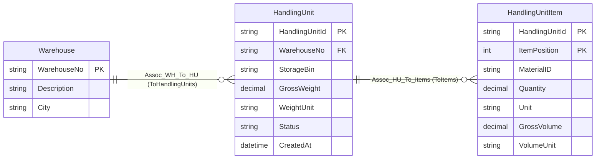
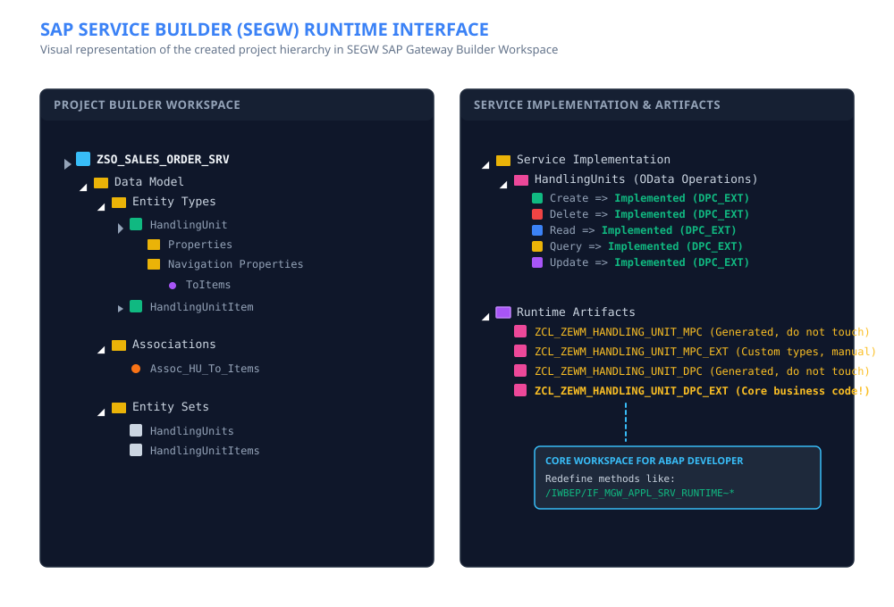
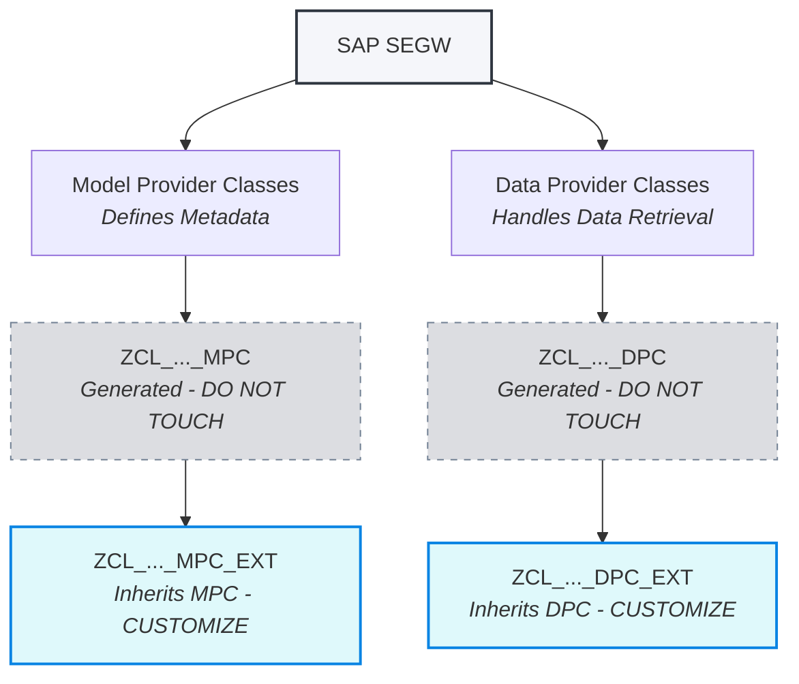

In the era of modern SAP development—where the ABAP RESTful Application Programming Model (RAP) and Cloud Application Programming Model (CAP) dominate the conversation—you might wonder if classical Gateway development is dead.

The short answer is: **absolutely not.**

While RAP is the future for SAP S/4HANA and SAP BTP, thousands of business-critical ERP systems (including pre-S/4HANA systems, older NetWeaver releases, or specific Line of Business landscapes) rely heavily on classical **SAP Gateway Service Builder (`SEGW`)** services. If you are developing on SAP ECC, or wrapping services around Extended Warehouse Management (EWM) RF transactions, or integrating on-premise systems with SAP Fiori or external web APIs, SEGW is still your ultimate workhorse.

This comprehensive, end-to-end guide will walk you through the entire lifecycle of developing a classical, high-performing SEGW OData (V2) service. We will cover architectural planning, project setup, class structure generation, and **highly detailed, production-ready ABAP code templates** for all CRUD, Action, Navigation, and Batch operations.

---

## Why Still Developing Classical SEGW Services?

Before diving into the code, let's understand why classical `SEGW` services remain so relevant in modern enterprises:

1. **Legacy and Stable System Landscapes:** Many enterprises are on SAP NetWeaver 7.40, 7.50, or S/4HANA versions where RAP is not yet fully supported, or where existing SEGW frameworks have been working flawlessly for years.
2. **Developer Skillsets:** The SAP ecosystem is vast. Many ABAP developers have deep expertise in standard ABAP classes, DDIC, and Gateway, making SEGW-based development significantly faster for their team to build, maintain, and debug.
3. **EWM & Specialized Logistics Scenarios:** In modules like Extended Warehouse Management (EWM), particularly when dealing with RF scanners, custom Web Dynpro, or specialized Fiori apps, integrating classical SEGW services is often much easier and more direct than setting up a complete RAP stack.
4. **Fine-grained Control:** With SEGW's Data Provider Class (DPC) extension, you have complete control over database queries, BAPIs, lock mechanisms, buffering, and transactional boundaries.

---

## Step 1: Concept & Modeling (No Code First!)

One of the most common pitfalls in ABAP development is opening transaction `SEGW` and immediately hacking together entities. OData is a contract-based API standard. A bad OData model leads to a bad API, which subsequently leads to a sluggish, over-complicated frontend.

### 1. Structure Your Conceptual Architecture

Before writing a single line of ABAP, map out your OData service structure. For our guide, we will use a classic **EWM Handling Unit (HU)** scenario:

- **`HandlingUnit`** (Header Entity)
- **`HandlingUnitItem`** (Item Entity)
- **`Warehouse`** (Associated Entity)

### 2. Choose Your Modeling Tool

Always visualize your entities, key properties, navigation associations, and cardinality beforehand.

- **Draw.io (diagrams.net):** A fantastic free tool. SAP maintains official shapes and stencils for Draw.io (the SAP Fiori / SAP BTP sticker pack). You can map out your entity relationships, properties with types (e.g., `Edm.String`, `Edm.DateTime`), and navigations.
- **yEd Graph Editor:** A powerful freeware diagramming tool. It features automatic layouts which are incredibly useful for massive enterprise data models with dozens of joining tables and entities.


Shape OData for UI5, not your database. Use flat, bind-ready structures so SmartTables and master-detail layouts work with minimal JavaScript—never map entities 1:1 to internal tables or processing objects.




### 3. DDIC Preparation: Design Lean Custom Structures

Before importing structures into SEGW, create dedicated, custom DDIC structures (`SE11` structures or types) in the ABAP Dictionary containing **only the fields required for your OData concept**.


Do **not** use the full, raw structures of enormous database tables or standard structures (such as standard EWM headers like `/SCWM/HUHDR`, or massive standard ERP tables). Doing so ends up importing over 300 fields when perhaps only 10 are actually needed by your project. 

Importing monoliths creates significant issues:
- **Cluttered Interfaces:** Both frontend and backend developers have to navigate hundreds of unused properties, leading to a bloated OData metadata document and confusing syntax.
- **Performance Overhead:** For optimal database and network performance, it is much more efficient to only select, serialize, and transmit the fields actually in use. Keep payloads as small and lean as possible.


---

## Step 2: Creating the SEGW Project

Once your architectural drawing is approved, log into your SAP GUI and open transaction **`SEGW`** (Gateway Service Builder).

1. Click on **Create Project** (Paper icon).
2. Enter a **Project Name** following your company's naming conventions (e.g., `ZGW_EWM_HANDLING_UNIT_SRV`).
3. Set the **Project Type** to `Service with SAP Gateway Content`.
4. Specify a package (or select `$TMP` for local test projects).
5. Choose your generation strategy (standard `Standard (OData V2)`).



### What Can We Create in SEGW?

In the Project Tree, you will configure three primary building blocks:

- **Entity Types & Entity Sets:** A definition of the data structure (Entity Type) and the collection of records (Entity Set). You can create these manually, import them from a **DDIC Structure** (recommended for speed and type-safety), or import them from a search help or RFC.
- **Associations:** Define relationships between entities (e.g., `HandlingUnit` has a `1:N` relationship with `HandlingUnitItem`).
- **Function Imports:** Custom endpoints for actions that do not fit into typical RESTful CRUD patterns (e.g., `MoveHandlingUnit`, `PostGoodsReceipt`).


Always map your properties to real, active ABAP Dictionary types. This guarantees that your OData metadata properly inherits text descriptions, formatting, input conversions (like alpha-padding), and search helps.


---

## Step 3: Understanding the Generated Classes (MPC vs DPC)

Once your structures are defined, click the **Generate Runtime Objects** button (Red-and-white circle icon). The Gateway framework will prompt you to generate or register four main classes and a service definition:



### 1. Model Provider Classes (MPC)

- **`ZCL_..._MPC`:** Base class containing generated code to build the service metadata. This class is auto-regenerated every time you click "Generate" in SEGW. Never touch it!
- **`ZCL_..._MPC_EXT`:** The Model Extension class. It inherits from the base MPC. Use this to tweak metadata dynamically (e.g., overriding property labels, marking fields as nullable, or manually defining custom annotations).

### 2. Data Provider Classes (DPC)

- **`ZCL_..._DPC`:** Base class containing empty boilerplates and internal mapping logic. Just like the base MPC, it must never be modified directly.
- **`ZCL_..._DPC_EXT`:** This is where the magic happens. It inherits from the base DPC and is where you will write all of your business logic by overriding specific CRUD method definitions.

Because we are focusing on implementing service logic, **all code samples below belong to your custom `ZCL_..._DPC_EXT` class**.

---

## Step 4: Section-by-Section CRUD Implementation in DPC_EXT

Every entity set in your OData service must support the four basic data operations known as **CRUD**:

| Operation | HTTP | What it does |
| --- | --- | --- |
| **Create** | `POST` | Inserts a new record into the entity set. |
| **Read** | `GET` | Returns one record (by key) or a collection (optionally filtered, sorted, or paged). |
| **Update** | `PUT` / `PATCH` / `MERGE` | Changes an existing record identified by its key. |
| **Delete** | `DELETE` | Removes a record identified by its key. |

In SEGW, the Gateway framework generates a dedicated DPC method for each operation **per entity set**. Your `HandlingUnits`, `HandlingUnitItems`, and `Warehouses` entity sets each get their own `GET_ENTITYSET`, `GET_ENTITY`, `CREATE_ENTITY`, `UPDATE_ENTITY`, and `DELETE_ENTITY` overrides in `ZCL_..._DPC_EXT`. The pattern is the same for every entity—only the field mapping and persistence logic change.

The table below shows the generated method names for the `HandlingUnits` entity set, which we use as the reference example throughout this section:

| Operation | DPC Method to Override | Purpose |
| --- | --- | --- |
| **Read** (collection) | `HANDLINGUNITS_GET_ENTITYSET` | Returns a list of resources (optionally filtered/paged). |
| **Read** (single) | `HANDLINGUNITS_GET_ENTITY` | Returns a single resource based on its key properties. |
| **Create** | `HANDLINGUNITS_CREATE_ENTITY` | Creates a new resource. |
| **Update** | `HANDLINGUNITS_UPDATE_ENTITY` | Updates an existing resource. |
| **Delete** | `HANDLINGUNITS_DELETE_ENTITY` | Deletes a resource. |

---

### GET_ENTITYSET Method Implementation

The `GET_ENTITYSET` method is responsible for querying multiple records. It can also receive filters, sorting parameters, pagination keys, or navigation details.

#### 1. Return All (Unfiltered)

The simplest starting point: read every record from the persistence layer and map it to `ET_ENTITYSET`.

```abap
  METHOD handlingunits_get_entityset.
    SELECT huident, lgnum, lgpla, g_weight, gewei, created_at
      FROM zewm_huhdr
      INTO TABLE @DATA(lt_hu_db).

    LOOP AT lt_hu_db ASSIGNING FIELD-SYMBOL(<fs_hu>).
      INSERT VALUE #(
        handlingunit_id = <fs_hu>-huident
        warehouse_no    = <fs_hu>-lgnum
        storage_bin     = <fs_hu>-lgpla
        gross_weight    = <fs_hu>-g_weight
        weight_unit     = <fs_hu>-gewei
        created_at      = <fs_hu>-created_at
      ) INTO TABLE et_entityset.
    ENDLOOP.
  ENDMETHOD.
```

---

#### 2. Using OData Filters and Pagination

Clients typically combine `$filter` with `$top` and `$skip` to narrow and page results—for example: `HandlingUnits?$filter=WarehouseNo eq '1001' and StorageBin eq 'ST-BIN-01'&$top=50&$skip=100`.

The SAP Gateway framework converts OData filters into standard ABAP SELECT-OPTIONS ranges. Apply `$top` and `$skip` directly in the `SELECT` so paging happens at the database, not in a loop over the full result set.

```abap
  METHOD handlingunits_get_entityset.
    DATA: lr_warehouse_no TYPE RANGE OF /scwm/lgnum,
          lr_storage_bin  TYPE RANGE OF /scwm/lgpla.

    " 1. Extract filter parameters using the technical request context
    DATA(lo_filter) = io_tech_request_context->get_filter( ).

    IF lo_filter IS BOUND.
      lo_filter->convert_2_select_options(
        EXPORTING iv_property_path = 'WarehouseNo'
        IMPORTING et_select_options = lr_warehouse_no
      ).
      lo_filter->convert_2_select_options(
        EXPORTING iv_property_path = 'StorageBin'
        IMPORTING et_select_options = lr_storage_bin
      ).
    ENDIF.

    " 2. Read $top and $skip from the OData request
    DATA(lv_skip) = io_tech_request_context->get_skip( ).
    DATA(lv_top)  = io_tech_request_context->get_top( ).

    " 3. Query DB with filters and server-side pagination
    IF lv_top > 0.
      SELECT huident, lgnum, lgpla, g_weight, gewei, created_at
        FROM zewm_huhdr
        WHERE lgnum IN @lr_warehouse_no
          AND lgpla IN @lr_storage_bin
        UP TO @lv_top ROWS
        OFFSET @lv_skip
        INTO TABLE @DATA(lt_hu_db).
    ELSE.
      SELECT huident, lgnum, lgpla, g_weight, gewei, created_at
        FROM zewm_huhdr
        WHERE lgnum IN @lr_warehouse_no
          AND lgpla IN @lr_storage_bin
        OFFSET @lv_skip
        INTO TABLE @lt_hu_db.
    ENDIF.

    " 4. Map to ET_ENTITYSET output
    LOOP AT lt_hu_db ASSIGNING FIELD-SYMBOL(<fs_hu>).
      INSERT VALUE #(
        handlingunit_id = <fs_hu>-huident
        warehouse_no    = <fs_hu>-lgnum
        storage_bin     = <fs_hu>-lgpla
        gross_weight    = <fs_hu>-g_weight
        weight_unit     = <fs_hu>-gewei
        created_at      = <fs_hu>-created_at
      ) INTO TABLE et_entityset.
    ENDLOOP.
  ENDMETHOD.
```

---

#### 3. Reading Navigation Keys in GET_ENTITYSET

A classic requirement is requesting all **Items** associated with a specific Handling Unit, for example: `HandlingUnits('10001')/ToItems`.

When `HandlingUnitItems_GET_ENTITYSET` is invoked in this fashion, we must detect the parent's Key (`HandlingUnitId = '10001'`) using the **`it_navigation_path`** signature.

```abap
  METHOD handlingunititems_get_entityset.
    DATA: lv_huident TYPE /scwm/huident.

    " 1. Read information about the navigation path source
    READ TABLE it_navigation_path INTO DATA(ls_nav_path) WITH KEY is_source = abap_true.
    IF sy-subrc = 0.
      " If we navigated from a HandlingUnit, get the key from the source's key tab
      READ TABLE ls_nav_path-key_tab INTO DATA(ls_key) WITH KEY name = 'HandlingUnitId'.
      IF sy-subrc = 0.
        lv_huident = ls_key-value.
      ENDIF.
    ENDIF.

    " 2. If a parent ID was found, query only items under that parent
    IF lv_huident IS NOT INITIAL.
      SELECT huident, posnr, matnr, quan, meins, g_vol, g_vol_unit
        FROM zewm_huitm
        WHERE huident = @lv_huident
        INTO TABLE @DATA(lt_items_db).
    ELSE.
      " Otherwise, return all or raise an exception depending on requirements
      SELECT huident, posnr, matnr, quan, meins, g_vol, g_vol_unit
        FROM zewm_huitm
        UP TO 100 ROWS " Avoid huge unfiltered database hits
        INTO TABLE @lt_items_db.
    ENDIF;

    " 3. Map to ET_ENTITYSET output
    LOOP AT lt_items_db ASSIGNING FIELD-SYMBOL(<fs_item>).
      INSERT VALUE #(
        handlingunit_id = <fs_item>-huident
        item_pos        = <fs_item>-posnr
        material        = <fs_item>-matnr
        quantity        = <fs_item>-quan
        unit            = <fs_item>-meins
        gross_volume    = <fs_item>-g_vol
        volume_unit     = <fs_item>-g_vol_unit
      ) INTO TABLE et_entityset.
    ENDLOOP;
  ENDMETHOD.
```

---

### GET_ENTITY Method Implementation

The `GET_ENTITY` method handles retrieving a unique, single record. This is invoked when the client hits `HandlingUnits('10001')`.

#### Read Keys and Return Single Entity

```abap
  METHOD handlingunits_get_entity.
    DATA: lv_huident TYPE /scwm/huident.

    " 1. Retrieve the unique keys of the entity from the IT_KEY_TAB
    READ TABLE it_key_tab INTO DATA(ls_key) WITH KEY name = 'HandlingUnitId'.
    IF sy-subrc = 0.
      lv_huident = ls_key-value.
    ENDIF.

    " Pad alpha numeric sequence if database uses leading zeros (e.g., Conversion Exit ALPHA)
    CALL FUNCTION 'CONVERSION_EXIT_ALPHA_INPUT'
      EXPORTING
        input  = lv_huident
      IMPORTING
        output = lv_huident.

    " 2. Perform absolute key lookup in DB
    SELECT SINGLE huident, lgnum, lgpla, g_weight, gewei, created_at
      FROM zewm_huhdr
      WHERE huident = @lv_huident
      INTO @DATA(ls_hu_db).

    IF sy-subrc = 0.
      " 3. Map to ER_ENTITY structure
      er_entity-handlingunit_id = ls_hu_db-huident.
      er_entity-warehouse_no    = ls_hu_db-lgnum.
      er_entity-storage_bin     = ls_hu_db-lgpla.
      er_entity-gross_weight    = ls_hu_db-g_weight.
      er_entity-weight_unit     = ls_hu_db-gewei.
      er_entity-created_at      = ls_hu_db-created_at.
    ELSE.
      " Raise an OData-friendly 404 Exception if the resource does not exist
      RAISE EXCEPTION TYPE /iwbep/cx_mgw_busi_exception
        EXPORTING
          textid      = /iwbep/cx_mgw_busi_exception=>gcv_not_found
          status_code = /iwbep/cx_mgw_busi_exception=>gcv_http_status_404.
    ENDIF.
  ENDMETHOD.
```

---

### CREATE_ENTITY Method Implementation

The `CREATE_ENTITY` method processes an HTTP `POST` containing a JSON or XML payload of the values representing the new record.

```abap
  METHOD handlingunits_create_entity.
    DATA: ls_payload TYPE zcl_zewm_handling_unit_mpc=>ts_handlingunit.

    " 1. Retrieve the incoming payload from the requests data provider
    io_data_provider->read_entry_data( IMPORTING es_data = ls_payload ).

    " 2. Validate payload and map to standard database structures
    DATA(ls_new_hu) = VALUE zewm_huhdr(
      created_at = sy-datum
      lgnum      = ls_payload-warehouse_no
      lgpla      = ls_payload-storage_bin
      g_weight   = ls_payload-gross_weight
      gewei      = ls_payload-weight_unit
    ).

    " Let our custom or system logic generate a new number sequence
    CALL FUNCTION 'NUMBER_GET_NEXT'
      EXPORTING
        nr_range_nr             = '01'
        object                  = 'ZEWM_HUID'
      IMPORTING
        number                  = ls_new_hu-huident
      EXCEPTIONS
        interval_not_found      = 1
        number_range_not_intern = 2
        object_not_found        = 3
        quantity_is_not_1       = 4
        interval_overflow       = 5
        buffer_overflow         = 6
        OTHERS                  = 7.

    IF sy-subrc <> 0.
      " If sequence generation fails, return a 400 Bad Request
      RAISE EXCEPTION TYPE /iwbep/cx_mgw_busi_exception
        EXPORTING
          textid      = /iwbep/cx_mgw_busi_exception=>gcv_exception_occurring
          status_code = /iwbep/cx_mgw_busi_exception=>gcv_http_status_400.
    ENDIF.

    " 3. Write data to the DB
    INSERT zewm_huhdr FROM @ls_new_hu.
    IF sy-subrc = 0.
      COMMIT WORK AND WAIT.
      
      " 4. Fill the ER_ENTITY response with the newly generated record details
      " The Gateway runtime will send this back in the response body (HTTP 201 Created)
      er_entity                 = ls_payload.
      er_entity-handlingunit_id = ls_new_hu-huident.
      er_entity-created_at      = ls_new_hu-created_at.
    ELSE.
      ROLLBACK WORK.
      RAISE EXCEPTION TYPE /iwbep/cx_mgw_busi_exception
        EXPORTING
          textid      = /iwbep/cx_mgw_busi_exception=>gcv_exception_occurring
          status_code = /iwbep/cx_mgw_busi_exception=>gcv_http_status_500.
    ENDIF.
  ENDMETHOD.
```

---

### UPDATE_ENTITY Method Implementation

The `UPDATE_ENTITY` method handles updating an existing record via HTTP `PUT` (usually replacements) or `MERGE`/`PATCH` (delta updates).

```abap
  METHOD handlingunits_update_entity.
    DATA: ls_payload TYPE zcl_zewm_handling_unit_mpc=>ts_handlingunit,
          lv_huident TYPE /scwm/huident.

    " 1. Retrieve the keys of the targeted resource
    READ TABLE it_key_tab INTO DATA(ls_key) WITH KEY name = 'HandlingUnitId'.
    IF sy-subrc = 0.
      lv_huident = ls_key-value.
    ENDIF.

    " 2. Read the changes payload from the body
    io_data_provider->read_entry_data( IMPORTING es_data = ls_payload ).

    " 3. Update database matching on key
    UPDATE zewm_huhdr 
      SET lgpla    = @ls_payload-storage_bin,
          g_weight = @ls_payload-gross_weight,
          gewei    = @ls_payload-weight_unit
      WHERE huident = @lv_huident.

    IF sy-subrc = 0.
      COMMIT WORK AND WAIT.
      " 4. Fill ER_ENTITY with updated values confirming success
      er_entity                 = ls_payload.
      er_entity-handlingunit_id = lv_huident.
    ELSE.
      ROLLBACK WORK.
      RAISE EXCEPTION TYPE /iwbep/cx_mgw_busi_exception
        EXPORTING
          textid      = /iwbep/cx_mgw_busi_exception=>gcv_not_found
          status_code = /iwbep/cx_mgw_busi_exception=>gcv_http_status_404.
    ENDIF.
  ENDMETHOD.
```

---

### DELETE_ENTITY Method Implementation

The `DELETE_ENTITY` method handles destroying a record via HTTP `DELETE`.

It has an empty response parameter (`er_entity` does not exist), as OData DELETE operations return an empty body (`HTTP 204 No Content`).

```abap
  METHOD handlingunits_delete_entity.
    DATA: lv_huident TYPE /scwm/huident.

    " 1. Extract the unique key
    READ TABLE it_key_tab INTO DATA(ls_key) WITH KEY name = 'HandlingUnitId'.
    IF sy-subrc = 0.
      lv_huident = ls_key-value.
    ENDIF.

    " 2. Run delete command on data store
    DELETE FROM zewm_huhdr WHERE huident = @lv_huident.
    
    IF sy-subrc = 0.
      COMMIT WORK AND WAIT.
      " HTTP Status code 204 (No Content) is dispatched automatically by standard Gateway
    ELSE.
      ROLLBACK WORK.
      RAISE EXCEPTION TYPE /iwbep/cx_mgw_busi_exception
        EXPORTING
          textid      = /iwbep/cx_mgw_busi_exception=>gcv_not_found
          status_code = /iwbep/cx_mgw_busi_exception=>gcv_http_status_404.
    ENDIF.
  ENDMETHOD.
```

---

### EXECUTE_ACTION (OData Function Imports)

Not all business processes map nicely to simple CRUD operations. Sometimes you need to trigger arbitrary processes like releasing credit holds, canceling items, or initiating approvals.

In SEGW, you define a **Function Import** named `MoveHandlingUnit` that accepts import parameters `HandlingUnitId` and `NewStorageBin`.

The Gateway runtime then directs this payload to the dynamic generic method **`/IWBEP/IF_MGW_APPL_SRV_RUNTIME~EXECUTE_ACTION`**.

```abap
  METHOD /iwbep/if_mgw_appl_srv_runtime~execute_action.
    DATA: lv_huident     TYPE /scwm/huident,
          lv_new_bin     TYPE /scwm/lgpla,
          ls_handling_unit TYPE zcl_zewm_handling_unit_mpc=>ts_handlingunit.

    " 1. Determine which Function Import action is requested
    IF iv_action_name = 'MoveHandlingUnit'.
      
      " 2. Read parameters passed to the function action
      READ TABLE it_parameter INTO DATA(ls_param) WITH KEY name = 'HandlingUnitId'.
      IF sy-subrc = 0.
        lv_huident = ls_param-value.
      ENDIF.

      READ TABLE it_parameter INTO ls_param WITH KEY name = 'NewStorageBin'.
      IF sy-subrc = 0.
        lv_new_bin = ls_param-value.
      ENDIF.

      " 3. Apply business action logic
      UPDATE zewm_huhdr 
        SET lgpla = @lv_new_bin
        WHERE huident = @lv_huident.

      IF sy-subrc = 0.
        COMMIT WORK.

        " Fetch details to return in parameters if the action returns an Entity type
        SELECT SINGLE huident, lgnum, lgpla, g_weight, gewei, created_at
          FROM zewm_huhdr
          WHERE huident = @lv_huident
          INTO @DATA(ls_hu_db).

        ls_handling_unit-handlingunit_id = ls_hu_db-huident.
        ls_handling_unit-warehouse_no    = ls_hu_db-lgnum.
        ls_handling_unit-storage_bin     = ls_hu_db-lgpla.
        ls_handling_unit-gross_weight    = ls_hu_db-g_weight.
        ls_handling_unit-weight_unit     = ls_hu_db-gewei.
        ls_handling_unit-created_at      = ls_hu_db-created_at.

        " 4. Package and return the results as a standard entity structures
        copy_data_to_ref(
          EXPORTING
            is_data = ls_handling_unit
          CHANGING
            cr_data = er_data
        ).
      ELSE.
        ROLLBACK WORK.
        RAISE EXCEPTION TYPE /iwbep/cx_mgw_busi_exception
          EXPORTING
            textid      = /iwbep/cx_mgw_busi_exception=>gcv_not_found
            status_code = /iwbep/cx_mgw_busi_exception=>gcv_http_status_404.
      ENDIF.
    ENDIF.
  ENDMETHOD.
```

---

## Step 5: Testing Your OData Service

You do not need a UI5 application—or any frontend at all—to verify that your SEGW service works. OData is plain HTTP. Once the service is registered and active, you can exercise reads, writes, navigations, and actions directly from the SAP system or any REST client.

### SAP Gateway Client (`/IWFND/GW_CLIENT`)

The built-in SAP GUI transaction **`/IWFND/GW_CLIENT`** (Gateway Client) is the classic way to smoke-test a service without leaving the ABAP stack:

1. Open transaction `/IWFND/GW_CLIENT` in the SAP GUI.
2. Enter the relative service path—for example `/sap/opu/odata/sap/ZGW_EWM_HANDLING_UNIT_SRV/`.
3. Append entity-set segments, keys, and query options (`$filter`, `$top`, `$skip`, navigations) the same way a browser or UI5 app would.
4. Execute the request to run `GET`, `POST`, `PUT`, `PATCH`, or `DELETE` against your backend.

The Gateway Client displays the HTTP status code and raw response body—ideal for validating metadata, stepping through `DPC_EXT` logic, and inspecting OData error payloads before you invest time in frontend development.

### Postman — the Modern, Cross-Platform Alternative

**[Postman](https://www.postman.com/)** is what most teams use today. It runs outside the SAP GUI and works equally well for **classical SEGW OData V2 services** and **modern RAP-based OData V4 services**—only the service URL and protocol version change.

A typical workflow:

1. Create a collection and set a **base URL** variable (e.g. `https://my-sap-host:443`).
2. Request the service root (`GET /sap/opu/odata/sap/ZGW_EWM_HANDLING_UNIT_SRV/`) or metadata (`.../$metadata`).
3. For **writes** (`POST`, `PUT`, `DELETE`), fetch an **X-CSRF-Token** first with `GET` and header `X-CSRF-Token: Fetch`, then pass the returned token on mutating requests.
4. Configure **authentication** (Basic auth, SSO, or OAuth—depending on your landscape) in the Authorization tab.

Postman is especially useful when you want to save reusable test cases, share collections with teammates, or run the same requests against DEV, QA, and PROD—workflows the Gateway Client was never built for.

---

## BATCH_REQUESTING ($batch)

OData clients often aggregate requests inside a single HTTP `POST` to `/$batch` to reduce network Round-Trip-Times (RTT) or perform multi-step transactional updates within a single ACID boundary.

By default, the standard Gateway runtime handles batch calls by unpacking each request and invoking the standard GET, CREATE, UPDATE, or DELETE DPC methods one-by-one. Each operation is treated as an isolated database transaction, running inside its own separate `COMMIT WORK`.

If you need a unified transaction—meaning **if any single item fails, the entire batch should roll back**—you *must* override the central batch changeset methods in your `_DPC_EXT` class:

- `CHANGESET_BEGIN`
- `CHANGESET_PROCESS`

---

### CHANGESET_BEGIN

`CHANGESET_BEGIN` is triggered before processing a changeset group. We override this to inform the Gateway framework that we want to intercept the standard one-by-one behavior and execute a custom process block instead.

```abap
  METHOD /iwbep/if_mgw_appl_srv_runtime~changeset_begin.
    " 1. Instruct the framework that we will handle processing inside CHANGESET_PROCESS.
    " By setting cv_defer_mode = abap_true, we take full transactional responsibility!
    cv_defer_mode = abap_true.
  ENDMETHOD.
```

---

### CHANGESET_PROCESS

`CHANGESET_PROCESS` receives an entire table of HTTP operations (such as multi-row creations or parallel updates) in **`it_changeset_request`**. We loop through, process our actions, and dynamically map responses into **`ct_changeset_response`**.

We must always make sure to support and parse operations targeting either **Entities (CRUD)** or standard **Actions (Function Imports)**.

```abap
  METHOD /iwbep/if_mgw_appl_srv_runtime~changeset_process.
    DATA: ls_response            TYPE /iwbep/if_mgw_appl_types=>gty_s_changeset_response,
          lt_hu_headers_inserts  TYPE TABLE OF zewm_huhdr,
          lt_hu_item_inserts     TYPE TABLE OF zewm_huitm,
          lo_msg_container       TYPE REF TO /iwbep/if_message_container.

    " Clear transaction buffers before start
    CLEAR: lt_hu_headers_inserts, lt_hu_item_inserts.

    " 1. Main loop to process and buffer incoming changes in memory
    LOOP AT it_changeset_request ASSIGNING FIELD-SYMBOL(<fs_req>).
      CLEAR ls_response.

      " Identify the resource entity set path
      DATA(lv_entity_set_name) = <fs_req>-request_context->get_entity_set_name( ).

      CASE lv_entity_set_name.

        " =====================================================================
        " Sub Case A: Changeset process with Entity (e.g. HandlingUnit Headers)
        " =====================================================================
        WHEN 'HandlingUnits'.
          DATA: ls_hu_payload TYPE zcl_zewm_handling_unit_mpc=>ts_handlingunit.

          IF <fs_req>-operation_type = /iwbep/if_mgw_appl_types=>gco_op_create_entity.
            " Read incoming body payload
            <fs_req>-entry_provider->read_entry_data( IMPORTING es_data = ls_hu_payload ).

            " Transform to database format and buffer
            INSERT VALUE #(
              huident    = ls_hu_payload-handlingunit_id
              lgnum      = ls_hu_payload-warehouse_no
              lgpla      = ls_hu_payload-storage_bin
              g_weight   = ls_hu_payload-gross_weight
              gewei      = ls_hu_payload-weight_unit
              created_at = sy-datum
            ) INTO TABLE lt_hu_headers_inserts.

            " Prepare success response container
            ls_response-operation_no = <fs_req>-operation_no.
            ls_response-status_code  = /iwbep/cx_mgw_busi_exception=>gcv_http_status_201. " Created
            copy_data_to_ref(
              EXPORTING
                is_data = ls_hu_payload
              CHANGING
                cr_data = ls_response-entity_data
            ).
            INSERT ls_response INTO TABLE ct_changeset_response.
          ENDIF.

        " =====================================================================
        " Sub Case B: Changeset process with Function Import Action
        " =====================================================================
        WHEN OTHERS.
          " Check if this is an Action / Function Import inside a changeset context
          DATA(lv_action_name) = <fs_req>-request_context->get_action_name( ).

          IF lv_action_name = 'MoveHandlingUnit'.
            DATA: lv_huident       TYPE /scwm/huident,
                  lv_new_bin       TYPE /scwm/lgpla,
                  ls_handling_unit TYPE zcl_zewm_handling_unit_mpc=>ts_handlingunit.

            " Fetch parameters passed to the changeset action
            READ TABLE <fs_req>-request_context->get_parameters( ) 
              INTO DATA(ls_param) WITH KEY name = 'HandlingUnitId'.
            IF sy-subrc = 0.
              lv_huident = ls_param-value.
            ENDIF.

            READ TABLE <fs_req>-request_context->get_parameters( ) 
              INTO ls_param WITH KEY name = 'NewStorageBin'.
            IF sy-subrc = 0.
              lv_new_bin = ls_param-value.
            ENDIF.

            " Buffer update operation in memory
            UPDATE zewm_huhdr 
              SET lgpla = @lv_new_bin
              WHERE huident = @lv_huident.

            IF sy-subrc = 0.
              ls_response-operation_no = <fs_req>-operation_no.
              ls_response-status_code  = /iwbep/cx_mgw_busi_exception=>gcv_http_status_200. " OK
              
              " Prepare dummy status change response
              ls_handling_unit-handlingunit_id = lv_huident.
              ls_handling_unit-storage_bin     = lv_new_bin.
              copy_data_to_ref(
                EXPORTING
                  is_data = ls_handling_unit
                CHANGING
                  cr_data = ls_response-entity_data
              ).
              INSERT ls_response INTO TABLE ct_changeset_response.
            ELSE.
              " Set up abort exception
              RAISE EXCEPTION TYPE /iwbep/cx_mgw_busi_exception
                EXPORTING
                  status_code = /iwbep/cx_mgw_busi_exception=>gcv_http_status_400.
            ENDIF.
          ENDIF.
      ENDCASE.
    ENDLOOP;

    " 2. Execute bulk persistence for buffered items inside a single database transaction
    TRY.
        IF lt_hu_headers_inserts IS NOT INITIAL.
          INSERT zewm_huhdr FROM TABLE @lt_hu_headers_inserts.
          IF sy-subrc <> 0.
            RAISE EXCEPTION TYPE cx_sy_open_sql_db.
          ENDIF.
        ENDIF.

        " 3. If everything is successful, standard commit is triggered
        COMMIT WORK AND WAIT.

      CATCH cx_root.
        " 4. In case of ANY error, rollback ALL actions processed in this changeset
        ROLLBACK WORK.
        
        " Return HTTP 500 error to the client, rolling back the entire changeset
        RAISE EXCEPTION TYPE /iwbep/cx_mgw_busi_exception
          EXPORTING
            textid      = /iwbep/cx_mgw_busi_exception=>gcv_exception_occurring
            status_code = /iwbep/cx_mgw_busi_exception=>gcv_http_status_500.
    ENDTRY.
  ENDMETHOD.
```

---

## Conclusion

Developing custom `SEGW` services remains a foundation skill for any professional ABAP developer working on Enterprise Resource Planning systems. By taking a thoughtful modular design approach (writing clean mockups first using tools like **Draw.io** or **yEd**) and understanding how to structure clean Gateway classes in `_DPC_EXT`, you can build lightning-fast, robust, and highly reliable services.

Remember to follow optimal ABAP standards:

- Always use **7.40+ inline declarations** for cleaner, simpler data loops.
- Handle technical parameters like **`$top` / `$skip`** early in your GET_ENTITYSET queries to protect your system performance.
- Utilize **`CHANGESET_PROCESS`** for transactional batches.
