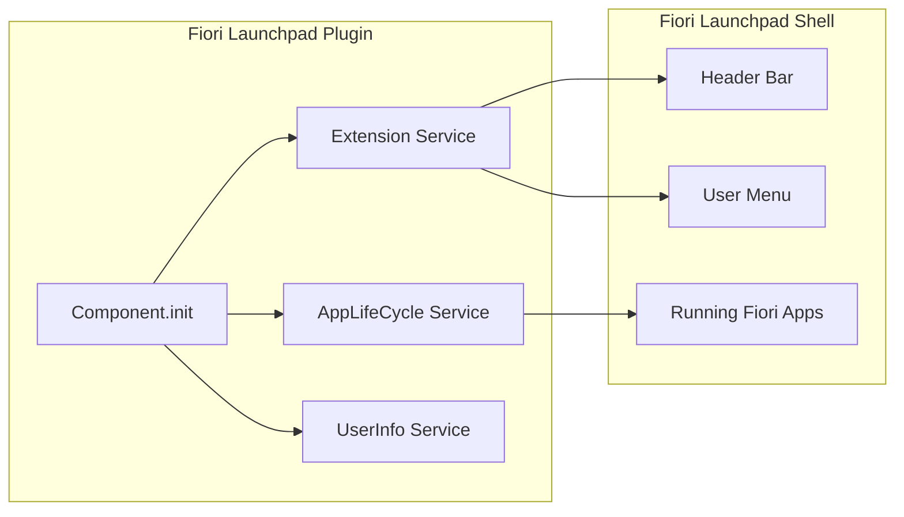
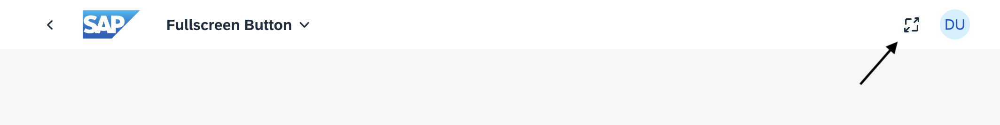

When people talk about UI5 development, they usually mean one of two things: **UI5 applications** or **UI5 libraries**. But there is a third option that many developers overlook — **Fiori Launchpad plugins**.

Plugins run inside the Fiori shell and can extend the launchpad itself: add header buttons, register user menu actions, or simply run in the background and do their job without any visible UI at all.


Fiori Launchpad plugins require **SAPUI5**. They are **not** available in OpenUI5, because `sap.ushell` is not part of the OpenUI5 distribution.


In my opinion, plugins are **underrated**. They are lightweight, powerful, and perfect for cross-app functionality that does not belong inside a single Fiori app.

Some real-world examples:

- **Usage tracking** across all launched applications
- **Custom reporting** or diagnostics triggered from the shell
- **Global utilities** like a fullscreen toggle, theme helpers, or support widgets
- **Background automation** that reacts to app lifecycle events

---

## Plugin Architecture — Simpler Than You Think

Architecturally, a Fiori Launchpad plugin is very close to a regular UI5 application — just without views and controllers.

You start with a **component** (typically `Component.ts` or `Component.js`) and implement your logic inside the `init()` method. From there, you can use everything you already know from UI5 app development:

- OData models and `Component` metadata
- `i18n` resource bundles
- Standard UI5 controls and libraries
- TypeScript, ESLint, UI5 Tooling, and modern project setups

The main difference: instead of rendering a full application UI, you hook into **shell services** like `Extension`, `AppLifeCycle`, or `UserInfo`.



---

## Adding Buttons and User Menu Actions

### The Old Renderer Approach

In older UI5 versions, registering shell extensions was cumbersome. You had to fetch the **renderer instance** manually and work with APIs that changed frequently between releases.

Typical pain points:

- `controlType` and placement options changed over time
- Multiple header positions (`begin`, `end`, etc.) with inconsistent behavior
- Verbose boilerplate just to add a single button
- Harder to maintain when supporting multiple UI5 versions

A simplified example of the old pattern:

```typescript
const renderer = await Container.getRenderer();
renderer.addHeaderItem({
    id: "myCustomButton",
    icon: "sap-icon://action",
    text: "My Action",
    press: () => {
        // handle press
    },
}, true, false, ["begin"]);
```

It works — but it never felt clean.

### The New Extension API (UI5 1.120+)

Starting with **UI5 1.120**, SAP introduced the dedicated **`sap.ushell.services.Extension`** API — a much clearer and more maintainable way to extend the shell.

**API reference:** [sap.ushell.services.Extension](https://ui5.sap.com/#/api/sap.ushell.services.Extension)

With the Extension API you can:

- Create **header items** (buttons in the shell header)
- Register **user menu actions**
- Show extensions globally across apps with `showForAllApps()`

The trade-off: placement is more opinionated. Header items are supported at the **end** position, and user menu entries are first-class citizens — but you no longer get the old free-form renderer positioning.

### Old Renderer vs. Extension API

| Topic | Old Renderer API | New Extension API (1.120+) |
| --- | --- | --- |
| Service | `Container.getRenderer()` | `Container.getServiceAsync("Extension")` |
| Header buttons | Multiple positions (`begin`, `end`, …) | End position via `createHeaderItem()` |
| User menu | Manual renderer integration | Native `createUserAction()` support |
| API stability | Changed across UI5 versions | Dedicated, documented service |
| TypeScript support | Possible, but loosely typed | Clean async service typing |
| Recommended for | Legacy systems below 1.120 | **New development on 1.120+** |

---

## What Else Can a Plugin Do?

Beyond adding visible shell controls, plugins can interact with the **application lifecycle** and **user context**.

### React to App Changes with AppLifeCycle

If your plugin needs to know when a Fiori app has finished loading — for example to attach listeners or read the active component — use the `AppLifeCycle` service:

```typescript
const appLifeCycle = await Container.getServiceAsync("AppLifeCycle");
const current = appLifeCycle.getCurrentApplication();

appLifeCycle.attachAppLoaded(
    {},
    () => {
        // UI5 application changed
    },
    {}
);
```

This is especially useful for plugins that need to interact with the **currently open app component** after navigation.

### Access the Logged-In User

User information is available through the `UserInfo` service:

```typescript
import Container from "sap/ushell/Container";

const containerInstance = await Container.getServiceAsync("UserInfo");
const userInfo = containerInstance as UserInfo;

const userId = userInfo.getId();
const fullName = userInfo.getFullName();
const email = userInfo.getEmail();
```

Typical use cases: personalization, audit logging, feature toggles per user, or displaying context-aware shell actions.

---

## Scaffolding a Plugin with TypeScript

Manually setting up a Fiori Launchpad plugin — especially with TypeScript, UI5 Tooling, and the correct shell integration — takes time. For this reason, I created a **Yeoman generator** in the UI5 Community:

[**→ GitHub: ui5-community/generator-ui5-ts-flp-plugin**](https://github.com/ui5-community/generator-ui5-ts-flp-plugin)

The generator is built on top of [Easy UI5](https://github.com/ui5-community/generator-easy-ui5) and scaffolds a ready-to-run Fiori Launchpad plugin project.

**Highlights:**

- TypeScript-ready project structure
- Automatic integration strategy based on the **UI5 version you select**
  - Uses the **Extension API** on UI5 1.120+
  - Falls back to the **legacy renderer approach** on older versions
- Includes shell extension sample

### Quick Start

Install the generators globally:

```bash
npm i -g yo generator-easy-ui5
```

Scaffold a new plugin:

```bash
yo easy-ui5 ts-flp-plugin
```

Follow the prompts — especially the **UI5 version** — and start local development:

```bash
npm start
```

The generator wires up the correct shell integration path for your target version, so you do not have to maintain two codebases manually.

---

## Sample Plugin: Fullscreen Toggle

To demonstrate the Extension API in practice, I built a small open-source plugin that adds a **fullscreen toggle button** to the Fiori shell header.

[**→ GitHub: mariokernich/fiori-fullscreen-plugin**](https://github.com/mariokernich/fiori-fullscreen-plugin)



The core logic loads an `i18n` bundle, creates a header item through the Extension service, and toggles the browser fullscreen API on press:

```typescript
import ResourceModel from "sap/ui/model/resource/ResourceModel";
import Container from "sap/ushell/Container";
import Extension from "sap/ushell/services/Extension";
import type { Button$PressEvent } from "sap/m/Button";

const resourceModel = new ResourceModel({
    bundleName: "de.kernich.fiori.fullscreen.messagebundle",
    async: true,
});
const resourceBundle = await resourceModel.getResourceBundle();

const extension = await Container.getServiceAsync<Extension>("Extension");

const item = await extension.createHeaderItem({
    icon: document.fullscreenElement
        ? "sap-icon://exit-full-screen"
        : "sap-icon://full-screen",
    text: document.fullscreenElement
        ? resourceBundle.getText("btnExitFullscreen")
        : resourceBundle.getText("btnEnterFullscreen"),
    press: (event: Button$PressEvent) => {
        if (!document.fullscreenElement) {
            void document.body.requestFullscreen();
            event
                .getSource()
                .setText(resourceBundle.getText("btnExitFullscreen"));
            event.getSource().setIcon("sap-icon://exit-full-screen");
        } else {
            void document.exitFullscreen();
            event
                .getSource()
                .setText(resourceBundle.getText("btnEnterFullscreen"));
            event.getSource().setIcon("sap-icon://full-screen");
        }
    },
});

item.showForAllApps();
item.showOnHome();
```

A few things worth noting:

- `createHeaderItem()` returns a promise — the API is fully async
- `Button$PressEvent` gives you proper TypeScript typing for the press handler
- `showForAllApps()` makes the button available across every launched Fiori app
- `i18n` works exactly like in a standard UI5 application

---

## Deploying and Activating the Plugin

Once your plugin is built, you need to register it in the launchpad landscape.

### On-Premise (ABAP Fiori Launchpad)

Deploy the plugin as a **BSP/UI5 application** with `sap.flp.type: "plugin"` in `manifest.json`

Option 1: Register it in the Fiori launchpad configuration — typically as a **global shell plugin** via launchpad site / content administrator settings. Use T-Code `/UI2/FLP_CUS_CONF` and `/UI2/FLP_CONF_DEF`. With this option everyone will get the plugin loaded without any restriction.

Option 2: Assign the plugin through a **PFCG role** so authorized users load the extension at shell startup

### SAP Build Work Zone

1. Deploy the plugin as an **HTML5 application** (often via MTA to SAP BTP)
2. Ensure `manifest.json` contains:

```json
"sap.flp": {
  "type": "plugin"
}
```

3. In the **Work Zone Administration Console**, refresh the HTML5 Apps content channel
4. Add the plugin in **Content Explorer** and assign it to a **role** (for example, `Everyone` or a dedicated plugin role)

After assignment, the plugin loads automatically when users open the launchpad — no tile required.

---

## Conclusion

Fiori Launchpad plugins are a powerful but often ignored extension point in the UI5 ecosystem. They let you enhance the shell itself — globally, cleanly, and without touching every individual Fiori app.

With **TypeScript**, the modern **Extension API** (UI5 1.120+), and a proper project generator, building plugins today is significantly more pleasant than wrestling with the old renderer APIs.

If you have a cross-app requirement — tracking, reporting, shell utilities, or lifecycle automation — a plugin is very likely the right tool for the job.

**Useful links:**

- [Extension API documentation](https://ui5.sap.com/#/api/sap.ushell.services.Extension)
- [generator-ui5-flp-plugin](https://github.com/ui5-community/generator-ui5-ts-flp-plugin)
- [fiori-fullscreen-plugin sample](https://github.com/mariokernich/fiori-fullscreen-plugin)
