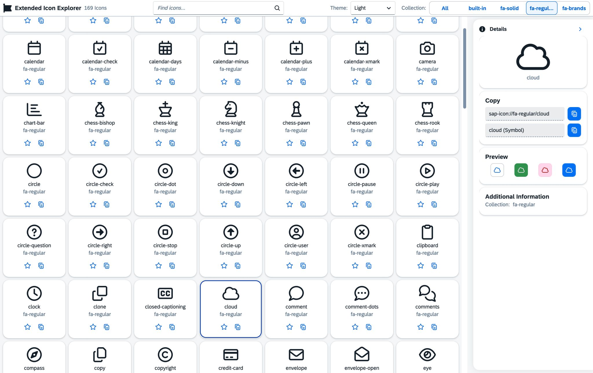

What do a camera and a washing machine have in common? Actually, nothing. In the UI5 world, however, you often have to get creative. Additionally, the selection of standard icons is limited and the look & feel varies depending on the version.

For this reason, I've found myself in the situation of "repurposing" a camera as a washing machine. The lens worked well as a drum and the flash as a control panel. The only problem was that after an update, more contours were added, which clearly identified the camera as a camera.

Since this is obviously not a new problem, UI5 now allows you to use the IconPool framework and register custom icons. But somehow it's always tedious to find the icon files and maintain the metadata properly.

## UI5 Library Project

For this reason, I came up with a suitable solution that I'd like to share with you through my new project: I took the most well-known and largest icon library, [Font Awesome](https://fontawesome.com/), and packaged it into a UI5 library.

[**→ GitHub Repository: ui5-fontawesome-lib**](https://github.com/ui5-community/ui5-fontawesome-lib)

By using the library, all free Font Awesome icons become available. The library can also be extended with paid icons through a Pro license in just a few simple steps. This makes it possible to expand the 704 standard icons by an additional 61,764 icons.

To use the library for development, you simply need to install an NPM module and add a ui5-middleware configuration. More details can be found in the repository.

```bash
npm i ui5-fontawesome-lib
```

Once installed, use Font Awesome icons through the familiar `sap-icon` URI scheme:

```text
sap-icon://{icon-pack}/{icon-name}
```

- **Icon pack:** `fa-regular`, `fa-solid`, or `fa-brands`
- **Icon name:** the Font Awesome icon identifier (e.g. `heart`, `star`, `github`)

```xml
<!-- Regular -->
<Icon src="sap-icon://fa-regular/heart" />

<!-- Solid -->
<Icon src="sap-icon://fa-solid/star" />

<!-- Brands -->
<Icon src="sap-icon://fa-brands/github" />
```

## Showcase Application



To make icon selection even easier, I also created a small clone of the well-known Icon Explorer that includes all icons. Feel free to check it out: [ui5-community.github.io/ui5-icon-explorer](https://ui5-community.github.io/ui5-icon-explorer/)

[**→ GitHub Repository: ui5-icon-explorer**](https://github.com/ui5-community/ui5-icon-explorer)
