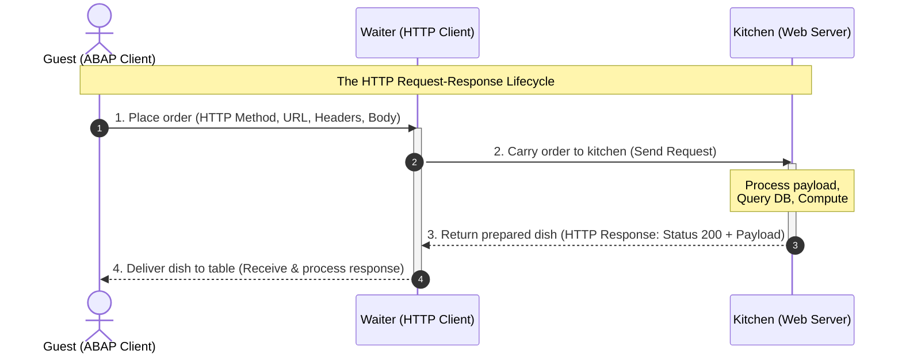

In an interconnected enterprise runtime, SAP is no longer an isolated platform. Whether you need to fetch real-time exchange rates, send invoice payloads to external microservices, or integrate cloud services, communicating over HTTP and parsing JSON or XML has become standard practice for every ABAP developer.

But how do HTTP requests actually work? What are headers and cookies, and how do we manage them? And how can you easily convert ABAP data objects into JSON or XML (and vice versa)?

In this guide, we break these concepts down into simple, practical terms. We will start with an easy-to-understand **waiter analogy**, examine the role of headers and cookies, and dive straight into ready-to-use code examples utilizing modern ABAP and **inline declarations**.

---

## 1. Deconstructing an HTTP Request (The Waiter Analogy)

To understand HTTP communication, imagine dining at a restaurant. There are four primary actors:
1. **The Guest (Client):** You (or your ABAP program) wanting to request something.
2. **The Order (Request):** Your message outlining what you want.
3. **The Waiter (HTTP Client):** The messenger carrying your order to the kitchen and bringing the food back.
4. **The Kitchen (Web Server / API):** The backend processing your request and preparing the response.

### Core Anatomy of a Request:
- **The URL (Endpoint Address):** The street address or table location (e.g., `https://api.example.com/v1/products`).

### HTTP Methods (The Active Verbs)
To define what action we want the server to perform, we use specific HTTP methods. Here is how they map to our restaurant analogy and database operations:

| HTTP Method | Restaurant Analogy | Database Action (CRUD) | Description |
| :--- | :--- | :--- | :--- |
| **`GET`** | "Bring me the menu" or "Serve the soup" | Read (Retrieve) | Fetches existing resource details from the server without modifying anything. |
| **`POST`** | "Place a new custom order" | Create (Insert) | Submits new data payloads to the server to create a brand new resource. |
| **`PUT` / `PATCH`** | "Replace my steak with fish" / "Add extra pepper" | Update (Modify) | Overwrites a resource entirely (`PUT`) or updates specific fields (`PATCH`). |
| **`DELETE`** | "Cancel my order" / "Take away the empty plate" | Delete (Remove) | Permanently deletes a specific resource from the server. |

This entire interaction is mapped in the **Mermaid sequence diagram** below:



---

## 2. Understanding Headers and Cookies

When communicating over HTTP, the request and response do not just consist of raw payloads. They also contain metadata: **Headers** and **Cookies**.

### What are HTTP Headers?
Headers are **key-value pairs** sent in both requests and responses. Think of request headers as your "special dining instructions" or "ID verification" when placing an order:
* **`Accept: application/json`**: Telling the kitchen, *"I only understand JSON. Please serve my data format accordingly."*
* **`Content-Type: application/json; charset=utf-8`**: Telling the kitchen, *"The payload body I am handing over is written in UTF-8-encoded JSON."*
* **`Authorization: Bearer <token>`**: Your exclusive membership card allowing you access to VIP dining areas.

### What are Cookies?
Cookies are small pieces of stateful data that a server sends to your client via a response header (`Set-Cookie`). Your client then stores them and automatically attaches them to subsequent outgoing requests (`Cookie` header).

Think of cookies as a physical **cloakroom ticket** the restaurant hands you on your first visit:
* On your response, the waiter says: *"Keep this ticket locally."* (`Set-Cookie: session_id=XYZ123`)
* On your next request, you automatically show that ticket back to the waiter: *"Remember me? Here is my ticket."* (`Cookie: session_id=XYZ123`)
* This is crucial for **Session Management**, keeping track of logged-in states, or preserving user preferences across stateless HTTP calls.

---

## 3. Execution of HTTP Requests in ABAP

In modern ABAP instances (such as SAP S/4HANA Cloud or modern On-Premise systems), we use the `IF_WEB_HTTP_CLIENT` interface. It is the Clean Core-compliant successor to the legacy `CL_HTTP_CLIENT` class.

Here is an example demonstrating how to initialize a client, set headers, manage cookies, and retrieve a response:

```abap
TRY.
    " 1. Instantiate the HTTP Client using the URL Destination
    DATA(lo_http_client) = cl_web_http_client_manager=>create_by_http_destination(
      cl_http_destination_provider=>create_by_url( 'https://jsonplaceholder.typicode.com/posts' )
    ).

    " 2. Obtain the request configuration API
    DATA(lo_request) = lo_http_client->get_http_request( ).

    " 3. Setting HTTP Headers
    lo_request->set_header_field( i_name = 'Accept'       i_value = 'application/json' ).
    lo_request->set_header_field( i_name = 'Content-Type' i_value = 'application/json' ).

    " 4. Managing Cookies
    " Manually set a cookie for state tracking/session handling
    lo_request->get_cookie_manager( )->set_cookie(
      i_name  = 'sap-user-context'
      i_value = 'language=EN&client=100'
    ).

    " Set request payload (JSON Body)
    lo_request->set_text( `{"title": "Clean Core", "body": "Modern ABAP is great!", "userId": 1}` ).

    " 5. Execute HTTP Request via POST Method
    DATA(lo_response) = lo_http_client->execute( if_web_http_client=>post ).

    " 6. Evaluate HTTP Response Metainfo and Payload
    DATA(ls_status)       = lo_response->get_status( ).
    DATA(lv_response_txt) = lo_response->get_text( ).

    IF ls_status-code = 201. " Created successfully
      cl_demo_output=>write( 'Successfully created new entry!' ).
      cl_demo_output=>write( lv_response_txt ).
    ELSE.
      cl_demo_output=>write( |Error: { ls_status-code } - { ls_status-reason }| ).
    ENDIF.

    " 7. Terminate connection
    lo_http_client->close( ).

  CATCH cx_web_http_client_error cx_http_dest_provider_error INTO DATA(lx_error).
    cl_demo_output=>write( |Exception caught: { lx_error->get_text( ) }| ).
ENDTRY.
cl_demo_output=>display( ).
```

---

## 4. Handling JSON Payloads (The Modern Standard)

JSON (*JavaScript Object Notation*) is the de-facto data serialization standard for modern API endpoints. ABAP makes parsing and creating JSON extremely seamless using `/UI2/CL_JSON` combined with **inline data declarations**.

### JSON Deserialization (JSON to ABAP)
Let's parse incoming JSON data directly into an inline-defined ABAP structure without pre-creating global dictionary structures:

```abap
" Raw JSON response
DATA(lv_json_string) = `{ "id": 101, "title": "Modern ABAP is great!", "completed": false }`.

" Define target structure inline on the fly
DATA: BEGIN OF ls_todo,
        id        TYPE i,
        title     TYPE string,
        completed TYPE abap_bool,
      END OF ls_todo.

" De-serialize using camel-case mapping to snake_case automatically
/UI2/CL_JSON=>deserialize(
  EXPORTING
    json        = lv_json_string
    pretty_name = /UI2/CL_JSON=>pretty_name-camel_case
  CHANGING
    data        = ls_todo
).

" Display structural attributes
cl_demo_output=>write( |ID: { ls_todo-id }| ).
cl_demo_output=>write( |Title: { ls_todo-title }| ).
cl_demo_output=>write( |Completed: { ls_todo-completed }| ).
cl_demo_output=>display( ).
```

### JSON Serialization (ABAP to JSON)
Generating modern JSON structures out of internal ABAP objects is just as fast:

```abap
" Build data structure inline
DATA(ls_payload) = VALUE #( 
  id        = 999 
  title     = 'Post created via ABAP' 
  completed = abap_true 
).

" Serialize ABAP structure into formatted JSON
DATA(lv_json_output) = /UI2/CL_JSON=>serialize(
  data        = ls_payload
  compress    = abap_true
  pretty_name = /UI2/CL_JSON=>pretty_name-camel_case
).

cl_demo_output=>write( lv_json_output ).
cl_demo_output=>display( ).
```

---

## 5. Handling XML Payloads (The Standard Classic)

For older legacy platforms, SOAP-based systems, or explicit SAP-to-SAP background messaging, XML is the typical vehicle. We manipulate XML using ABAP's identity transformation: `CALL TRANSFORMATION id`.

### XML Deserialization (XML to ABAP)
We want to parse the following hierarchical XML into a structured ABAP record:
```xml
<post>
  <id>404</id>
  <title>XML Parsing</title>
</post>
```

We do this easily using an inline structure:

```abap
" Raw XML text string
DATA(lv_xml_payload) = `<post><id>404</id><title>XML Parsing</title></post>`.

" Inline defined structure matching the hierarchy
DATA: BEGIN OF ls_post_data,
        id    TYPE i,
        title TYPE string,
      END OF ls_post_data.

TRY.
    " Parse XML using the system identity (ID) transformation
    CALL TRANSFORMATION id
      SOURCE xml lv_xml_payload
      RESULT post = ls_post_data. " Matches the XML root tag 'post'

    cl_demo_output=>write( |Parsed Title: { ls_post_data-title } (ID: { ls_post_data-id })| ).
  CATCH cx_transformation_error INTO DATA(lx_xml_err).
    cl_demo_output=>write( |Error parsing XML: { lx_xml_err->get_text( ) }| ).
ENDTRY.
cl_demo_output=>display( ).
```

### XML Serialization (ABAP to XML)
To wrap records back into an XML format:

```abap
" Fill an inline structure
DATA(ls_invoice) = VALUE #( 
  invoice_id = 'INV-5501'
  purchaser  = 'Wayne Enterprises'
).

DATA lv_xml_output TYPE string.

" Convert structural data to raw XML string
CALL TRANSFORMATION id
  SOURCE data = ls_invoice
  RESULT xml lv_xml_output.

cl_demo_output=>write( lv_xml_output ).
cl_demo_output=>display( ).
```

{}
When simple ID mapping is insufficient for deeply nested schemas or advanced namespaces, you should create a dedicated **Simple Transformation (ST)** or **XSLT** object in Eclipse ADT and trigger it inside your `CALL TRANSFORMATION` statement.
{}

---

## Summary & Integration Best Practices

By following these fundamental practices, you write clean, reliable integration logic every time:

1. **Avoid `CL_HTTP_CLIENT` for New Service Configurations:** The modern `IF_WEB_HTTP_CLIENT` client API is secure, decoupled, and Clean-Core compliant.
2. **Utilize Inline Declarations:** Declaring data containers, loops, and target records directly in your serialization and deserialization blocks keeps your logical layers clean of redundant SE11 Dictionary overhead.
3. **Always Wrap in Try-Catch Blocks:** Network calls, HTTP timeouts, and corrupted payloads will happen. Wrapping execution steps in defensive `TRY-CATCH` blocks keeps your background jobs from crashing on unexpected remote states.

---

## Pro Tip: Wrap your HTTP Requests in a Helper Class

If you find yourself making HTTP requests in multiple places, writing boilerplate code to handle headers, cookies, query parameters, destinations, and clients gets repetitive and messy. Wrapping these calls into a clean, reusable utility class simplifies your application logic significantly.

Here is a robust helper class `ZCL_HTTP_HANDLER` that supports modern REST methods (`GET`, `POST`, `PUT`, `DELETE`), handles query parameter tables, tracks stateful headers/cookies, and manages client lifecycle cleanly:

```abap
CLASS zcl_http_handler DEFINITION
  PUBLIC
  CREATE PUBLIC.

  PUBLIC SECTION.
    TYPES:
      BEGIN OF ty_name_value,
        name  TYPE string,
        value TYPE string,
      END OF ty_name_value,
      tt_name_value TYPE STANDARD TABLE OF ty_name_value WITH DEFAULT KEY.

    METHODS:
      constructor
        RAISING
          cx_web_http_client_error,

      set_header
        IMPORTING
          iv_name  TYPE string
          iv_value TYPE string,

      set_cookie
        IMPORTING
          iv_name  TYPE string
          iv_value TYPE string,

      get
        IMPORTING
          iv_url         TYPE string
          it_query_params TYPE tt_name_value OPTIONAL
        RETURNING
          VALUE(rv_response) TYPE string
        RAISING
          cx_web_http_client_error
          cx_http_dest_provider_error,

      post
        IMPORTING
          iv_url         TYPE string
          it_query_params TYPE tt_name_value OPTIONAL
          iv_body        TYPE string OPTIONAL
        RETURNING
          VALUE(rv_response) TYPE string
        RAISING
          cx_web_http_client_error
          cx_http_dest_provider_error,

      put
        IMPORTING
          iv_url         TYPE string
          it_query_params TYPE tt_name_value OPTIONAL
          iv_body        TYPE string OPTIONAL
        RETURNING
          VALUE(rv_response) TYPE string
        RAISING
          cx_web_http_client_error
          cx_http_dest_provider_error,

      delete
        IMPORTING
          iv_url         TYPE string
          it_query_params TYPE tt_name_value OPTIONAL
        RETURNING
          VALUE(rv_response) TYPE string
        RAISING
          cx_web_http_client_error
          cx_http_dest_provider_error.

  PRIVATE SECTION.
    DATA:
      mt_headers TYPE tt_name_value,
      mt_cookies TYPE tt_name_value.

    METHODS:
      create_client
        IMPORTING
          iv_url           TYPE string
        RETURNING
          VALUE(ro_client) TYPE REF TO if_web_http_client
        RAISING
          cx_web_http_client_error
          cx_http_dest_provider_error,

      prepare_request
        IMPORTING
          io_client        TYPE REF TO if_web_http_client
          it_query_params  TYPE tt_name_value OPTIONAL
          iv_body          TYPE string OPTIONAL
        RAISING
          cx_web_http_client_error.
ENDCLASS.


CLASS zcl_http_handler IMPLEMENTATION.

  METHOD constructor.
    " Initialisierung falls notwendig
  ENDMETHOD.

  METHOD set_header.
    DELETE mt_headers WHERE name = iv_name.
    APPEND VALUE #( name = iv_name value = iv_value ) TO mt_headers.
  ENDMETHOD.

  METHOD set_cookie.
    DELETE mt_cookies WHERE name = iv_name.
    APPEND VALUE #( name = iv_name value = iv_value ) TO mt_cookies.
  ENDMETHOD.

  METHOD create_client.
    DATA(lo_destination) = cl_http_destination_provider=>create_by_url( iv_url ).
    ro_client = cl_web_http_client_manager=>create_by_http_destination( lo_destination ).
  ENDMETHOD.

  METHOD prepare_request.
    DATA(lo_request) = io_client->get_http_request( ).

    " Header-Felder setzen
    LOOP AT mt_headers ASSIGNING FIELD-SYMBOL(<fs_header>).
      lo_request->set_header_field(
        i_name  = <fs_header>-name
        i_value = <fs_header>-value
      ).
    ENDLOOP.

    " Cookies setzen
    LOOP AT mt_cookies ASSIGNING FIELD-SYMBOL(<fs_cookie>).
      lo_request->set_cookie(
        i_name  = <fs_cookie>-name
        i_value = <fs_cookie>-value
      ).
    ENDLOOP.

    " Query-Parameter setzen
    LOOP AT it_query_params ASSIGNING FIELD-SYMBOL(<fs_param>).
      lo_request->set_query_parameter(
        name  = <fs_param>-name
        value = <fs_param>-value
      ).
    ENDLOOP.

    " Body-Inhalt falls vorhanden setzen
    IF iv_body IS NOT INITIAL.
      lo_request->set_text( iv_body ).
    ENDIF.
  ENDMETHOD.

  METHOD get.
    DATA(lo_client) = create_client( iv_url ).
    prepare_request(
      io_client       = lo_client
      it_query_params = it_query_params
    ).

    DATA(lo_response) = lo_client->execute( if_web_http_client=>get ).
    rv_response = lo_response->get_text( ).
    lo_client->close( ).
  ENDMETHOD.

  METHOD post.
    DATA(lo_client) = create_client( iv_url ).
    prepare_request(
      io_client       = lo_client
      it_query_params = it_query_params
      iv_body         = iv_body
    ).

    DATA(lo_response) = lo_client->execute( if_web_http_client=>post ).
    rv_response = lo_response->get_text( ).
    lo_client->close( ).
  ENDMETHOD.

  METHOD put.
    DATA(lo_client) = create_client( iv_url ).
    prepare_request(
      io_client       = lo_client
      it_query_params = it_query_params
      iv_body         = iv_body
    ).

    DATA(lo_response) = lo_client->execute( if_web_http_client=>put ).
    rv_response = lo_response->get_text( ).
    lo_client->close( ).
  ENDMETHOD.

  METHOD delete.
    DATA(lo_client) = create_client( iv_url ).
    prepare_request(
      io_client       = lo_client
      it_query_params = it_query_params
    ).

    DATA(lo_response) = lo_client->execute( if_web_http_client=>delete ).
    rv_response = lo_response->get_text( ).
    lo_client->close( ).
  ENDMETHOD.

ENDCLASS.
```

### How to use the ZCL_HTTP_HANDLER Wrapper Class

Using this wrapper class makes your main business logic short, clean, and extremely readable. Here are practical examples demonstrating how to use it for different HTTP operations:

#### 1. A Simple GET Request with Query Parameters
Instead of instantiating destinations, clients, and requests manually, you simply call the wrapper class:

```abap
TRY.
    DATA(lo_http) = NEW zcl_http_handler( ).

    " Inline lookup query parameter table
    DATA(lt_params) = VALUE zcl_http_handler=>tt_name_value(
      ( name = 'userId' value = '1' )
    ).

    " Fetch data
    DATA(lv_response) = lo_http->get(
      iv_url          = 'https://jsonplaceholder.typicode.com/posts'
      it_query_params = lt_params
    ).

    cl_demo_output=>write( lv_response ).

  CATCH cx_web_http_client_error cx_http_dest_provider_error INTO DATA(lx_err).
    cl_demo_output=>write( lx_err->get_text( ) ).
ENDTRY.
cl_demo_output=>display( ).
```

#### 2. A Stateful POST Request with Headers and Cookies
If you need to pass authentication tokens, context headers, or cookies alongside a payload:

```abap
TRY.
    DATA(lo_http) = NEW zcl_http_handler( ).

    " Set headers and cookies (which are stored in the object state)
    lo_http->set_header( iv_name = 'Authorization' iv_value = 'Bearer s0me-secr3t-asdf-t0k3n' ).
    lo_http->set_header( iv_name = 'Content-Type'  iv_value = 'application/json' ).
    lo_http->set_cookie( iv_name = 'mysessionid'   iv_value = '987654321' ).

    DATA(lv_json_payload) = `{"service": "active", "status": "completed"}`.

    " Execute POST request with state active
    DATA(lv_response) = lo_http->post(
      iv_url  = 'https://api.example.com/v1/status'
      iv_body = lv_json_payload
    ).

    cl_demo_output=>write( lv_response ).

  CATCH cx_web_http_client_error cx_http_dest_provider_error INTO DATA(lx_err).
    cl_demo_output=>write( lx_err->get_text( ) ).
ENDTRY.
cl_demo_output=>display( ).
```