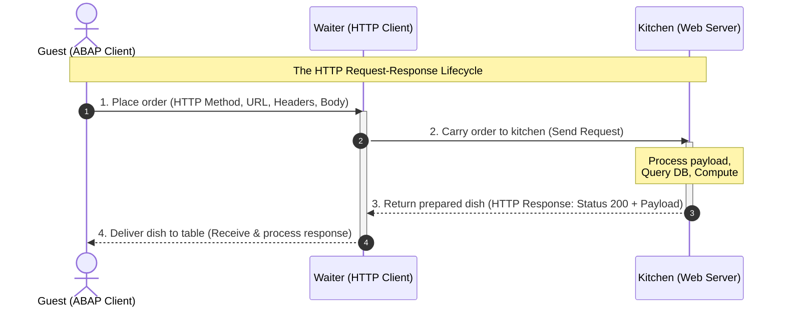

In an interconnected enterprise runtime, SAP is no longer an isolated platform. Modern business processes rarely live inside a single system — they span many cloud services, external partners, and third-party tools. To make them work together, systems need to *talk* to each other, and the language they use is **HTTP**.

### Why do we need HTTP calls?
Almost every service on the internet exposes its functionality through a **REST API** (a set of web addresses you can call over HTTP). This is fantastic for us as ABAP developers: if a system offers a REST API, we can connect to it directly from our ABAP code. And the two data formats these APIs speak are almost always **JSON** (the modern standard) or **XML** (the classic, still common in SAP-to-SAP and SOAP scenarios) — exactly the two formats we will learn to handle in this guide.

This becomes especially powerful on the **SAP Business Technology Platform (BTP)**. BTP is where companies **centrally bring everything together in the cloud** — connecting their S/4HANA backend, cloud services, and countless external systems in one place. HTTP calls are the glue that makes this central integration possible.

### Real-world business examples
Here are just a few things you could build with HTTP calls from ABAP:

- **Project management (Jira, Azure DevOps):** Automatically create a Jira ticket when a quality issue is posted in SAP, or update the SAP order status when a Jira issue is closed.
- **Communication (Microsoft Teams, Slack):** Send a Teams or Slack notification the moment a critical sales order or a failed payment is detected.
- **Finance & rates:** Fetch **real-time currency exchange rates** or stock prices from an external financial API.
- **Logistics (DHL, UPS):** Request live shipment tracking data and show it directly on the SAP sales order.
- **CRM & Marketing (Salesforce, HubSpot):** Keep customer data in sync between SAP and your CRM system.
- **AI services:** Send a text to an AI service (like translation or sentiment analysis) and process the JSON response.

But how do HTTP requests actually work? What are headers and cookies, and how do we manage them? And how can you easily convert ABAP data objects into JSON or XML (and vice versa)?

In this guide, we break these concepts down into simple, practical terms. We will start with an easy-to-understand **waiter analogy**, examine the role of headers and cookies, and dive straight into ready-to-use code examples utilizing modern ABAP and **inline declarations**.

---

## 1. Deconstructing an HTTP Request (The Waiter Analogy)

To understand HTTP communication, imagine dining at a restaurant. There are four primary actors:
1. **The Guest (Client):** You (or your ABAP program) wanting to request something.
2. **The Order (Request):** Your message outlining what you want.
3. **The Waiter (HTTP Client):** The messenger carrying your order to the kitchen and bringing the food back.
4. **The Kitchen (Web Server / API):** The backend processing your request and preparing the response.

### Core Anatomy of a Request
Every HTTP request is made up of a few simple building blocks. Using our restaurant analogy, here is what each part means:

- **The URL (Endpoint Address):** The street address or table location that tells the waiter *where* to deliver your order (e.g., `https://api.example.com/v1/products`).
- **The Method (The Verb):** The action you want to perform — get something, create something, change something, or delete something (see the table below).
- **The Headers (Extra Instructions):** Small notes attached to your order, such as "I only accept JSON" or "here is my membership card" (more on this in Section 2).
- **The Query Parameters (Filters):** Optional add-ons in the URL that refine your request, like *"only bring me desserts under 10€"* (e.g., `?userId=1&status=open`).
- **The Body (The Payload):** The actual content you send along, for example the details of a new order. Usually only needed for `POST`, `PUT`, and `PATCH`.

### HTTP Methods (The Active Verbs)
To define what action we want the server to perform, we use specific HTTP methods. Here is how they map to our restaurant analogy and database operations:

| HTTP Method | Restaurant Analogy | Database Action (CRUD) | Description |
| :--- | :--- | :--- | :--- |
| **`GET`** | "Bring me the menu" or "Serve the soup" | Read (Retrieve) | Fetches existing resource details from the server without modifying anything. |
| **`POST`** | "Place a new custom order" | Create (Insert) | Submits new data payloads to the server to create a brand new resource. |
| **`PUT` / `PATCH`** | "Replace my steak with fish" / "Add extra pepper" | Update (Modify) | Overwrites a resource entirely (`PUT`) or updates specific fields (`PATCH`). |
| **`DELETE`** | "Cancel my order" / "Take away the empty plate" | Delete (Remove) | Permanently deletes a specific resource from the server. |

This entire interaction is mapped in the **Mermaid sequence diagram** below:



---

## 2. Understanding Headers and Cookies

When communicating over HTTP, the request and response do not just consist of raw payloads. They also contain metadata: **Headers** and **Cookies**.

### What are HTTP Headers?
Headers are **key-value pairs** sent in both requests and responses. Think of request headers as your "special dining instructions" or "ID verification" when placing an order:
* **`Accept: application/json`**: Telling the kitchen, *"I only understand JSON. Please serve my data format accordingly."*
* **`Content-Type: application/json; charset=utf-8`**: Telling the kitchen, *"The payload body I am handing over is written in UTF-8-encoded JSON."*
* **`Authorization: Bearer <token>`**: Your exclusive membership card allowing you access to VIP dining areas.

### What are Cookies?
Cookies are small pieces of stateful data that a server sends to your client via a response header (`Set-Cookie`). Your client then stores them and automatically attaches them to subsequent outgoing requests (`Cookie` header).

Think of cookies as a physical **cloakroom ticket** the restaurant hands you on your first visit:
* On your response, the waiter says: *"Keep this ticket locally."* (`Set-Cookie: session_id=XYZ123`)
* On your next request, you automatically show that ticket back to the waiter: *"Remember me? Here is my ticket."* (`Cookie: session_id=XYZ123`)
* This is crucial for **Session Management**, keeping track of logged-in states, or preserving user preferences across stateless HTTP calls.

---

## 3. Understanding Status Codes (Did the Order Work?)

After the kitchen processes your order, the waiter always comes back with a short status message telling you whether everything went fine. In HTTP, this message is a three-digit **status code**. As a beginner, you only need to remember the five families:

| Range | Meaning | Restaurant Analogy | Common Examples |
| :--- | :--- | :--- | :--- |
| **`1xx`** | Informational | "I'm working on it, please wait." | `100 Continue` |
| **`2xx`** | Success ✅ | "Here is your dish, enjoy!" | `200 OK`, `201 Created`, `204 No Content` |
| **`3xx`** | Redirection | "That dish moved to another table." | `301 Moved`, `304 Not Modified` |
| **`4xx`** | Client Error ❌ | "*You* made a mistake in your order." | `400 Bad Request`, `401 Unauthorized`, `403 Forbidden`, `404 Not Found` |
| **`5xx`** | Server Error 🔥 | "The *kitchen* broke down." | `500 Internal Server Error`, `503 Service Unavailable` |

{}
A quick way to remember: **`2xx` = good news**, **`4xx` = your fault** (fix your request), **`5xx` = their fault** (the server has a problem). Always check the status code before trusting the response body!
{}

---

## 4. Understanding Where to Send Requests (URLs vs. Destinations)

In the examples below we use `create_by_url( )` with a full URL. This is perfect for **learning and quick tests**. But in real projects, hard-coding URLs, users, and passwords into your code is a bad idea — if the endpoint changes, you would have to modify and re-transport your program.

Instead, SAP lets you store connection details (URL, authentication, certificates) **outside** your code in a reusable configuration:

- **On-Premise:** Use an **RFC Destination** (transaction `SM59`) and connect with `cl_http_destination_provider=>create_by_destination( )`.
- **SAP BTP / S/4HANA Cloud:** Use a **Communication Arrangement** and connect with `cl_http_destination_provider=>create_by_comm_arrangement( )`.

{}
Use `create_by_url( )` while experimenting, but switch to a **Destination** or **Communication Arrangement** for anything that goes to production. It keeps secrets out of your code and is fully Clean Core-compliant.
{}

---

## 5. Execution of HTTP Requests in ABAP

In modern ABAP instances (such as SAP S/4HANA Cloud or modern On-Premise systems), we use the `IF_WEB_HTTP_CLIENT` interface. It is the Clean Core-compliant successor to the legacy `CL_HTTP_CLIENT` class.

Here is an example demonstrating how to initialize a client, set headers, manage cookies, and retrieve a response:

```abap
TRY.
    " 1. Instantiate the HTTP Client (here with a direct URL for simplicity)
    DATA(lo_http_client) = cl_web_http_client_manager=>create_by_http_destination(
      cl_http_destination_provider=>create_by_url( 'https://jsonplaceholder.typicode.com/posts' )
    ).

    " 2. Obtain the request object so we can configure it
    DATA(lo_request) = lo_http_client->get_http_request( ).

    " 3. Set HTTP Headers (our "extra instructions")
    lo_request->set_header_field( i_name = 'Accept'       i_value = 'application/json' ).
    lo_request->set_header_field( i_name = 'Content-Type' i_value = 'application/json' ).

    " 4. Add a query parameter -> results in ...?userId=1
    lo_request->set_query_parameter( name = 'userId' value = '1' ).

    " 5. Set a cookie (for state tracking / session handling)
    lo_request->set_cookie(
      i_name  = 'sap-user-context'
      i_value = 'language=EN&client=100'
    ).

    " 6. Set the request payload (JSON body)
    lo_request->set_text( `{"title": "Clean Core", "body": "Modern ABAP is great!", "userId": 1}` ).

    " 7. Execute the request using the POST method
    DATA(lo_response) = lo_http_client->execute( if_web_http_client=>post ).

    " 8. Evaluate the response status and payload
    DATA(ls_status)       = lo_response->get_status( ).
    DATA(lv_response_txt) = lo_response->get_text( ).

    IF ls_status-code = 201. " 201 = Created successfully
      cl_demo_output=>write( 'Successfully created new entry!' ).
      cl_demo_output=>write( lv_response_txt ).
    ELSE.
      cl_demo_output=>write( |Error: { ls_status-code } - { ls_status-reason }| ).
    ENDIF.

    " 9. Always close the connection when you are done
    lo_http_client->close( ).

  CATCH cx_web_http_client_error cx_http_dest_provider_error INTO DATA(lx_error).
    cl_demo_output=>write( |Exception caught: { lx_error->get_text( ) }| ).
ENDTRY.
cl_demo_output=>display( ).
```

{}
Network calls can hang forever if the other server is slow or unreachable. You can protect your program by setting a timeout **before** executing the request:

```abap
lo_http_client->set_timeout( 30 ). " wait at most 30 seconds
```
{}

---

## 6. Authentication (Proving Who You Are)

Most real APIs will not talk to anonymous strangers — you must prove your identity, just like showing an ID card or membership card at the restaurant. Here are the three most common ways, all set via a simple header:

**1. Basic Authentication (username + password)**
The username and password are combined and Base64-encoded. ABAP can build this header for you:

```abap
DATA(lv_credentials) = cl_http_utility=>encode_base64( `myUser:myPassword` ).
lo_request->set_header_field(
  i_name  = 'Authorization'
  i_value = |Basic { lv_credentials }|
).
```

**2. Bearer Token / OAuth 2.0 (a temporary access token)**
Very common for cloud APIs. You send a token you received earlier from a login/token service:

```abap
lo_request->set_header_field(
  i_name  = 'Authorization'
  i_value = |Bearer eyJhbGciOiJIUzI1NiIsInR5c...|
).
```

**3. API Key (a simple secret key)**
Some APIs just want a secret key in a custom header:

```abap
lo_request->set_header_field( i_name = 'X-API-Key' i_value = 'my-secret-api-key' ).
```

{}
**Never** hard-code passwords or tokens in your source code! Store them in a **Destination** or **Communication Arrangement** (see Section 4). SAP then adds the authentication automatically, and your secrets stay out of the code and out of transports.
{}

---

## 7. Working with SAP OData Services (The CSRF Token)

If you call an **SAP OData service** and want to **change** data (`POST`, `PUT`, `DELETE`), there is one extra step that trips up almost every beginner: the **CSRF token** (pronounced "sea-surf"). It is a security check that prevents malicious websites from performing actions on your behalf.

The rule is simple and always the same:
1. First, send a `GET` request with the special header `X-CSRF-Token: Fetch`. The server replies with a token.
2. Then, send your actual `POST`/`PUT`/`DELETE` request and include that token in the `X-CSRF-Token` header.

```abap
" STEP 1: Fetch the CSRF token with a harmless GET request
DATA(lo_request) = lo_http_client->get_http_request( ).
lo_request->set_header_field( i_name = 'X-CSRF-Token' i_value = 'Fetch' ).

DATA(lo_response) = lo_http_client->execute( if_web_http_client=>get ).

" Read the token the server sent back to us
DATA(lv_csrf_token) = lo_response->get_header_field( 'X-CSRF-Token' ).

" STEP 2: Reuse the SAME client and send the token back with our change request
lo_request->set_header_field( i_name = 'X-CSRF-Token' i_value = lv_csrf_token ).
lo_request->set_text( `{"MaterialId": "4711", "Description": "New Material"}` ).

DATA(lo_post_response) = lo_http_client->execute( if_web_http_client=>post ).
```

{}
A `403 Forbidden` error on an SAP OData `POST`/`PUT`/`DELETE` is almost always a **missing or invalid CSRF token**. Make sure you fetch the token first **and reuse the same HTTP client** (so the session cookie stays intact), otherwise the token will be rejected.
{}

{}
So far we have focused on *consuming* REST APIs. But what if you want to *expose* your own data as a REST/OData service in a modern environment like **ABAP Cloud** or **SAP BTP**? In the **ABAP RESTful Application Programming Model (RAP)**, **custom CDS views (CDS entities)** are the go-to approach for building exactly these kinds of services.

👉 Learn how to build them in the dedicated guide: [Building Custom CDS Entities with Unmanaged Queries in ABAP RAP]().
{}

---

## 8. Handling JSON Payloads (The Modern Standard)

JSON (*JavaScript Object Notation*) is the de-facto data serialization standard for modern API endpoints. ABAP makes parsing and creating JSON extremely seamless using `/UI2/CL_JSON` combined with **inline data declarations**.

### JSON Deserialization (JSON to ABAP)
Let's parse incoming JSON data directly into an inline-defined ABAP structure without pre-creating global dictionary structures:

```abap
" Raw JSON response
DATA(lv_json_string) = `{ "id": 101, "title": "Modern ABAP is great!", "completed": false }`.

" Define target structure inline on the fly
DATA: BEGIN OF ls_todo,
        id        TYPE i,
        title     TYPE string,
        completed TYPE abap_bool,
      END OF ls_todo.

" De-serialize using camel-case mapping to snake_case automatically
/UI2/CL_JSON=>deserialize(
  EXPORTING
    json        = lv_json_string
    pretty_name = /UI2/CL_JSON=>pretty_name-camel_case
  CHANGING
    data        = ls_todo
).

" Display structural attributes
cl_demo_output=>write( |ID: { ls_todo-id }| ).
cl_demo_output=>write( |Title: { ls_todo-title }| ).
cl_demo_output=>write( |Completed: { ls_todo-completed }| ).
cl_demo_output=>display( ).
```

### JSON Serialization (ABAP to JSON)
Generating modern JSON structures out of internal ABAP objects is just as fast:

```abap
" Build data structure inline
DATA(ls_payload) = VALUE #( 
  id        = 999 
  title     = 'Post created via ABAP' 
  completed = abap_true 
).

" Serialize ABAP structure into formatted JSON
DATA(lv_json_output) = /UI2/CL_JSON=>serialize(
  data        = ls_payload
  compress    = abap_true
  pretty_name = /UI2/CL_JSON=>pretty_name-camel_case
).

cl_demo_output=>write( lv_json_output ).
cl_demo_output=>display( ).
```

{}
JSON APIs usually use `camelCase` field names (like `userId`), while ABAP field names are typically lowercase with underscores (like `user_id`). The `pretty_name = /UI2/CL_JSON=>pretty_name-camel_case` parameter handles this mapping **automatically** for you (`user_id` ↔ `userId`).

If your fields stay empty after deserialization, this mapping is the **number one culprit** — double-check that the JSON name really matches your ABAP field name after conversion.
{}

### Alternative for ABAP Cloud: the XCO Library
`/UI2/CL_JSON` is great and widely used, but it is **not released for ABAP Cloud** (e.g. on BTP or in S/4HANA Cloud Public Edition). There, SAP gives you the modern **XCO library** instead:

```abap
" Serialize an ABAP structure to JSON using XCO
DATA(lv_json) = xco_cp_json=>data->from_abap( ls_payload )->to_string( ).

" Deserialize JSON back into an ABAP structure
xco_cp_json=>data->from_string( lv_json )->write_to( REF #( ls_payload ) ).
```

{}
On a **classic On-Premise** system, `/UI2/CL_JSON` is perfectly fine and offers convenient options. In **ABAP Cloud**, use `XCO` — it is the officially released, Clean Core-compliant option.
{}

---

## 9. Handling XML Payloads (The Standard Classic)

For older legacy platforms, SOAP-based systems, or explicit SAP-to-SAP background messaging, XML is the typical vehicle. We manipulate XML using ABAP's identity transformation: `CALL TRANSFORMATION id`.

### XML Deserialization (XML to ABAP)
We want to parse the following hierarchical XML into a structured ABAP record:
```xml
<post>
  <id>404</id>
  <title>XML Parsing</title>
</post>
```

We do this easily using an inline structure:

```abap
" Raw XML text string
DATA(lv_xml_payload) = `<post><id>404</id><title>XML Parsing</title></post>`.

" Inline defined structure matching the hierarchy
DATA: BEGIN OF ls_post_data,
        id    TYPE i,
        title TYPE string,
      END OF ls_post_data.

TRY.
    " Parse XML using the system identity (ID) transformation
    CALL TRANSFORMATION id
      SOURCE xml lv_xml_payload
      RESULT post = ls_post_data. " Matches the XML root tag 'post'

    cl_demo_output=>write( |Parsed Title: { ls_post_data-title } (ID: { ls_post_data-id })| ).
  CATCH cx_transformation_error INTO DATA(lx_xml_err).
    cl_demo_output=>write( |Error parsing XML: { lx_xml_err->get_text( ) }| ).
ENDTRY.
cl_demo_output=>display( ).
```

### XML Serialization (ABAP to XML)
To wrap records back into an XML format:

```abap
" Fill an inline structure
DATA(ls_invoice) = VALUE #( 
  invoice_id = 'INV-5501'
  purchaser  = 'Wayne Enterprises'
).

DATA lv_xml_output TYPE string.

" Convert structural data to raw XML string
CALL TRANSFORMATION id
  SOURCE data = ls_invoice
  RESULT xml lv_xml_output.

cl_demo_output=>write( lv_xml_output ).
cl_demo_output=>display( ).
```

{}
When simple ID mapping is insufficient for deeply nested schemas or advanced namespaces, you should create a dedicated **Simple Transformation (ST)** or **XSLT** object in Eclipse ADT and trigger it inside your `CALL TRANSFORMATION` statement.
{}

---

## 10. Pro Tip: Wrap your HTTP Requests in a Helper Class

If you find yourself making HTTP requests in multiple places, writing boilerplate code to handle headers, cookies, query parameters, destinations, and clients gets repetitive and messy. Wrapping these calls into a clean, reusable utility class simplifies your application logic significantly.

Here is a robust helper class `ZCL_HTTP_HANDLER` that supports modern REST methods (`GET`, `POST`, `PUT`, `DELETE`), handles query parameter tables, tracks stateful headers/cookies, and manages client lifecycle cleanly:

```abap
CLASS zcl_http_handler DEFINITION
  PUBLIC
  CREATE PUBLIC.

  PUBLIC SECTION.
    TYPES:
      BEGIN OF ty_name_value,
        name  TYPE string,
        value TYPE string,
      END OF ty_name_value,
      tt_name_value TYPE STANDARD TABLE OF ty_name_value WITH DEFAULT KEY,

      " Response now carries BOTH the status code and the body,
      " so the caller can react to errors (e.g. 404 or 500).
      BEGIN OF ty_response,
        code   TYPE i,
        reason TYPE string,
        body   TYPE string,
      END OF ty_response.
    METHODS:
      constructor
        RAISING
          cx_web_http_client_error,

      set_header
        IMPORTING
          iv_name  TYPE string
          iv_value TYPE string,

      set_cookie
        IMPORTING
          iv_name  TYPE string
          iv_value TYPE string,

      get
        IMPORTING
          iv_url         TYPE string
          it_query_params TYPE tt_name_value OPTIONAL
        RETURNING
          VALUE(rs_response) TYPE ty_response
        RAISING
          cx_web_http_client_error
          cx_http_dest_provider_error,

      post
        IMPORTING
          iv_url         TYPE string
          it_query_params TYPE tt_name_value OPTIONAL
          iv_body        TYPE string OPTIONAL
        RETURNING
          VALUE(rs_response) TYPE ty_response
        RAISING
          cx_web_http_client_error
          cx_http_dest_provider_error,

      put
        IMPORTING
          iv_url         TYPE string
          it_query_params TYPE tt_name_value OPTIONAL
          iv_body        TYPE string OPTIONAL
        RETURNING
          VALUE(rs_response) TYPE ty_response
        RAISING
          cx_web_http_client_error
          cx_http_dest_provider_error,

      delete
        IMPORTING
          iv_url         TYPE string
          it_query_params TYPE tt_name_value OPTIONAL
        RETURNING
          VALUE(rs_response) TYPE ty_response
        RAISING
          cx_web_http_client_error
          cx_http_dest_provider_error.

  PRIVATE SECTION.
    DATA:
      mt_headers TYPE tt_name_value,
      mt_cookies TYPE tt_name_value.

    METHODS:
      create_client
        IMPORTING
          iv_url           TYPE string
        RETURNING
          VALUE(ro_client) TYPE REF TO if_web_http_client
        RAISING
          cx_web_http_client_error
          cx_http_dest_provider_error,

      prepare_request
        IMPORTING
          io_client        TYPE REF TO if_web_http_client
          it_query_params  TYPE tt_name_value OPTIONAL
          iv_body          TYPE string OPTIONAL
        RAISING
          cx_web_http_client_error,

      " Collects the status code AND body from the response into one structure
      collect_response
        IMPORTING
          io_response        TYPE REF TO if_web_http_response
        RETURNING
          VALUE(rs_response) TYPE ty_response
        RAISING
          cx_web_http_client_error.
ENDCLASS.


CLASS zcl_http_handler IMPLEMENTATION.

  METHOD constructor.
    " Initialization if needed
  ENDMETHOD.

  METHOD set_header.
    DELETE mt_headers WHERE name = iv_name.
    APPEND VALUE #( name = iv_name value = iv_value ) TO mt_headers.
  ENDMETHOD.

  METHOD set_cookie.
    DELETE mt_cookies WHERE name = iv_name.
    APPEND VALUE #( name = iv_name value = iv_value ) TO mt_cookies.
  ENDMETHOD.

  METHOD create_client.
    DATA(lo_destination) = cl_http_destination_provider=>create_by_url( iv_url ).
    ro_client = cl_web_http_client_manager=>create_by_http_destination( lo_destination ).
  ENDMETHOD.

  METHOD prepare_request.
    DATA(lo_request) = io_client->get_http_request( ).

    " Set header fields
    LOOP AT mt_headers ASSIGNING FIELD-SYMBOL(<fs_header>).
      lo_request->set_header_field(
        i_name  = <fs_header>-name
        i_value = <fs_header>-value
      ).
    ENDLOOP.

    " Set cookies
    LOOP AT mt_cookies ASSIGNING FIELD-SYMBOL(<fs_cookie>).
      lo_request->set_cookie(
        i_name  = <fs_cookie>-name
        i_value = <fs_cookie>-value
      ).
    ENDLOOP.

    " Set query parameters
    LOOP AT it_query_params ASSIGNING FIELD-SYMBOL(<fs_param>).
      lo_request->set_query_parameter(
        name  = <fs_param>-name
        value = <fs_param>-value
      ).
    ENDLOOP.

    " Set the body content if provided
    IF iv_body IS NOT INITIAL.
      lo_request->set_text( iv_body ).
    ENDIF.
  ENDMETHOD.

  METHOD collect_response.
    DATA(ls_status) = io_response->get_status( ).
    rs_response-code   = ls_status-code.
    rs_response-reason = ls_status-reason.
    rs_response-body   = io_response->get_text( ).
  ENDMETHOD.

  METHOD get.
    DATA(lo_client) = create_client( iv_url ).
    prepare_request(
      io_client       = lo_client
      it_query_params = it_query_params
    ).

    DATA(lo_response) = lo_client->execute( if_web_http_client=>get ).
    rs_response = collect_response( lo_response ).
    lo_client->close( ).
  ENDMETHOD.

  METHOD post.
    DATA(lo_client) = create_client( iv_url ).
    prepare_request(
      io_client       = lo_client
      it_query_params = it_query_params
      iv_body         = iv_body
    ).

    DATA(lo_response) = lo_client->execute( if_web_http_client=>post ).
    rs_response = collect_response( lo_response ).
    lo_client->close( ).
  ENDMETHOD.

  METHOD put.
    DATA(lo_client) = create_client( iv_url ).
    prepare_request(
      io_client       = lo_client
      it_query_params = it_query_params
      iv_body         = iv_body
    ).

    DATA(lo_response) = lo_client->execute( if_web_http_client=>put ).
    rs_response = collect_response( lo_response ).
    lo_client->close( ).
  ENDMETHOD.

  METHOD delete.
    DATA(lo_client) = create_client( iv_url ).
    prepare_request(
      io_client       = lo_client
      it_query_params = it_query_params
    ).

    DATA(lo_response) = lo_client->execute( if_web_http_client=>delete ).
    rs_response = collect_response( lo_response ).
    lo_client->close( ).
  ENDMETHOD.

ENDCLASS.
```

### How to use the ZCL_HTTP_HANDLER Wrapper Class

Using this wrapper class makes your main business logic short, clean, and extremely readable. Here are practical examples demonstrating how to use it for different HTTP operations:

#### 1. A Simple GET Request with Query Parameters
Instead of instantiating destinations, clients, and requests manually, you simply call the wrapper class:

```abap
TRY.
    DATA(lo_http) = NEW zcl_http_handler( ).

    " Inline lookup query parameter table
    DATA(lt_params) = VALUE zcl_http_handler=>tt_name_value(
      ( name = 'userId' value = '1' )
    ).

    " Fetch data
    DATA(ls_response) = lo_http->get(
      iv_url          = 'https://jsonplaceholder.typicode.com/posts'
      it_query_params = lt_params
    ).

    " Check the status code before trusting the body
    IF ls_response-code = 200.
      cl_demo_output=>write( ls_response-body ).
    ELSE.
      cl_demo_output=>write( |Request failed: { ls_response-code } { ls_response-reason }| ).
    ENDIF.

  CATCH cx_web_http_client_error cx_http_dest_provider_error INTO DATA(lx_err).
    cl_demo_output=>write( lx_err->get_text( ) ).
ENDTRY.
cl_demo_output=>display( ).
```

#### 2. A Stateful POST Request with Headers and Cookies
If you need to pass authentication tokens, context headers, or cookies alongside a payload:

```abap
TRY.
    DATA(lo_http) = NEW zcl_http_handler( ).

    " Set headers and cookies (which are stored in the object state)
    lo_http->set_header( iv_name = 'Authorization' iv_value = 'Bearer s0me-secr3t-asdf-t0k3n' ).
    lo_http->set_header( iv_name = 'Content-Type'  iv_value = 'application/json' ).
    lo_http->set_cookie( iv_name = 'mysessionid'   iv_value = '987654321' ).

    DATA(lv_json_payload) = `{"service": "active", "status": "completed"}`.

    " Execute POST request with state active
    DATA(ls_response) = lo_http->post(
      iv_url  = 'https://api.example.com/v1/status'
      iv_body = lv_json_payload
    ).

    " 2xx means success
    IF ls_response-code BETWEEN 200 AND 299.
      cl_demo_output=>write( |Success ({ ls_response-code }): { ls_response-body }| ).
    ELSE.
      cl_demo_output=>write( |Request failed: { ls_response-code } { ls_response-reason }| ).
    ENDIF.

  CATCH cx_web_http_client_error cx_http_dest_provider_error INTO DATA(lx_err).
    cl_demo_output=>write( lx_err->get_text( ) ).
ENDTRY.
cl_demo_output=>display( ).
```

---

## 11. Troubleshooting: Common Beginner Errors

Even with perfect code, HTTP calls can fail for reasons *outside* your program. Here are the errors you will most likely run into — and how to fix them:

| Symptom | Likely Cause | How to Fix |
| :--- | :--- | :--- |
| **SSL handshake failed** / certificate error | The target server's **SSL certificate** is not trusted by your SAP system. | Import the server's certificate into transaction **`STRUST`** (SSL client PSE). This is the #1 reason HTTPS calls fail on-premise. |
| **`403 Forbidden`** on POST/PUT/DELETE to SAP | Missing or invalid **CSRF token**. | Fetch the token first and reuse the same client (see Section 7). |
| **`401 Unauthorized`** | Missing or wrong **credentials/token**. | Check your `Authorization` header or the Destination configuration (Section 6). |
| Program **hangs forever** | The remote server is slow or unreachable. | Set a **timeout** with `set_timeout( )` (Section 5). |
| Fields are **empty after deserialization** | JSON `camelCase` vs. ABAP field names mismatch. | Use `pretty_name-camel_case` and verify the names match (Section 8). |
| **Garbled special characters** (é, ü, ...) | Wrong **encoding**. | Make sure you send/read UTF-8 and set `Content-Type: application/json; charset=utf-8`. |

{}
When calling an **HTTPS** endpoint, your SAP system must trust the remote server. If the certificate (or its root/intermediate certificate) is not in **`STRUST`**, the connection is refused *before* any data is sent. Ask your Basis team to import the certificate chain into the **SSL Client (Standard)** PSE — this solves the vast majority of HTTPS connection problems.
{}

---

## Summary & Integration Best Practices

By following these fundamental practices, you write clean, reliable integration logic every time:

1. **Use the modern `IF_WEB_HTTP_CLIENT` API:** It is secure, decoupled, and Clean Core-compliant — the successor to the legacy `CL_HTTP_CLIENT`.
2. **Keep secrets out of your code:** Use **Destinations** (`SM59`) or **Communication Arrangements** (BTP) instead of hard-coding URLs, users, and passwords.
3. **Always check the status code:** A `2xx` means success. Never trust the response body before you have confirmed the status.
4. **Handle the CSRF token for SAP OData:** Fetch it first, then send it back with every change request.
5. **Use inline declarations:** Declaring data containers and target records directly in your (de)serialization blocks keeps your code clean and free of redundant Dictionary overhead.
6. **Pick the right JSON tool:** `/UI2/CL_JSON` on classic On-Premise, **`XCO`** in ABAP Cloud.
7. **Always wrap calls in `TRY-CATCH`:** Network calls, timeouts, and corrupted payloads *will* happen — defensive code keeps your jobs from crashing.
8. **Reuse a helper class:** A small wrapper like `ZCL_HTTP_HANDLER` removes boilerplate and makes your business logic short and readable.

---




Use the `IF_WEB_HTTP_CLIENT` interface. Create a client with `cl_web_http_client_manager=>create_by_http_destination( )`, configure the request (headers, body, query parameters), call `execute( )` with the desired method (`get`, `post`, `put`, `delete`), and read the response. It is the Clean Core-compliant successor to the legacy `CL_HTTP_CLIENT` class.



`CL_HTTP_CLIENT` is the older, legacy HTTP client. `IF_WEB_HTTP_CLIENT` is the modern, secure, and Clean Core-compliant API available in SAP S/4HANA and ABAP Cloud. For any new development you should always use `IF_WEB_HTTP_CLIENT`.



On classic On-Premise systems, `/UI2/CL_JSON` is convenient and widely used. In ABAP Cloud (BTP or S/4HANA Cloud Public Edition), `/UI2/CL_JSON` is not released — use the modern `XCO` library (`xco_cp_json`) instead, which is the officially released, Clean Core-compliant option.



A `403 Forbidden` on an SAP OData `POST`, `PUT`, or `DELETE` almost always means a missing or invalid CSRF token. First send a `GET` request with the header `X-CSRF-Token: Fetch` to obtain a token, then send it back in the `X-CSRF-Token` header of your change request — and make sure you reuse the same HTTP client so the session cookie stays valid.



Your SAP system must trust the remote server's SSL certificate. Import the server's certificate (including its root and intermediate certificates) into transaction `STRUST` under the SSL Client (Standard) PSE. Missing certificates are the number one reason HTTPS calls fail on-premise.



Set an `Authorization` header: use `Basic` with Base64-encoded `user:password` for Basic Auth, `Bearer <token>` for OAuth 2.0, or a custom header like `X-API-Key` for API keys. In production, store credentials in a Destination (`SM59`) or Communication Arrangement instead of hard-coding them, so SAP adds authentication automatically and secrets stay out of your code.



Prefer JSON for modern REST APIs — it is lightweight and the de-facto standard. Use XML for SOAP-based services, legacy platforms, or explicit SAP-to-SAP background messaging. ABAP handles JSON with `/UI2/CL_JSON` or `XCO`, and XML with `CALL TRANSFORMATION id`.


