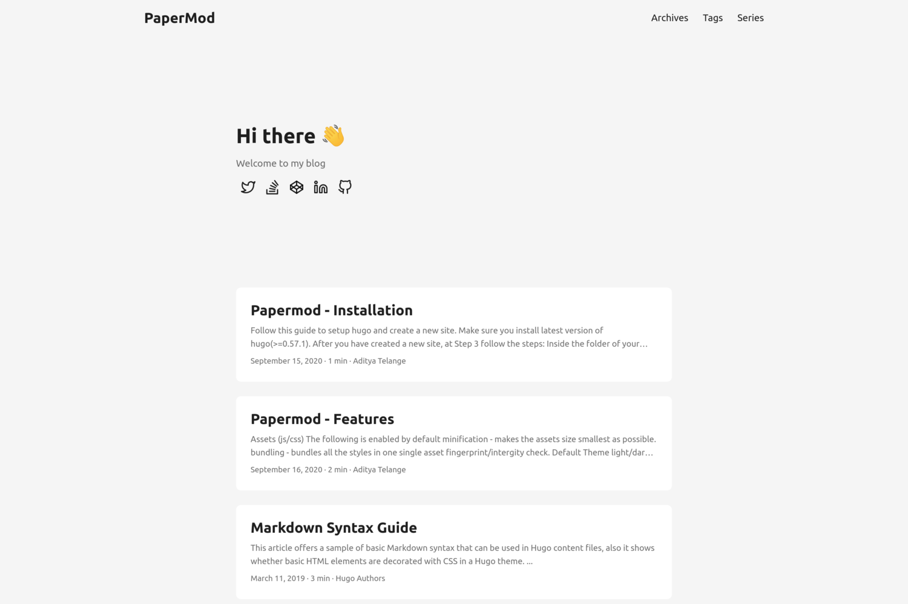

If you are still developing ABAP in SAP GUI using transaction `SE80`, it's time for a wake-up call: **you are missing out on the entire modern SAP development ecosystem**.

With the advent of the **ABAP Restful Application Programming Model (RAP)**, Core Data Services (CDS) views, and SAP Business Technology Platform (BTP) ABAP Environment, Eclipse is no longer optional—it is the standard. SAP GUI simply does not support editing CDS views, writing behavior definitions, or managing RAP business objects.

This comprehensive guide walks you through setting up a professional, highly-optimized Eclipse environment for ABAP development on **Windows, macOS, and Ubuntu/Linux**. Let's get started!

---

## Step 1: The Foundation — Why SapMachine is Your Best JRE Choice

Eclipse is a Java-based IDE. This means its performance, rendering speed, and stability rely heavily on the underlying **Java Runtime Environment (JRE)**.

While you could use any standard OpenJDK, the golden rule for SAP developers is to use **SapMachine**.

### Why SapMachine?

1. **Official SAP downstream support**: SapMachine is SAP's highly-optimized downstream release of the OpenJDK project. It receives direct enterprise-grade security patches and long-term support (LTS).
2. **First-class compatibility with ADT**: Since the ABAP Development Tools (ADT) are created by SAP engineers, they are heavily tested and optimized using SapMachine runtimes. Installing it avoids strange SSL handshakes and UI rendering bugs.
3. **Performance perks**: It includes memory allocation and garbage collection tuning tailored for enterprise JVM clients.

### Installation

No matter your OS, downloading SapMachine is straightforward:

- **Download Link**: Visit [SapMachine website](https://sapmachine.io/) and grab the latest **SapMachine JDK LTS** version (e.g., SapMachine 17 or 21 is highly recommended for newer Eclipse builds).

- **Homebrew (macOS)**:

  ```bash
  brew install --cask sapmachine-jdk
  ```

- **APT (Ubuntu/Debian)**:

  Configure the SAP package repository and run:

  ```bash
  sudo apt-get install sapmachine-21-jdk
  ```

---

## Step 2: Download Eclipse and Wire Up Your Enterprise JVM

With SapMachine installed, it is time to download the IDE itself.

### Which Eclipse Package Should You Choose?

Instead of downloading complex packages loaded with enterprise server tooling, download the lightweight **"Eclipse IDE for Java Developers"** or the base **Eclipse Installer** from the [official Eclipse Downloads Page](https://www.eclipse.org/downloads/packages/).



### Hooking up SapMachine (The Pro Tip)

To ensure Eclipse launches strictly with SapMachine and doesn't load a legacy system Java path, you need to explicitly declare your JVM path in the configuration file.

1. Open your Eclipse folder.
2. Locate the configuration file named `eclipse.ini` (On macOS, right-click `Eclipse.app` -> `Show Package Contents` -> `Contents/Eclipse/eclipse.ini`).
3. Add the `-vm` argument **above** the `-vmargs` line:

```ini
-vm
/path/to/your/sapmachine/bin/java
```

*(On macOS, this typically targets `/Library/Java/JavaVirtualMachines/sapmachine-21.jdk/Contents/Home/bin/java`).*

---

## Step 3: Installing the ABAP Development Tools (ADT)

Now, we'll transform your vanilla Java IDE into an ABAP powerhouse.

1. Launch Eclipse.
2. Head over to the menu and select **Help > Install New Software...**
3. In the "Work with" field, paste the official SAP Development Tools update site URL:

   ```txt
   https://tools.hana.ondemand.com/latest
   ```

4. Press Enter. Eclipse will query the repository.
5. Expand the node and check **ABAP Development Tools**.
6. Click **Next**, accept the license agreements, and click **Finish**.
7. Eclipse will ask to restart. Let it.

Your IDE is now fully ABAP-ready!

---

## Step 4: Mastering Modern Eclipse Features for Modern Development

Working in ADT is fundamentally different from the procedural SE80 editor. Here are the core modern paradigms and layouts you must live by:

### 1. No More Procedural Reports: Welcome Web-Bound Classes & ABAP Unit

Say goodbye to writing standalone report programs (`SE38`). In modern ABAP Cloud environment:

- **No GUI Dependency**: Standalone executables are obsolete. Executable code belongs in Object-Oriented Classes (`CLAS`).
- **ABAP Unit (`AUnit`)**: To run and test code, you no longer hit F8. You write modern test classes with assertions. Pressing `Ctrl + Shift + F10` executes your tests instantly inside the IDE, reporting coverage and functional bugs.

```abap
CLASS lcl_unit_test DEFINITION FOR TESTING
  DURATION SHORT
  RISK LEVEL HARMLESS.
  PRIVATE SECTION.
    METHODS: test_calc FOR TESTING.
ENDCLASS.

CLASS lcl_unit_test IMPLEMENTATION.
  METHOD test_calc.
    cl_abap_unit_assert=>assert_equals(
      act = lcl_calculator=>add( iv_a = 5 iv_b = 10 )
      exp = 10 " Will fail!
    ).
  ENDMETHOD.
ENDCLASS.
```

### 2. Adding SAP Systems (On-Premise & Cloud)

To connect to systems:

- **On-Premise System**: Navigate to `File > New > ABAP Project`. Under the hood, ADT automatically detects your local **SAP GUI Logon Pad** configuration on Windows (or SAP GUI for Java configuration on macOS/Linux). Just select the system and input your credentials.
- **BTP Cloud System**: For BTP Steampunk/Cloud instances, click on `New ABAP Cloud Project` and choose to authenticate via a **Service Key** schema or dynamic SaaS browser login login.

### 3. How to Debug Like a Senior Developer

In Eclipse, debugging is extremely intuitive compared to SAP GUI:

- **Web-Based Debugging**: Debugging is fully decoupled. If a consumer triggers a RAP Entity service via a browser, Eclipse will capture the HTTP payload thread dynamically, popping open the debug view right at your breakpoint.
- Hovering over a variable instantly displays complex structures. You can drill down deep into internal tables without crashing your editor session.

---

## Step 5: Essential Eclipse Views You Cannot Live Without

To maximize screen real estate, you should split your workspace into specialized Views. Here are the must-haves:

### Outline View

Instead of scrolling endlessly through thousands of lines of code to find a method, the **Outline View** displays a structured hierarchical tree of your current code. Click on any attribute, constructor, parameter, or private method to jump directly to its definition or implementation.

### ABAP Element Info (F2)

Forgot the parameters of `cl_salv_table=>factory` or need to inspect the fields of a custom CDS entity? Place your cursor on the object and press **`F2`** (or open the *ABAP Element Info View*). You'll get an interactive, rich signature box showing variables, data types, and inline documentation in real time without losing your spot.

### Feed Reader

Stay connected to your server environment. The **Feed Reader View** automatically aggregates and delivers:

- **ABAP Short Dumps**: Get notified instantly when a dump occurs in your test system with a clickable exception path.
- **System Feeds & Notifications**: Track system health alerts and release cycles straight from your cloud/on-premise instances.

### Supercharged Code Templates

Tired of typing boilerplate declarations? Eclipse templates allow you to save snippet structures. Type `ctrl + space` after typing a shortcut (e.g., `try` or `sel`), and Eclipse automatically drafts exception handling tables or complex nested SELECT operations.

---

## Step 6: Level Up with Must-Have Eclipse Plugins

The true power of Eclipse over SAP GUI is its rich extensibility. Here are the top third-party plugins you should immediately install via the Eclipse Marketplace:

### ABAP Favorites

If you miss the fast favorites sidebar of SAP GUI's transaction trees, **ABAP Favorites** is your savior. It lets you create custom folder networks containing your most frequently used ABAP classes, tables, structures, and CDS views for rapid indexing.

### ABAP Search and Analysis (AOT)

A sophisticated search utility that is lightyears beyond command-line queries. Use regular expressions to scan files and objects, inspect dependency diagrams, and identify custom structural vulnerabilities across entire development trees in a snap.

### Eclipse Color Themes

Let's face it: coding is a visual experience. Install color packages to swap standard bright schemes to optimized night themes (like dark-purple or Dracula) to rest your eyes during those late-night debugging marathons.

---

## Conclusion

Transitioning from SAP GUI `SE80` to Eclipse ADT is like switching from a typewriter to a modern word processor. Not only does it unlock the door to **RAP, CDS, BTP**, and other cloud technologies, but it also elevates your daily workflow through powerful refactoring, real-time code checking, and intuitive interfaces.

*How do you like your Eclipse setup? Tell us your favorite productivity tweaks and plugins in the comments below!*
