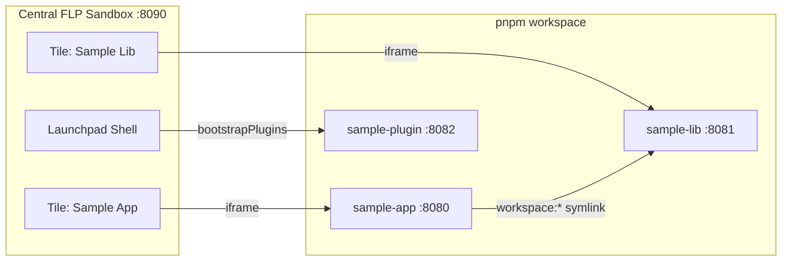

Sooner or later, every UI5 developer runs into the same situation: you have an **application**, and next to it a **control library** that the app should consume. Maybe there is even a **Fiori Launchpad plugin** in the mix. Three projects that belong together — but live in three separate repositories.

And then the pain starts. How do you develop the library *and* the app at the same time? The usual answers are all bad:

- **Publish the library** to a registry for every tiny change? Way too slow.
- **`npm pack` and reinstall** the tarball after each edit? Tedious and error-prone.
- **Copy the built library** into the app's `webapp` folder? Please don't.
- **`resourceroots` hacks** pointing at some sibling folder? Fragile and nobody on the team understands them six months later.

The good news: none of this is necessary. With **pnpm workspaces** and the standard **UI5 Tooling**, all three projects can live in one repository, link against each other live, and start with a **single command** — including a shared Fiori Launchpad sandbox that ties everything together.

I built a complete, working showcase for this setup:

[**→ GitHub Repository: ui5-monorepo-showcase**](https://github.com/mariokernich/ui5-monorepo-showcase)

In this post, I'll walk you through how it works — and the handful of non-obvious settings that make or break the setup.

---

## What We Are Building

The monorepo contains three UI5 TypeScript projects plus one central launchpad sandbox:

| Package                  | Type                | Port    | Description                                              |
| ------------------------ | ------------------- | ------- | -------------------------------------------------------- |
| `packages/sample-app`    | UI5 Application     | `8080`  | App `com.myorg.myapp`, consumes the library via workspace link |
| `packages/sample-lib`    | UI5 Library         | `8081`  | Control library `com.myorg.mylib` with a custom control  |
| `packages/sample-plugin` | FLP Shell Plugin    | `8082`  | Launchpad plugin `com.myorg.myplugin`, loaded by the shell |
| `flpSandbox.html`        | Central FLP Sandbox | `8090`  | One launchpad that hosts the app as a tile and loads the plugin |



The app renders a custom control from the library, the library has its own test page, and the plugin adds a header button to the launchpad shell itself. Everything is TypeScript, everything reloads live.

---

## Why a Monorepo? The Benefits in Plain Words

Before we dive into the configuration, let's step back for a moment. Why put three projects into one repository at all? Because it removes friction in exactly the places where multi-repo setups hurt every single day:

- **No publishing cycle.** In separate repositories, every library change means: bump the version, publish, and reinstall in the app — just to see a button render correctly. In the workspace, the app links **directly against the library's sources**. You save a file in `sample-lib`, reload the browser, and the change is there. That's it.

- **One command starts everything.** New team member? `git clone`, `pnpm install`, `pnpm start` — and the complete landscape is running: app, library, plugin, and the shared launchpad. No wiki page with ten setup steps, no "works on my machine".

- **One change, one commit.** Add a property to a library control *and* use it in the app? In a multi-repo world that's two pull requests that must be merged in the right order. Here it's **one atomic commit** — the library change and its usage always stay in sync, and reviewers see the full picture in a single diff.

- **The CI catches integration breaks immediately.** One pipeline typechecks, lints, and builds *all* packages on every push. If a library change breaks the app, you find out **now** — not weeks later when someone finally updates the library version in the app.

- **Type safety across package boundaries.** Because the app's TypeScript sees the library's sources directly, renaming a control property immediately flags every usage in the app. Refactorings that would be scary across repositories become routine.

- **Less duplication, faster installs.** One lockfile, one `node_modules` store: pnpm installs shared tooling like the UI5 CLI, ESLint, and TypeScript once and links it everywhere, instead of downloading the same packages three times.

In short: everything that belongs together *lives* together — and the tooling overhead of keeping three separate repositories in sync simply disappears.


A monorepo shines when the projects are developed **together** and by the same team — exactly the app + library + plugin scenario shown here. Fully independent products with separate release cycles and owners can still be better off in separate repositories.


---

## Step 1: The pnpm Workspace

The foundation is a plain pnpm workspace. The root `pnpm-workspace.yaml` declares where the packages live:

```yaml
packages:
  - packages/*
```

The app then consumes the library like any other npm dependency — just with the [`workspace:` protocol](https://pnpm.io/workspaces#workspace-protocol-workspace) instead of a version number:

```jsonc
// packages/sample-app/package.json
{
  "dependencies": {
    "com.myorg.mylib": "workspace:*"
  }
}
```

When you run `pnpm install`, pnpm does not download anything for this dependency. Instead, it creates a **symlink**:

```text
packages/sample-app/node_modules/com.myorg.mylib → ../../sample-lib
```

And here is the nice part: the **UI5 Tooling follows this symlink automatically**. Because the linked package contains a `ui5.yaml` with `type: library`, `ui5 serve` and `ui5 build` inside the app treat it like any regular UI5 dependency. You can verify it with `ui5 tree`.

No `npm pack`, no local registry, no manual `resourceroots`. Every change in the library is instantly visible in the app.

Don't forget: the library must still be declared in the app's `manifest.json`, otherwise the UI5 **runtime** won't load it:

```jsonc
// packages/sample-app/webapp/manifest.json
"sap.ui5": {
  "dependencies": {
    "libs": {
      "sap.ui.core": {},
      "sap.m": {},
      "com.myorg.mylib": {}
    }
  }
}
```

---

## Step 2: Transpiling the Linked TypeScript Library

Both the app and the library are written in TypeScript and use [`ui5-tooling-transpile`](https://www.npmjs.com/package/ui5-tooling-transpile). This is where the first trap hides.

By default, the transpile middleware **only transpiles the root project**. When the app requests `/resources/com/myorg/mylib/library.js`, the request hits the library's *TypeScript* sources — and 404s. Your app boots, but the library is simply gone.

The fix is one line in the app's `ui5.yaml`:

```yaml
# packages/sample-app/ui5.yaml
server:
  customMiddleware:
    - name: ui5-tooling-transpile-middleware
      afterMiddleware: compression
      configuration:
        transpileDependencies: true # ← transpile linked TS dependencies too
```

With `transpileDependencies: true`, the app's dev server transpiles the library's `.ts` sources on the fly and serves them as JavaScript.


This option only affects the development server. Production builds are unaffected — there, each package transpiles itself with its own `ui5-tooling-transpile-task`.


---

## Step 3: TypeScript Across Package Boundaries

Linking the packages at runtime is only half the story. You also want **code completion and type safety** across packages — for example, importing the typed press event of a library control inside the app:

```typescript
// packages/sample-app/webapp/controller/Main.controller.ts
import type { GreetingCard$PressEvent } from "com/myorg/mylib/GreetingCard";

public onGreetingCardPress(event: GreetingCard$PressEvent): void {
    const card = event.getSource();
    MessageToast.show(`Greeting card pressed by ${card.getName()}`);
}
```

Two entries in the app's `tsconfig.json` make this work:

```jsonc
// packages/sample-app/tsconfig.json
{
  "compilerOptions": {
    "paths": {
      // resolve "com/myorg/mylib/*" imports into the workspace sibling
      "com/myorg/mylib/*": ["../sample-lib/src/com/myorg/mylib/*"]
    }
  },
  "include": [
    "./webapp/**/*",
    // pick up the library's generated control interfaces
    "../sample-lib/src/**/*.gen.d.ts"
  ]
}
```

The `*.gen.d.ts` files are generated by `ui5-tooling-transpile` (via `generateTsInterfaces: true` in the library's `ui5.yaml`). They contain the typed accessors (`getName()`, `firePress()`, …), the `$GreetingCardSettings` constructor type, and event types like `GreetingCard$PressEvent`.


TypeScript resolves the pnpm symlink to its real location. An include glob through `node_modules/com.myorg.mylib/**` will therefore **never match** — you have to include the files via the actual sibling path (`../sample-lib/src/**/*.gen.d.ts`). This one cost me some time.


In the XML view, the library control is then used like any other control:

```xml
<!-- packages/sample-app/webapp/view/Main.view.xml -->
<mvc:View xmlns:mylib="com.myorg.mylib" ...>
    <mylib:GreetingCard
        name="UI5 Developer"
        color="Highlight"
        press=".onGreetingCardPress" />
</mvc:View>
```

---

## Step 4: One Command to Start Everything

With three dev servers and one static launchpad, nobody wants to open four terminals. The root `package.json` orchestrates everything:

```jsonc
// package.json (root)
{
  "scripts": {
    "start": "run-p start:projects start:flp",
    "start:projects": "pnpm --recursive --parallel --stream run start",
    "start:flp": "http-server -p 8090 -c-1 --silent -o /flpSandbox.html ."
  },
  "devDependencies": {
    "http-server": "^14.1.1",
    "npm-run-all2": "^7.0.2"
  }
}
```

- `pnpm --recursive --parallel run start` runs the `start` script of **every workspace package** at the same time (`--stream` prefixes each output line with the package folder — very helpful).
- `run-p` from `npm-run-all2` additionally starts the static `http-server` that serves the central `flpSandbox.html`.

Each package pins its **own unique port** and does *not* open a browser — only the central launchpad does:

```jsonc
// packages/sample-app/package.json
"start": "ui5 serve --port 8080"

// packages/sample-lib/package.json
"start": "ui5 serve --port 8081"

// packages/sample-plugin/package.json
"start": "ui5 serve --port 8082 --config ui5-test.yaml"
```

So the whole developer experience boils down to:

```sh
pnpm install
pnpm start
```

…and the launchpad opens at `http://localhost:8090/flpSandbox.html` with the app as a tile, the library test page as a second tile, and the plugin's header button already in the shell.


`pnpm --parallel` starts all servers at once. If two packages default to the same port, one of them dies with `EADDRINUSE` — so pin a distinct port in every package's `start` script.


---

## Step 5: The Central FLP Sandbox

The most interesting part of the showcase is the shared launchpad. `flpSandbox.html` bootstraps the classic Fiori Launchpad sandbox from the SAPUI5 CDN and wires all three projects together via `window["sap-ushell-config"]`:

```js
window["sap-ushell-config"] = {
    defaultRenderer: "fiori2",

    // The FLP plugin: loaded by the SHELL itself, not started via tile
    bootstrapPlugins: {
        FLPPluginAll: {
            component: "com.myorg.myplugin",
            url: "http://localhost:8082/",
        },
    },

    // Apps that appear as tiles on the homepage
    applications: {
        "myapp-display": {
            title: "Sample App",
            applicationType: "URL",
            url: "http://localhost:8080/index.html",
        },
        "mylib-display": {
            title: "Sample Lib",
            applicationType: "URL",
            url: "http://localhost:8081/test-resources/com/myorg/mylib/Example.html",
        },
    },
};
```

Note the difference between the two mechanisms:

- **Applications** appear as tiles and open in an iframe when clicked.
- The **plugin** is not a tile. The shell itself fetches its `manifest.json` and `Component.js` at startup and runs the component inside the launchpad — in the showcase it registers a header button via the modern `Extension` service. If you want to dive deeper into plugins, I wrote a [dedicated post about Fiori Launchpad plugins with TypeScript](/posts/developing-fiori-launchpad-plugins-with-typescript).

### Cross-Origin Hurdle #1: Iframe Embedding

The tiles use `applicationType: "URL"`, so the app on `:8080` is embedded as an iframe from a **different origin** than the launchpad on `:8090`. UI5's clickjacking protection would normally block all interaction — you get the blocked cursor 🚫 and a console error about a missing allowlist. The app therefore allows embedding in its bootstrap:

```html
<!-- packages/sample-app/webapp/index.html -->
<script
    id="sap-ui-bootstrap"
    ...
    data-sap-ui-frame-options="allow"
></script>
```


`allow` disables clickjacking protection entirely — fine on localhost, not in production. There, use `trusted` with an explicit allowlist:
`data-sap-ui-frame-options-config='{"allowlist": ["your-flp-host"]}'`


### Cross-Origin Hurdle #2: CORS for the Plugin

While tile apps live in iframes, the launchpad loads the **plugin's resources directly** from `:8082` into the `:8090` origin. That means the plugin's dev server must send **CORS headers**. The showcase solves this with a tiny project-local custom middleware:

```js
// packages/sample-plugin/lib/middleware/cors.cjs
module.exports = function () {
    return function (req, res, next) {
        res.setHeader("Access-Control-Allow-Origin", "*");
        res.setHeader("Access-Control-Allow-Methods", "GET, HEAD, OPTIONS");
        res.setHeader("Access-Control-Allow-Headers", "*");
        if (req.method === "OPTIONS") {
            res.statusCode = 204;
            return res.end();
        }
        next();
    };
};
```

It is registered in the plugin's server config, with the extension definition as a second YAML document in the same file:

```yaml
# packages/sample-plugin/ui5-test.yaml
server:
  customMiddleware:
    - name: cors-middleware
      afterMiddleware: csp
    - name: ui5-tooling-transpile-middleware
      afterMiddleware: compression
---
specVersion: "4.0"
kind: extension
type: server-middleware
metadata:
  name: cors-middleware
middleware:
  path: lib/middleware/cors.cjs
```

---

## Gotchas & Lessons Learned

A quick checklist of everything that can silently break this setup:

- **`transpileDependencies: true`** in the *consuming* app — otherwise the linked TypeScript library 404s at runtime.
- **Unique ports per package** — `pnpm --parallel` kills colliding servers with `EADDRINUSE`.
- **`data-sap-ui-frame-options="allow"`** in every app embedded cross-origin in the sandbox.
- **CORS middleware** on every server whose resources the launchpad origin loads directly (plugins, reuse libraries loaded via `url`, …).
- **Pin the CDN version** for the classic FLP sandbox (`1.120.x`) — and always with the full patch version in the URL.
- **pnpm build scripts** — postinstall scripts of dependencies (esbuild, browser drivers, …) must be explicitly allowed via `allowBuilds` in `pnpm-workspace.yaml`, otherwise pnpm skips them.
- **`*.gen.d.ts` includes via the real path**, not through `node_modules` — TypeScript resolves the symlink.

---

## Conclusion

A pnpm workspace turns the classic "app + library + plugin" pain into a genuinely pleasant setup: one `git clone`, one `pnpm install`, one `pnpm start` — and you develop all three projects live against each other, with full TypeScript support across package boundaries and a shared launchpad that shows the complete picture.

The best part is how little magic is involved. The `workspace:` protocol and the symlink-following UI5 Tooling do the heavy lifting; the rest is a handful of well-placed configuration lines (`transpileDependencies`, `paths`, CORS, frame options) that you now know about.

The complete, working setup — including CI, tests, and the custom control with generated TypeScript interfaces — is on GitHub. Clone it, run it, and steal whatever you need for your own projects:

**Useful links:**

- [ui5-monorepo-showcase on GitHub](https://github.com/mariokernich/ui5-monorepo-showcase)
- [pnpm workspaces & the `workspace:` protocol](https://pnpm.io/workspaces)
- [ui5-tooling-transpile](https://www.npmjs.com/package/ui5-tooling-transpile)
- [UI5 Tooling custom middleware](https://sap.github.io/ui5-tooling/stable/pages/extensibility/CustomServerMiddleware/)
- [My post on Fiori Launchpad plugins with TypeScript](/posts/developing-fiori-launchpad-plugins-with-typescript)

---


  
  Yes. The mechanism the UI5 Tooling relies on is the **symlink in `node_modules`**, and npm workspaces and Yarn workspaces create those as well. The `workspace:*` protocol shown in this post is pnpm/Yarn syntax — with npm workspaces you reference the package with a regular version range instead. I prefer pnpm because it is fast, strict about undeclared dependencies, and its workspace features (`--filter`, `--recursive --parallel`) make the orchestration scripts very compact.
  

  
  No — that is the whole point of the setup. With `transpileDependencies: true` in the app's `ui5.yaml`, the app's dev server transpiles the library's TypeScript sources **on the fly**. You edit a control in `sample-lib`, reload the app, and see the change immediately. A build of the library is only needed for production (`pnpm -r run build`).
  

  
  No. The workspace link is a **development-time convenience only**. For production, every package runs its own `ui5 build` and is deployed as an independent artifact — for example, the app and the library as separate BSP applications on ABAP, or separate HTML5 apps on BTP. The app finds the deployed library at runtime through its `manifest.json` dependency, exactly as with any standard UI5 library. Alternatively, a **self-contained build** can bundle the library into the app.
  

  
  Yes — and it gets even simpler. The workspace linking (Step 1) is completely independent of TypeScript. In a plain JavaScript monorepo you can drop the transpile middleware, `transpileDependencies`, and the `tsconfig.json` path mappings entirely; the symlinked library is served as-is.
  

  
  UI5 CLI v3+ ships a [dedicated workspace configuration](https://sap.github.io/ui5-tooling/stable/pages/Workspace/) that maps dependencies to local folders without any npm-level linking. It is a solid alternative if you cannot switch package managers. In a pnpm monorepo, however, it is redundant: the symlinks already exist, one mechanism serves both Node.js resolution *and* the UI5 Tooling, and there is no extra config file to keep in sync.
  

  
  The two versions serve different layers. Each package declares its own framework version in `ui5.yaml` (here OpenUI5 `1.150.0`) — that is what your app and library actually run on. The pinned `1.120.30` only applies to the **classic launchpad sandbox** in `flpSandbox.html`: its homepage renderer (`fiori2` with groups and tiles) is deprecated and broken on newer SAPUI5 releases, and 1.120 is the LTS line that still fully supports it. The apps inside the iframes are unaffected by the sandbox version.
  

