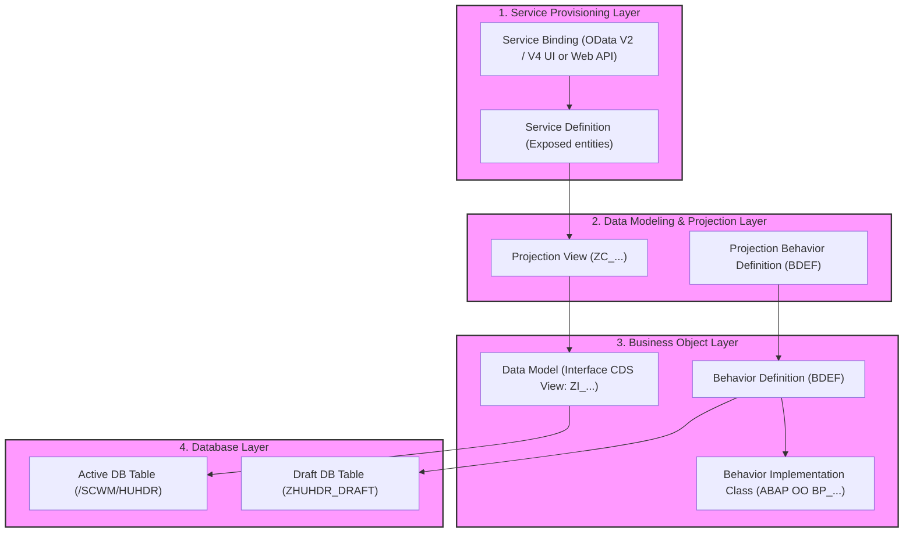
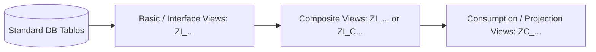
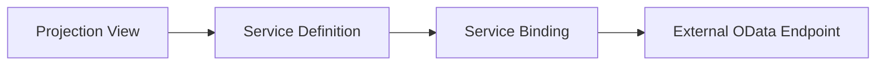
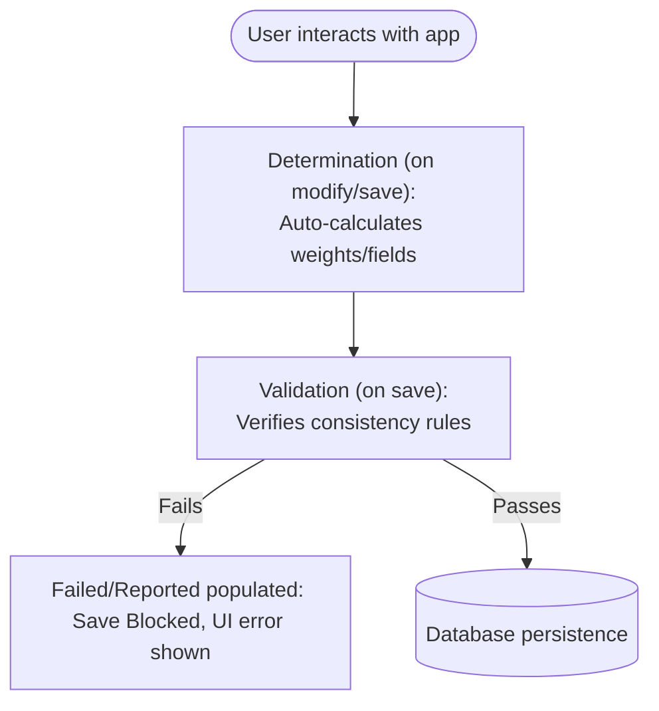
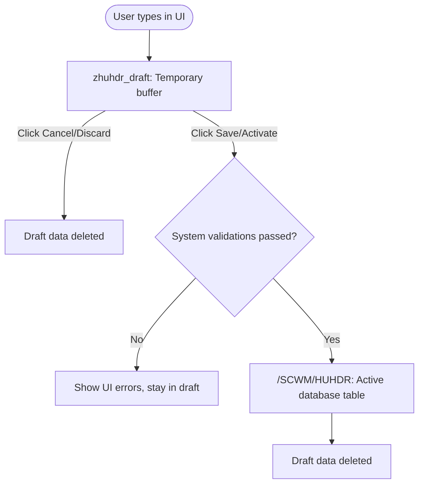

Entering the world of modern SAP S/4HANA development can feel like learning a completely new language. If you are coming from classical ABAP (reports, dynpros, smart forms, SE80) or traditional custom OData services built with SEGW, you might have heard terms like **RAP**, **CDS View Entities**, **BDEF**, **EML**, and **VDM** thrown around. 

This post is a comprehensive, step-by-step guide designed for **all skill levels—from absolute beginners to seasoned ABAP experts**. We will start with the absolute fundamentals, explaining core terminology in clear language, and gradually progress to advanced architectural patterns, high-performance database calculations, separation of concerns with Metadata Extensions, internationalization, and complex transactional logic. Throughout this journey, we'll use a real-world SAP EWM (Extended Warehouse Management) Handling Unit (`/SCWM/HUHDR`) as our running enterprise blueprint.

### RAP is Not Just for the Cloud!
One common misconception is that ABAP RAP requires you to run on SAP BTP or a cloud-only environment. **This is not true!** While RAP is indeed the standard programming model for the SAP BTP ABAP Environment, it is fully supported and recommended on modern on-premise releases. This compatibility makes RAP a core pillar of SAP's "Clean Core" extension philosophy.

Here are the requirements for on-premise SAP systems:
* **SAP S/4HANA 1909 (ABAP Platform 1909) or higher:** Basic read-only and unmanaged RAP services with custom query implementations.
* **SAP S/4HANA 2020/2021 (ABAP Platform 2020/2021) or higher:** Full support for the standard **Managed RAP Scenario** with draft handling, validations, block locks, and determinations.
* **SAP S/4HANA 2022/2023+ (ABAP Platform 2022/2023+) or higher:** Full feature parity with the cloud, including deep-insert operations, unmanaged saves, OData V4 advanced features, and native Business Event bindings.

---

## 1. Setting Up Your Development Environment

To compile modern RAP components like Core Data Services (CDS), Behavior Definitions (BDEF), or Projection layers, legacy SAP GUI transactions such as `SE80` or `SE38` cannot be used as they do not support ADT-specific object editors or advanced compilers. Instead, your development workstation must be configured using one of the following two options:

### Option 1: Using Eclipse (Recommended Industry Standard)

The **Eclipse IDE** combined with the official **ABAP Development Tools (ADT)** plugin is the primary, SAP-recommended setup for professional ABAP development.

1. **Download Eclipse:** Install the latest stable [Eclipse IDE for Java Developers](https://www.eclipse.org/) or Eclipse RCP.
2. **Install ADT Plugin:** Go to **Help** -> **Install New Software...** in Eclipse.
3. Enter the SAP update site URL: `https://tools.hana.ondemand.com/latest`.
4. Select **ABAP Development Tools** from the package list, proceed through the prompts, accept the license agreement, and complete the installation wizard.
5. **Connect your System:** Create an ABAP Project (`File > New > ABAP Project`), choose your connection config from your local SAP Logon Pad, and log in.

### Option 2: Using Visual Studio Code (Lightweight Alternative)

For developers preferring a highly efficient, customizable editor, **Visual Studio Code (VS Code)** can be configured as a lightweight development workstation.

{}
The official ABAP extension for VS Code was newly released on **June 1**. While it offers a fantastic, modern alternative to Eclipse, it is **not a full replacement yet**. It is especially interesting for leveraging **AI capabilities** (like GitHub Copilot) and **Model Context Protocol (MCP) integrations** directly inside your development workflow. However, it still has key limitations compared to Eclipse, such as no transaction support and a lack of graphical helper views for complex elements (remaining mostly text-based for now).
{}

1. **Download VS Code:** Download and install [VS Code](https://code.visualstudio.com/).
2. **Install ABAP Extensions:** Open the Extension Marketplace (`Cmd+Shift+X` on Mac / `Ctrl+Shift+X` on Windows), and search for **ABAP Development Tools**.
3. **Configure System Connections:** Define your S/4HANA server connections inside VS Code global or workspace settings JSON: set system hostname, client, and authentication mode.
4. Open the command palette (`Cmd+Shift+P` / `Ctrl+Shift+P`) and establish the connection to explore database and repository structures.

---

## 2. Planning Before Coding

Before typing a single line of ABAP or CDS code, you must design your business objects. Jumping straight into Core Data Services to build database tables or structures without a proper plan leads to massive technical debt.

{}
Always mock up your application screen layouts and your database relationships first. Standard UI frameworks like **Fiori Elements** expect a standardized, clean application structure. Missing relationships, wrong cardialities, or missing draft-tables will break your frontend layer later.
{}

To design your entity relationship model and flow of actions, you should use free modeling applications such as [draw.io](https://www.draw.io/) or [yEd Graph Editor](https://www.yworks.com/products/yed) to align details with your frontend development team and target users.

### The Planning Canvas

When planning your modern ABAP application, consider three aspects:
1. **The Core Business Object (BO):** What is the principal entity? (e.g., the Handling Unit Header).
2. **The Relationships:** What are the child entities? (e.g., Handling Unit Items). What are the cardinalities (1-to-many, 1-to-1)?
3. **The User Flow:** What operations will users perform? (e.g., creating a Handling Unit, updating net weight, sealing package, or printing labels). This determines your Read-only fields, Actions, and Draft settings.

Here is a mockup layout representing how our target Fiori Elements app should look:


---

## 3. What is RAP?

The **ABAP RESTful Application Programming Model (RAP)** is the modern standard for developing SAP S/4HANA-based enterprise applications. It allows developers to build semantic, transactional OData-based services optimized for SAP HANA that run seamlessly on both SAP BTP ABAP Environment (Steampunk) and S/4HANA on-premise/private cloud.

### Advantages of RAP
* **Cloud-Ready & Clean-Core Friendly:** RAP only relies on released, stable SAP standard APIs, preventing your system upgrades from breaking local code.
* **Native HANA Execution:** All heavy filtering, sorting, and joins are fully delegated ("pushed down") to the HANA database layer, ensuring blazing-fast execution speeds.
* **Standardized UX:** Built-in support for Fiori Elements, enabling developers to build screens entirely from ABAP annotations, without writing manual Javascript/SAPUI5 code.
* **Rich Out-of-the-Box Features:** Native draft handling, concurrency locks, auto-numbering, validations, and state-changing actions are easily configurable.

### Disadvantages of RAP
* **Learning Curve:** Transitioning from procedural ABAP to modern ABAP OO, Core Data Services, and declarative behavior models takes substantial training.
* **Version Dependencies:** Some advanced RAP features (such as OData V4 draft actions or deep-insert operations) are only available on newer S/4HANA releases (e.g., 2021+ or 2022+).

### RAP vs. CAP: Which One to Choose?

SAP offers two flagship programming models: **RAP** and **CAP** (Cloud Application Programming Model). Here is how they compare:

| Property | ABAP RAP | CAP (Cloud Application Programming Model) |
| :---: | :--- | :--- |
| **Primary Language** | ABAP Object-Oriented | JavaScript / Node.js or Java |
| **System Affinity** | Strongly bound to S/4HANA cores & SAP BTP ABAP env | Database agnostic (SAP HANA, PostgreSQL, SQLite) |
| **Best For** | Extending ERP logic, deep business logic inside S/4HANA | Microservices, external web apps, side-by-side extensions |

---

## 3.1. The Clean Core Philosophy and RAP

To succeed in modern SAP ecosystems (especially when planning for SAP S/4HANA Cloud), every developer must understand and align their designs with the **Clean Core** strategy.

### What is Clean Core?
The "Clean Core" is an IT architectural master philosophy defined by SAP to make system upgrades effortless, fast, and completely safe. In legacy ERP environments, developers modified the standard SAP core code directly (using custom modifications, implicit enhancements, or referencing unreleased internal tables). This led to "upgrade paralysis," where updating an SAP system required months of regression testing and millions of dollars to fix broken custom objects.

Standardizing a Clean Core means:
1. **Zero Core Modifications:** Your custom enhancements must not modify standard SAP software.
2. **Upgrade-Safe Extensions:** All custom coding must rely solely on officially **Released APIs** (stable objects, released BAs, and public interfaces) guaranteed by SAP not to change during future upgrades.
3. **Decoupled Extensions:** Separating custom developments clearly from standard business objects, running either side-by-side (via SAP BTP) or strictly isolated on-stack.

### How RAP and Clean Core Fit Together
ABAP RAP is not just a modern syntax framework; it is **the default architectural engine for on-stack Clean Core extensions** (also known as *Developer Extensibility*). Let's see how RAP solves the clean core requirements:

1. **Strict Developer Extensibility (Language Version `ABAP for Cloud Development`):**
   When building services in the cloud or modern private/on-premise S/4HANA systems, developers can restrict their custom classes to a strict language subset: **ABAP for Cloud Development**. This mode disables obsolete, dangerous statements (like absolute memory pointers, raw database modifications `INSERT/UPDATE/MODIFY /SCWM/HUHDR` outside the behavior processor, or direct legacy file commands). RAP behavior processors natively run on top of these restricted interfaces.
   
2. **Accessing SAP Data via Released CDS Views (The VDM Layer):**
   Instead of querying physical tables directly (e.g. `SELECT * FROM /SCWM/HUHDR` or `VBAK`), RAP requires you to model your business scenarios using the **Virtual Data Model (VDM)**. In a Clean Core setup, you build your custom views as projections on top of core interface views that have the `@API.element.release` annotation. Even if SAP restructures the physical table in a future release, the released CDS interface remains completely backward compatible, preventing your code from dumping.

3. **No Direct Database Manipulation (EML Orchestration):**
   In legacy ABAP, modifying standard tables meant executing raw `INSERT` or `UPDATE` SQL statements, which bypassed checking rules, validations, and trigger loops, causing database corruption. RAP enforces transactional safety through **Entity Manipulation Language (EML)** and standard Behavior Definitions (`BDEF`). EML routes all insert, delete, or update operations through the official business logic validations, safeguarding the core integrity.

4. **Logical Separation of Interface and Layout (MDEs):**
   By splitting data models and UI configurations into isolated Metadata Extensions (MDEs) and CDS projection layouts, developers can make UI adjustments without editing the database access code. This isolates any front-end specific extension logic and ensures stability.

---

## 4. The RAP Architecture

The architecture of RAP is divided into three key layers. Let’s look at how they connect together:



1. **Database Layer:** This contains your actual physical tables (e.g., SAP EWM Handling Unit `/SCWM/HUHDR` or custom replicas) and draft tables to buffer user input before saving.
2. **Business Object (BO) Layer:** This contains your data views (Core Data Services) and defines *what* actions are allowed on your data and *how* they are executed.
3. **Service Provisioning Layer:** This exposes your business object to the outer web world as an standard OData protocol.

---

## 5. What is CDS (Core Data Services)?

**Core Data Services (CDS)** is the data-modeling infrastructure of SAP HANA. It acts as an extension of SQL, allowing you to define rich data models directly on the database.

{}
**No!** CDS views are a standalone, foundational concept of SAP S/4HANA. While they define the data-backbone of RAP, they are also used for standard modern Open SQL queries, ALV with IDA, analytical dashboards, search catalogs, or creating CDS-based AMDP (ABAP Managed Database Procedures).
{}

For further details regarding CDS capabilities, refer to the [SAP CDS Documentation](https://help.sap.com/viewer/91ed123cfd9546e8b26f582736484e55/current/en-US).

### The Types of CDS Views
As an absolute beginner, you will encounter these main flavors of CDS syntax:

#### A. CDS View Entities (define view entity)
The modern standard. It replaces the obsolete `define view` syntax that relied on an active dictionary SQL-view artifact (`ZSQL_HU_OLD`). They are much faster to activate and support strict type checks.

```sql
@AccessControl.authorizationCheck: #NOT_REQUIRED
define view entity ZI_HandlingUnitHeader
  as select from /scwm/huhdr
{
  key guid_hu  as HandlingUnitGuid,
      huident  as HandlingUnitId,
      weight_gr as GrossWeight,
      unit_wd  as WeightUnit
}
```

#### B. Projection Views (define projection view on)
This is a specialized view entity positioned at the top of your BO stack. It exposes a direct subset of fields tailor-cut for one specific application client without altering the underlying main interface view.

```sql
@AccessControl.authorizationCheck: #NOT_REQUIRED
define projection view entity ZC_HandlingUnitHeader
  as projection on ZI_HandlingUnitHeader
{
  key HandlingUnitGuid,
      HandlingUnitId,
      GrossWeight,
      WeightUnit
}
```

#### C. Custom Entities (define custom entity)
Unlike normal views, custom entities have no database query source. Instead, they define a data interface structure whose query logic is fully coded in a custom ABAP Object-Oriented class implementing the `IF_RAP_QUERY_PROVIDER` interface. This is crucial for consuming legacy BAPIs or external REST APIs.

#### D. Abstract Entities (define abstract entity)
These define only raw metadata structures without any database persistence or execution provider. They are primarily used in RAP to represent the parameters required for complex user actions (e.g., a popup box asking for a "Target Storage Bin" when moving a Handling Unit).

---

### CDS Inline Functions, CASE Expressions & Calculated Fields

In modern S/4HANA development, we aim for **Code Pushdown**—which means performing as much calculation and data transformation directly on the database level (HANA DB) as possible, rather than pulling raw rows into ABAP memory and looping through them.

CDS views enable this natively by letting you define **Calculated Fields** using strong inline SQL mathematical, string, date, and conditional operations.

Here are the most common inline operations you will use to build smart data models:

#### 1. String Manipulation Functions
* `concat(string1, string2)`: Merges two string attributes together.
* `substring(string, position, length)`: Trims and extracts a section of a string.
* `lower(string)` / `upper(string)`: Standardizes letter casing.

```sql
// Combines short code and text for user-friendly UI output:
concat('HU No: ', huident) as HUFormattedDescription,
```

#### 2. Arithmetic & Scalar Functions
* Standard operations (`+`, `-`, `*`, `/`) can be applied directly to attributes.
* `division(arg1, arg2, decimals)`: Performs high-precision floating point divisions or percentages.
* `ceil(arg)`, `floor(arg)`, `round(arg, decimals)`: Controls decimals and integer boundaries.

```sql
// Calculate tare or packaging weight dynamically:
gross_weight - net_weight as PackagingTareWeight,
```

#### 3. Date, Time & Built-in Session Contexts
You can access system state session parameters (like the current login client, active language, or today's system date) with `$session` commands:
* `$session.user`: Current logging user.
* `$session.system_date`: Today's application date.
* `dats_days_between(date1, date2)`: Computes the integer age or days elapsed between two dates.

```sql
// Compute the age of a record in days:
dats_days_between(created_at_date, $session.system_date) as RecordAgeInDays,
```

---

### The Power of conditional CASE Expressions

Much like `IF ... ELSEIF ... ELSE` branches in ABAP code, the `CASE` statement in CDS evaluates logical criteria directly during database selection. It comes in two formats:

#### A. Simple CASE
Compares a single table field to explicit, fixed values.

```sql
case packing_type
  when '01' then 'Cardboard Box'
  when '02' then 'Plastic Crate'
  when '03' then 'Wooden Pallet'
  else 'Unknown Material'
end as PackingMaterialTypeDesc,
```

#### B. Searched CASE (Highly Versatile)
Evaluates complex boolean logic, range bounds (`>`, `<`, `=`), null validations (`is null`), or string patterns (`like`).

```sql
case 
  when net_weight > 1000 and weight_unit = 'KG' then 'Heavy Load - Forklift Required'
  when net_weight is null or net_weight = 0       then 'Empty / Package Weight Pending'
  else 'Standard Load'
end as HandlingInstructions,
```

---

### Real-world Master Blueprint: CDS Entity with Calculated Fields

Let's see these functions fully compiled within our `ZI_HandlingUnitHeader` view entity. Notice how we use `cast( ... as abap.char(20) )` to force target types when needed:

```sql
@AccessControl.authorizationCheck: #NOT_REQUIRED
define view entity ZI_HandlingUnitHeader
  as select from /scwm/huhdr as Header
{
  key Header.guid_hu                                   as HandlingUnitGuid,
      Header.huident                                   as HandlingUnitId,
      Header.hutypid                                   as HandlingUnitType,
      @Semantics.quantity.unitOfMeasure: 'WeightUnit'
      Header.weight_gr                                 as GrossWeight,
      @Semantics.quantity.unitOfMeasure: 'WeightUnit'
      Header.weight_nt                                 as NetWeight,
      Header.unit_wd                                   as WeightUnit,
      Header.created_by as CreatedBy,
      Header.created_at as CreatedAt,
      
      _Items // Associate header to child composite items
}
```

{}
**Alias limitations:** You cannot use an alias you defined on Line A in a calculation on Line B within the *same* CDS view entity. For example, trying to write `HUAgeInDays * 2 as DoubleAge` will trigger a syntax compiler error. If you need to chain calculations, you must either write the full formula out again or project this view inside another CDS projection entity.
{}

---

## 6. The Virtual Data Model (VDM)

The **Virtual Data Model (VDM)** is a semantic representation of S/4HANA system database structures. It ensures that business data is easy to discover, reusable across multiple apps, and logically organized.

The VDM uses three structural classifications of CDS views:



1. **Basic/Interface Views (`ZI_` prefixed):** These sit directly on top of the raw database tables. These are purely structural, mapping technical physical table fields (like `HUTYPID`) to business logic names (like `HandlingUnitType`). They must be clean, highly secure, and reusable.
2. **Composite Views (Optional):** These join multiple Basic Views together to compute high-level business indicators (such as joining a customer basic view with a sales header basic view).
3. **Consumption Views (`ZC_` prefixed):** These sit at the very top of the stack and are specifically adapted to specific client applications (like a shipping desktop dashboard). They are enriched with UI and analytical annotations.

---

## 7. UI Annotations (Designing UI from ABAP)

In RAP, we configure the appearance of elements in our Fiori Elements user interface directly within the CDS code of our Consumption/Projection view. Let’s break down the major annotations you *must* know:

### A. @UI.headerInfo
Configures the overall header summary of the detail screen, displaying the title of the individual entity and identifying its type.

```sql
@UI.headerInfo: {
  typeName: 'Handling Unit',
  typeNamePlural: 'Handling Units',
  title: { type: #STANDARD, value: 'HandlingUnitId' },
  description: { type: #STANDARD, value: 'HandlingUnitType' }
}
```

### B. @UI.facet
Organizes the detail page layout. It divides the screen into logical chapters (tabs or sections), and field groups.

```sql
@UI.facet: [
  {
    id: 'GeneralInfoFacet',
    purpose: #STANDARD,
    type: #COLLECTION,
    label: 'Handling Unit Details',
    position: 10
  },
  {
    id: 'BasicDataGroup',
    purpose: #STANDARD,
    type: #FIELDGROUP_REFERENCE,
    parentId: 'GeneralInfoFacet',
    label: 'Basic Measurements',
    targetQualifier: 'MeasurementsGroup',
    position: 10
  }
]
```

### C. @UI.lineItem
Displays a field as a column inside the main list dashboard view. The `position` parameter arranges columns from left to right.

```sql
@UI.lineItem: [ { position: 10, label: 'HU Identifier' } ]
HandlingUnitId;

@UI.lineItem: [ { position: 20, label: 'Gross Weight' } ]
GrossWeight;
```

### D. @UI.identification
Displays the field as a label-value pair within the main page data section context on the app detail page.

```sql
@UI.identification: [ { position: 10, label: 'Internal GIUD Reference' } ]
HandlingUnitGuid;
```

### E. @UI.selectionField
Defines the field as a filter criteria field within the top filter bar of your Fiori search pane.

```sql
@UI.selectionField: [ { position: 10 } ]
HandlingUnitId;
```

### F. @UI.hidden
Hides the field completely from the user interface while keeping it active, readable, and functional in the underlying service schema (OData metadata). This is essential for raw technical UUIDs, database system ETags, or administrative fields that are necessary for API interactions but should never be visible to the user.

```sql
@UI.hidden: true
HandlingUnitGuid;
```

### G. @EndUserText Annotations
Provides translatable linguistic text labels and tooltips for database fields. 
* `@EndUserText.label`: This overrides any default Data Element (DDIC) technical label in the system, displaying custom terminology (supports internationalization translation bundles).
* `@EndUserText.quickInfo`: Defines a helpful descriptive tooltip that appears when a user hovers their mouse pointer over the field inside the web browser.

```sql
@EndUserText.label: 'Handling Unit Identifier'
@EndUserText.quickInfo: 'Continuous serial number representing the box'
HandlingUnitId;
```

### H. @Consumption.valueHelpDefinition
Binds standard dropdown tables, Search Helps, or static selectable lists to a field. For instance, when a warehouse user inputs a `WeightUnit`, we want to restrict inputs to valid ISO codes (e.g. `KG`, `LB`, `TO`) using a standard SAP Unit of Measure lookup view.

```sql
@Consumption.valueHelpDefinition: [{ 
  entity: { name: 'I_UnitOfMeasure', element: 'UnitOfMeasure' } 
}]
WeightUnit;
```

### I. Separation of Concerns: Metadata Extensions (MDE)

While you *can* write all `@UI` annotations directly inside your projection CDS view entity (`ZC_...`), standard practice recommends separating the user interface configuration layout from the SQL data definition itself. Enter **Metadata Extensions (MDEs)**!

By moving UI annotations out of the CDS view, you keep your data modeling files clean, readable, and highly maintainable. UI designers can adjust visual hierarchies inside `.ddlx` metadata extension files without altering core database access logic.

#### Criteria & Requirements for Metadata Extensions:
1. **Enable MDEs:** The projection/consumption CDS view entity must declare `@Metadata.allowExtensions: true` at the very top of its header.
2. **Metadata Layer:** The MDE file must specify a layer using `@Metadata.layer: #CUSTOMER` (or `#PARTNER` or `#CORE`). The `#CUSTOMER` layer holds the highest priority, ensuring that customer layout modifications safely override standard core SAP layout layers.
3. **Target Binding:** The MDE declares an `annotate view` statement pointing directly to your target projection CDS view instead of a `define view` query.

#### Example Metadata Extension (`ZC_HandlingUnitHeader.ddlx`):

```sql
@Metadata.layer: #CUSTOMER

@UI.headerInfo: {
  typeName: 'Handling Unit',
  typeNamePlural: 'Handling Units',
  title: { type: #STANDARD, value: 'HandlingUnitId' }
}
annotate view ZC_HandlingUnitHeader
  with
{
  @UI.facet: [
    { id: 'HeaderDetails', type: #COLLECTION, label: 'General info', position: 10 },
    { id: 'HeaderGroup', parentId: 'HeaderDetails', type: #FIELDGROUP_REFERENCE, targetQualifier: 'DataGrp', label: 'Weight specifications', position: 10 },
    { id: 'ItemsTab', type: #LINEITEM_REFERENCE, targetElement: '_Items', label: 'HU Pack Items', position: 20 }
  ]

  @UI.hidden: true
  HandlingUnitGuid;
  
  @EndUserText.label: 'Handling Unit ID'
  @EndUserText.quickInfo: 'Unique Handling Unit Identifier'
  @UI.lineItem: [ { position: 10 } ]
  @UI.selectionField: [ { position: 10 } ]
  HandlingUnitId;
  
  @UI.lineItem: [ { position: 20 } ]
  HandlingUnitType;

  @UI.fieldGroup: [ { qualifier: 'DataGrp', position: 10 } ]
  @UI.lineItem: [ { position: 30 } ]
  GrossWeight;

  @UI.fieldGroup: [ { qualifier: 'DataGrp', position: 20 } ]
  NetWeight;

  @Consumption.valueHelpDefinition: [{ 
    entity: { name: 'I_UnitOfMeasure', element: 'UnitOfMeasure' } 
  }]
  WeightUnit;
}
```

---

### J. Internationalization: How to Translate UI Annotations (User Texts)

When we define user-facing texts directly in our CDS views or Metadata Extensions using `@EndUserText` annotations (like `@EndUserText.label` or `@EndUserText.quickInfo`), we are not hardcoding these texts into English forever. SAP treats these annotation strings as translatable repository assets.

Here is the exact mechanism and requirements to translate them into French, German, Spanish, or any other target system languages:

#### 1. The Translation Process via ADT or SE63
Since CDS views and Metadata Extensions are standard ABAP repository objects, their associated texts are catalogs stored in database text pools.
* **Via Eclipse ADT Tooling:** Right-click the `.asddls` view entity file or `.ddlx` metadata extension file inside the project explorer, select **Open in Translation Tool** (or press a shortcut key). This launches a dedicated translation UI panel.
* **Via SAP GUI (Traditional SE63):** Log in and execute transaction `SE63`. Navigate to **Translation > ABAP Objects > Short Texts**, search for metadata extension type elements, input the name of your MDE/CDS view, choose your Source and Target languages (e.g. German, French, Portuguese), and translate the labels.

#### 2. The Language Fallback Rule
When a user launches a Fiori Elements browser application, the Fiori shell requests the OData service metadata document by passing a specific language parameter (e.g. `sap-language=DE`).
* **Active Translation:** If a translation matching the current session language `sy-langu` exists (e.g., German), the OData engine automatically builds the metadata document substituting the `@EndUserText.label` values with the German text.
* **Language Fallback:** If no translation is found in the database, the engine falls back to the original development language (the language in which the primary developer created and activated the CDS view or MDE file).
* **DDIC Fallback:** If no `@EndUserText` annotation is declared on the field at all, the engine queries the standard Data Element (DDIC) medium/long labels associated with the table's underlying physical field as a secondary fallback.

#### 3. Component-Level Frontend Overrides (`i18n.properties`)
While translating via `SE63` / Eclipse ADT is perfect for universal cross-application use, frontend engineers can also override or supplement backend labels on a page-by-page basis. In SAP Business Application Studio or VS Code, they configure **`i18n.properties`** resource bundles inside the Fiori app's `webapp/i18n` workspace directory. Standard key overrides map to fields dynamically, translating UI cards without rebuilding the ABAP backend metadata layer.

---

Here is how how ADT displays these elements when designing:


---

## 8. The Core Entity Models (Our Running EWM Example)

To build our warehouse application, we will design two core entities: a **Handling Unit Header** and its **Items**. Let's define the interface and projection files.

Before writing the code, it is critical to understand the purpose of each layer we are about to create. In RAP, we split our data models into two distinct layers:

### A. The Base Interface Layer (ZI_ Prefix) — The Stable Data Foundation
Think of the interface layer as our analytical database and logic foundation. It sits directly on top of raw database tables (such as the standard EWM table `/SCWM/HUHDR` or custom tables).
* **Renaming Cryptic Fields:** Standard SAP physical tables are notorious for using short, cryptic column names—for example, `huident` (Handling Unit Identifier), `hutypid` (Handling Unit Type ID), or `weight_gr` (Gross Weight). In the `ZI_` view, we translate these database columns into readable camelCase business fields (like `HandlingUnitId`, `HandlingUnitType`, and `GrossWeight`). This makes our data models highly accessible.
* **Creating Associations & Compositions:** This is where we define the relationships between different models. For instance, we declare that a Header *owns* its Items via the `composition` keyword, linking them together as a single cohesive Business Object (BO).
* **Decoupling Business Logic:** If SAP alters the underlying physical table fields during a system upgrade, we only need to adjust the select query inside our `ZI_` view. All applications, dashboards, or external APIs built on top will continue working seamlessly. It acts as a protective shield for our apps!

### B. The Consumption / Projection Layer (ZC_ Prefix) — The App-Tailored View
The projection layer sits directly on top of the Interface layer and is custom-designed for a specific client application or service (e.g., a desktop Web UI, a mobile RF scanner terminal, or an external system integration API).
* **Exposing Only What is Needed:** A raw database entity might contain fifty columns, but a mobile app only needs to display five fields to a forklift driver. Projection views let us select exactly which fields are visible to the client, keeping network payloads lightweight and clean.
* **Separation of Concerns for UI Layouts:** This is the exclusive home for our `@UI` layout annotations (such as columns, filter bars, and detail sections). Keeping UI concerns isolated in the `ZC_` views ensures that our core `ZI_` interface views remain completely clean and reusable.
* **Composition Redirection:** Since our base interface views are linked together (`ZI_HandlingUnitHeader` is composed of `ZI_HandlingUnitItem`), the projection view must redirect those internal relationships to point to their corresponding projection target views (`_Items: redirected to composition child ZC_HandlingUnitItem`). This ensures that navigating to the child items brings up the correctly configured, UI-annotated child screens.

Let's now inspect the actual code templates for each of these key files:

### Base Interface: ZI_HandlingUnitHeader
This captures physical details of `/SCWM/HUHDR`.

```sql
@AbapCatalog.viewEnhancementCategory: [#NONE]
@AccessControl.authorizationCheck: #NOT_REQUIRED
@EndUserText.label: 'Handling Unit Header Interface'
@Metadata.ignorePropagatedAnnotations: true
@ObjectModel.usageType:{
  serviceQuality: #X,
  sizeCategory: #S,
  dataClass: #TRANSACTIONAL
}
define root view entity ZI_HandlingUnitHeader
  as select from /scwm/huhdr as Header
  composition [0..*] of ZI_HandlingUnitItem as _Items
{
  key Header.guid_hu   as HandlingUnitGuid,
      Header.huident   as HandlingUnitId,
      Header.hutypid   as HandlingUnitType,
      @Semantics.quantity.unitOfMeasure: 'WeightUnit'
      Header.weight_gr as GrossWeight,
      @Semantics.quantity.unitOfMeasure: 'WeightUnit'
      Header.weight_nt as NetWeight,
      Header.unit_wd   as WeightUnit,
      Header.created_by as CreatedBy,
      Header.created_at as CreatedAt,
      
      _Items // Associate header to child composite items
}
```

### Base Interface Child: ZI_HandlingUnitItem

```sql
@AbapCatalog.viewEnhancementCategory: [#NONE]
@AccessControl.authorizationCheck: #NOT_REQUIRED
@EndUserText.label: 'Handling Unit Item Interface'
define view entity ZI_HandlingUnitItem
  as select from /scwm/huitm as Item
  association [1..1] to ZI_HandlingUnitHeader as _Header on $projection.HandlingUnitGuid = _Header.HandlingUnitGuid
{
  key Item.guid_item  as ItemGuid,
      Item.guid_hu    as HandlingUnitGuid,
      Item.pmat_guid  as PackagingMaterialGuid,
      Item.quant      as Quantity,
      Item.unit_q     as QuantityUnit,
      
      _Header // Back-association to core parent header
}
```

### Consumption Projection: ZC_HandlingUnitHeader

```sql
@EndUserText.label: 'Handling Unit Consumption entity'
@AccessControl.authorizationCheck: #NOT_REQUIRED
@Metadata.allowExtensions: true

@UI.headerInfo: {
  typeName: 'Handling Unit',
  typeNamePlural: 'Handling Units',
  title: { type: #STANDARD, value: 'HandlingUnitId' }
}
define root view entity ZC_HandlingUnitHeader
  provider contract transactional_query
  as projection on ZI_HandlingUnitHeader
{
  @UI.facet: [
    { id: 'HeaderDetails', type: #COLLECTION, label: 'General info', position: 10 },
    { id: 'HeaderGroup', parentId: 'HeaderDetails', type: #FIELDGROUP_REFERENCE, targetQualifier: 'DataGrp', label: 'Weight specifications', position: 10 },
    { id: 'ItemsTab', type: #LINEITEM_REFERENCE, targetElement: '_Items', label: 'HU Pack Items', position: 20 }
  ]

  @UI.hidden: true
  key HandlingUnitGuid,
  
  @EndUserText.label: 'Handling Unit ID'
  @EndUserText.quickInfo: 'Unique Handling Unit Identifier'
  @UI.lineItem: [ { position: 10 } ]
  @UI.selectionField: [ { position: 10 } ]
  HandlingUnitId,
  
  @UI.lineItem: [ { position: 20 } ]
  HandlingUnitType,

  @UI.fieldGroup: [ { qualifier: 'DataGrp', position: 10 } ]
  @UI.lineItem: [ { position: 30 } ]
  GrossWeight,

  @UI.fieldGroup: [ { qualifier: 'DataGrp', position: 20 } ]
  NetWeight,

  @Consumption.valueHelpDefinition: [{ 
    entity: { name: 'I_UnitOfMeasure', element: 'UnitOfMeasure' } 
  }]
  WeightUnit,
  CreatedBy,
  CreatedAt,
  
  _Items : redirected to composition child ZC_HandlingUnitItem
}
```

### Consumption Child: ZC_HandlingUnitItem

```sql
@EndUserText.label: 'Handling Unit Item Consumption'
@AccessControl.authorizationCheck: #NOT_REQUIRED
@Metadata.allowExtensions: true
define view entity ZC_HandlingUnitItem
  as projection on ZI_HandlingUnitItem
{
  key ItemGuid,
  HandlingUnitGuid,
  
  @UI.lineItem: [ { position: 10, label: 'Pack Qty' } ]
  Quantity,
  @UI.lineItem: [ { position: 20 } ]
  QuantityUnit,
  @UI.lineItem: [ { position: 30, label: 'Material Ref' } ]
  PackagingMaterialGuid,
  
  _Header : redirected to parent ZC_HandlingUnitHeader
}
```

---

## 9. Behavior Definitions (BDEF) & The 4 Scenarios

While CDS views define the *data projection models*, the **Behavior Definition (BDEF)** defines the *transactional operations* available on those models (e.g., are create/updates supported? Do we use draft? Are fields read-only?).

We model behavior definitions inside a dedicated object file named identically to our interface CDS view (e.g. `ZI_HandlingUnitHeader.asbdef`).

There are four primary transactional implementation scenarios. Let's study how they work:

### Scenario 1: Managed
The easiest developer path. RAP itself handles all transactional CRUD (Create, Read, Update, Delete) databases statements automatically. It locks the instance tables and manages drafts directly. Use this for greenfield applications with dedicated custom DB tables.

```sql
managed implementation in class bp_i_handlingunitheader unique;
strict ( 2 );
with draft;

define behavior for ZI_HandlingUnitHeader alias HandlingUnit
persistent table /scwm/huhdr
draft table zhuhdr_draft
lock master
total etag CreatedAt
authorization master ( global )
{
  create;
  update;
  delete;

  field ( readonly ) CreatedAt, CreatedBy;
  field ( readonly, numbering: managed ) HandlingUnitGuid;

  draft action Edit;
  draft action Activate;
  draft action Discard;
  draft action Resume;
}
```

#### Managed Behavior Implementation ABAP OOP Class Snippet
Under a Managed scenario, the ABAP class is almost empty because SAP executes the database saving natively. It is used only to code custom validation checks or actions.

```abap
CLASS bp_i_handlingunitheader DEFINITION PUBLIC ABSTRACT FINAL FOR BEHAVIOR OF zi_handlingunitheader.
ENDCLASS.

CLASS bp_i_handlingunitheader IMPLEMENTATION.
  " Standard database writes are executed automatically by the RAP engine!
ENDCLASS.
```

---

### Scenario 2: Unmanaged
Used if you are wrapping brownfield enterprise structures, legacy databases, or must pass changes via standard SAP APIs (like classical EWM function modules `/SCWM/HU_CREATE` or `/SCWM/HU_UPDATE`). You are responsible for programming all read, lock, create, update, and delete actions.

```sql
unmanaged implementation in class bp_i_handlingunitheader unique;
strict ( 2 );

define behavior for ZI_HandlingUnitHeader alias HandlingUnit
lock master
authorization master ( global )
{
  create;
  update;
  delete;
}
```

#### Unmanaged Behavior Implementation ABAP OOP Class Snippet

```abap
CLASS bp_i_handlingunitheader DEFINITION PUBLIC ABSTRACT FINAL FOR BEHAVIOR OF zi_handlingunitheader.
ENDCLASS.

CLASS bp_i_handlingunitheader IMPLEMENTATION.
  " In Unmanaged, we MUST manually implement CREATE, UPDATE, DELETE in standard handlers!
  METHOD cba_Items.
    " CBA = Create By Association. Manually read parameters and call APIs.
  ENDMETHOD.

  METHOD update.
    " Loop through standard input entities to process updates.
    LOOP AT entities ASSIGNING FIELD-SYMBOL(<ls_entity>).
       " Call legacy APIs like /SCWM/HU_UPDATE here
    ENDLOOP.
  ENDMETHOD.

  METHOD delete.
    " Manually implement business deletions
  ENDMETHOD;
ENDCLASS.
```

---

### Scenario 3: Managed with Unmanaged Save
Allows RAP to manage your in-memory transactional buffer, concurrency locking, and status handling automatically. However, during the database saving lifecycle phase, RAP skips normal table commands and transfers control to your custom class sequence to perform custom API calls.

```sql
managed implementation in class bp_i_handlingunitheader unique;
strict ( 2 );

define behavior for ZI_HandlingUnitHeader alias HandlingUnit
persistent table /scwm/huhdr
with unmanaged save // <- Keeps RAP buffer but routes saving to ABAP
lock master
{
  create;
  update;
  delete;
}
```

#### Managed with Unmanaged Save ABAP OOP Class Snippet

```abap
CLASS bp_i_handlingunitheader DEFINITION PUBLIC ABSTRACT FINAL FOR BEHAVIOR OF zi_handlingunitheader.
ENDCLASS.

CLASS bp_i_handlingunitheader IMPLEMENTATION.
  " We implement the local saver logic in the save sequence
  METHOD save_modified.
    " This method is triggered during the transaction's COMMIT phase.
    " Read transactional buffers via EML (Entity Manipulation Language), and call custom APIs.
    " E.g., CALL FUNCTION '/SCWM/HU_SAVE_DB'.
  ENDMETHOD.
ENDCLASS.
```

---

### Scenario 4: Managed with Additional Save
Perfect for standard managed tables where you want classic automatic db writes, but also require a transactional saving exit to execute additional side-effects (such as submitting an outbound AMQP message, logging audit trails, or sending emails).

```sql
managed implementation in class bp_i_handlingunitheader unique;
strict ( 2 );

define behavior for ZI_HandlingUnitHeader alias HandlingUnit
persistent table /scwm/huhdr
with additional save // <- Standard system saves, then invites custom logic
lock master
{
  create;
  update;
  delete;
}
```

#### Managed with Additional Save ABAP OOP Class Snippet

```abap
CLASS bp_i_handlingunitheader DEFINITION PUBLIC ABSTRACT FINAL FOR BEHAVIOR OF zi_handlingunitheader.
ENDCLASS.

CLASS bp_i_handlingunitheader IMPLEMENTATION.
  " Standard DB save happens first, then additional logic:
  METHOD save_modified.
    " Read what changed and trigger external asynchronous actions
    " E.g., SUBMIT Z_UPDATE_EWM_LOGGER_JOB or raise custom Event Mesh payload
  ENDMETHOD.
ENDCLASS.
```

### Auto-Numbering in the Behavior Definition
Often, technical UUID keys should be handled automatically by the system upon creation. In your behavior definition, this is done by declaring:

```sql
field ( readonly, numbering: managed ) HandlingUnitGuid;
```

This commands RAP to issue a standard unassigned GUID key to the new entity automatically before database ingestion.

---

## 10. Defining and Binding the Service

Once modeling and behavior structures are configured, we expose our clean projection views to network services via a two-step process:



### Step 1: Service Definition
You create an ADT definition file that groups all internal projection entities to expose together as unified endpoints.

```sql
@EndUserText.label: 'Handling Unit Service Definition'
define service ZUI_HandlingUnits_V4 {
  expose ZC_HandlingUnitHeader as HandlingUnit;
  expose ZC_HandlingUnitItem as HandlingUnitItem;
}
```

### Step 2: Service Binding
You create a binding that selects the execution protocol. This is where you configure:
* **OData Version:** Choose between **OData V2** or **OData V4**.
* **Service Type:** Choose **UI Service** (rich frontend bindings for full Fiori elements layout apps) or **Web API** (headless endpoints focused on fast machine-to-machine integrations with light payloads, ignoring UI annotations).

```sql
define service binding ZUI_HandlingUnits_OData_V4 {
  binding type: #ODATA_V4_UI;
  service: ZUI_HandlingUnits_V4;
}
```

---

## 11. Understanding OData: V2 vs. V4

**OData (Open Data Protocol)** is the RESTful web API standard utilized across all modern SAP systems. Let’s compare the primary protocol formats:

| Capability | OData V2 | OData V4 |
| :--- | :--- | :--- |
| **Response Payload** | Verbose and heavier JSON/XML models | Highly compressed and efficient JSON formats |
| **Draft Infrastructure** | Handled via custom enterprise framework adapters | Built core natively within the protocol specifications |
| **Query Paths** | Slower nested expansion calls (`/Z_HUHeader?$expand=ToItems`) | Fast, clean batching models and parallel client execution |
| **Side Effects** | Difficult to build and trigger natively | Built-in standard actions updating client views seamlessly |

### Testing with App Preview & Swagger Utilities
Inside Eclipse ADT, you can open your Service Binding workspace and click **Preview** on any exposed entity. This launches a local integrated browser sandbox displaying:
1. **Fiori Elements App Preview:** A fully functional mock web app to test searches, line items, and edits.
2. **Swagger OpenAPI Preview:** A developer dashboard to quickly inspect network endpoint properties, structures, and payload JSON models.


---

## 12. Core Features of Business Objects

Let's look at how to implement advanced requirements on our Handling Unit business object.

### A. Associations vs. Compositions
* **Compositions:** Define a strict parent-child life-cycle dependency. If you delete a parent (Handling Unit), all its composition children (Items) must also be deleted automatically.
* **Associations:** Define general reference relationships (for example, association to standard warehouse user statistics). Deleting the HU shouldn't affect the user records.

In BDEF, parent-child composite navigation is configured with the `association` keyword:

```sql
define behavior for ZI_HandlingUnitHeader alias HandlingUnit
// ...
{
  association _Items { create; with draft; }
}
```

### B. Read-Only Fields
You can control when a field can be modified directly within BDEF:

```sql
// Structural permanent read-only:
field ( readonly ) CreatedAt;

// Read-only during updates (set upon create, unchangeable afterward):
field ( readonly : update ) HandlingUnitId;
```

---

## 13. Transactional Actions & Functions

* **Functions:** Side-effect-free operations that read data but perform no database modifications (e.g. `getSummaryReport()`).
* **Actions:** State-changing operations that process business logic (e.g., executing a Goods Issue, weighing a package, etc.).

Let's declare a custom action `WeighHU` on our header behavioral structure to update the weights:

```sql
define behavior for ZI_HandlingUnitHeader alias HandlingUnit
// ...
{
  action WeighHU result [1] $self;
}
```

To implement this action, we write ABAP Object-Oriented code in our class `bp_i_handlingunitheader`:

```abap
METHOD WeighHU.
  " 1. Read current HU records using EML (Entity Manipulation Language)
  READ ENTITIES OF zi_handlingunitheader IN LOCAL MODE
    ENTITY HandlingUnit
      FIELDS ( HandlingUnitGuid GrossWeight WeightUnit )
      WITH CORRESPONDING #( keys )
    RESULT DATA(lt_hu).

  " 2. Process our business logic: simulate weighing the HU scale.
  " For demo, let's set standard weights automatically.
  LOOP AT lt_hu ASSIGNING FIELD-SYMBOL(<ls_hu>).
    <ls_hu>-GrossWeight = 120. " Set gross weight
    <ls_hu>-NetWeight   = 100. " Set net weight
    <ls_hu>-WeightUnit  = 'KG'.
  ENDLOOP.

  " 3. Apply changes back directly to the transactional buffer
  MODIFY ENTITIES OF zi_handlingunitheader IN LOCAL MODE
    ENTITY HandlingUnit
      UPDATE FIELDS ( GrossWeight NetWeight WeightUnit )
      WITH VALUE #( FOR ls_hu IN lt_hu (
        HandlingUnitGuid = ls_hu-HandlingUnitGuid
        GrossWeight      = ls_hu-GrossWeight
        NetWeight        = ls_hu-NetWeight
        WeightUnit       = ls_hu-WeightUnit
      ) )
    FAILED DATA(lt_failed)
    REPORTED DATA(lt_reported).

  " 4. Fill output result to refresh client screen UI
  result = VALUE #( FOR ls_hu IN lt_hu (
    HandlingUnitGuid = ls_hu-HandlingUnitGuid
    %param           = CORRESPONDING #( ls_hu )
  ) ).
ENDMETHOD.
```

---

## 14. Entity Manipulation Language (EML)

**Entity Manipulation Language (EML)** is the extension of the ABAP language used to query, create, update, or trigger actions on RAP Business Objects directly in your ABAP code. 

As a beginner, you might ask: *"If S/4HANA runs on a database, why can't I just use standard Open SQL statements like `SELECT`, `INSERT` or `UPDATE`?"*

### Why EML Over Traditional SQL?
When you interact with standard Database Tables, you are bypassing all transactional rules. If you run a direct SQL `UPDATE` statement, you jump past essential business controls, such as:
1. **Concurrency Locks:** Running edits without locking the resource leads to data corruption if multiple users write at once.
2. **Business Validations:** System rules (e.g., ensuring a packaging weight is never negative) are not executed.
3. **Draft Lifecycle:** Keystrokes being buffered inside draft tables before publication are ignored by database SQL statements.

**EML is the only safe gateway.** It respects the entire Business Object contract, triggering validations, setting lock mechanisms, checking authorizations, and coordinating draft modifications automatically.

Let's dissect the core EML operations you will use daily:

---

### 1. Read Operations: `READ ENTITIES`
To read properties from RAP instances or follow parent-child compositions, use the `READ ENTITIES` command. It reads directly from the current in-memory transactional buffer.

#### Example: Read specific fields from a Handling Unit
```abap
READ ENTITIES OF zi_handlingunitheader
  ENTITY HandlingUnit
    FIELDS ( HandlingUnitId GrossWeight NetWeight WeightUnit )
    WITH VALUE #( ( HandlingUnitGuid = '0050568F-1B2F-1EDD-B5A1-1647BFBA7123' ) )
  RESULT DATA(lt_headers)
  FAILED DATA(lt_failed)
  REPORTED DATA(lt_reported).
```

#### Example: Read Child Items through Composition Link (Read-By-Association)
```abap
READ ENTITIES OF zi_handlingunitheader
  ENTITY HandlingUnit BY \_Items
    ALL FIELDS
    WITH VALUE #( ( HandlingUnitGuid = '0050568F-1B2F-1EDD-B5A1-1647BFBA7123' ) )
  RESULT DATA(lt_items).
```

---

### 2. Write Operations: `MODIFY ENTITIES`
Used for creating, updating, or deleting business object records, as well as triggering custom behavioral actions (like `WeighHU`).

#### Example: Triggering our custom Action
```abap
" Example: Triggering the WeighHU Action on a physical HU using EML
MODIFY ENTITIES OF zi_handlingunitheader
  ENTITY HandlingUnit
    EXECUTE WeighHU
      FROM VALUE #( ( %key-HandlingUnitGuid = '0050568F-1B2F-1EDD-B5A1-1647BFBA7123' ) )
  FAILED DATA(lt_failed)
  REPORTED DATA(lt_reported).
```

---

### 3. Save Commit: `COMMIT ENTITIES`
The modifications you perform with `MODIFY ENTITIES` do not save to the database tables immediately. They are buffered in-memory.
* **Inside Behavior Classes:** If you are writing code *inside* an action or validation method (i.e., within the RAP lifecycle), **never** write `COMMIT ENTITIES`! The orchestrating RAP engine manages the commit sequence automatically.
* **In Outside Code:** If you are writing a custom background job, a classical RFC function, or testing with an ABAP Console class (`IF_OO_ADT_CLASSRUN` console), you **must** call `COMMIT ENTITIES` explicitly to write changed buffers permanently.

```abap
" If successful, commit transaction changes
IF lt_failed IS INITIAL.
  COMMIT ENTITIES.
ELSE.
  " Inspect failure reason
ENDIF.
```

---

### Understanding Critical Returning Parameters: FAILED and REPORTED
Every EML statement outputs two system parameters that tell you exactly what went wrong. Unlike standard exceptions that interrupt the system, these structures allow soft-failing to feedback clear UX logs:

1. **`FAILED` Structure:** This lists the IDs and entities representing instances where the action failed. It is used to check if the framework succeeded (e.g. `IF lt_failed IS NOT INITIAL.`).
   * `%fail-cause`: Tells you *why* it failed (e.g. `#NOT_FOUND`, `#UNAUTHORIZED`, `#LOCKED`, `#DISABLED`).
2. **`REPORTED` Structure:** A rich structure containing the detailed error message payloads (T100 standard ABAP message classes, severity tags, description texts). The SAP Fiori Elements frontend reads this structure directly and renders these validation errors as beautiful popups in the browser.

---

## 15. Business Rules: Determinations and Validations

To build a reliable Business Object, we need to enforce rules and automate logic. RAP accomplishes this natively with two standard mechanisms: **Determinations** and **Validations**.



### A. Determinations (Auto-Calculating Values)
A **Determination** is an automated calculation that triggers when specific actions occur on your fields. For example, if a warehouse worker alters the `GrossWeight` or `WeightUnit` on a Handling Unit, we should automatically compute the new `NetWeight`.
* **Trigger Times:**
  * `on modify`: Triggers instantly in memory/draft as the user inputs data (ideal for interactive, real-time UI updates).
  * `on save`: Triggers only during the final transaction commit phase.

#### Declaring a Determination in BDEF:
```sql
define behavior for ZI_HandlingUnitHeader alias HandlingUnit
// ...
{
  determination calculateWeights on modify { create; field GrossWeight; }
}
```

---

### B. Validations (Enforcing Consistency and Guardrails)
A **Validation** check protects your system tables from invalid or corrupted records. For example, we want to ensure the `NetWeight` is never greater than the `GrossWeight`. If a guardrail checks fails, the save flow is **aborted**, and the error is returned back to the UI.
* Validations are designed with `trigger on save` to ensure the final submitted data is fully clean.

#### Declaring a Validation in BDEF:
```sql
define behavior for ZI_HandlingUnitHeader alias HandlingUnit
// ...
{
  validation validateWeights on save { field GrossWeight, NetWeight; }
}
```

#### Implementing a Validation in ABAP OOP:
```abap
METHOD validateWeights.
  " 1. Read the weights of the entities being validated
  READ ENTITIES OF zi_handlingunitheader IN LOCAL MODE
    ENTITY HandlingUnit
      FIELDS ( HandlingUnitGuid GrossWeight NetWeight )
      WITH CORRESPONDING #( keys )
    RESULT DATA(lt_hu).

  " 2. Loop and validate consistency
  LOOP AT lt_hu ASSIGNING FIELD-SYMBOL(<ls_hu>).
    IF <ls_hu>-NetWeight > <ls_hu>-GrossWeight.
      " Validate failed! populate and block saving
      APPEND VALUE #( %key-HandlingUnitGuid = <ls_hu>-HandlingUnitGuid ) TO failed-handlingunit.

      " Populate standard user-friendly T100 message alert:
      APPEND VALUE #(
        %key-HandlingUnitGuid = <ls_hu>-HandlingUnitGuid
        %msg                  = new_message_with_text(
                                  severity = if_abap_behv_message=>severity-error
                                  text     = 'Net weights cannot be greater than Gross weights!'
                                )
      ) TO reported-handlingunit.
    ENDIF.
  ENDLOOP.
  ENDLOOP.
ENDMETHOD.
```

---

## 16. RAP Business Events (Event-Driven Architecture)

In modern Cloud-Ready design, systems must remain decoupled. Instead of synchronous API calls that slow down your transactions, you can configure your Business Object to raise an asynchronous, real-time **Business Event** (e.g., notifying SAP Event Mesh or Kafka when water weights are finalized).

Valid SAP RAP events are integrated directly into standard Event Brokers without requiring custom database triggers, lock-scans, or heavy code!

### Step 1: Define the Event Payload via Abstract Entity
Before creating the event, we define what data will be contained inside the event message structure. We use an **Abstract Entity** (`define abstract entity`):

```sql
@EndUserText.label: 'Handling Unit Shipped Event Parameters'
define abstract entity ZAE_HUShippedParameter
{
  HandlingUnitId   : huident;
  PackagingMaterial: pmat_guid;
  ShippedBy        : created_by;
}
```

### Step 2: Declare the Event in BDEF
We bind the event directly to our business entity and reference our abstract entity structure for the payload parameters:

```sql
define behavior for ZI_HandlingUnitHeader alias HandlingUnit
// ...
{
  event HandlingUnitShipped parameter ZAE_HUShippedParameter;
}
```

### Step 3: Trigger the Event in your ABAP Handler via EML
Within saving or custom action lifecycles inside your local handler class, use the `RAISE EVENT` EML keyword to fire off the cloud message payload:

```abap
METHOD ship_hu.
  " Business log updates happen here
  " ...

  " Trigger event messaging natively:
  RAISE EVENT zi_handlingunitheader~HandlingUnitShipped
    FROM VALUE #( (
      %key-HandlingUnitGuid = '0050568F-1B2F-1EDD-B5A1-1647BFBA7123'
      %param                = VALUE #(
                                HandlingUnitId    = 'HU-998822'
                                PackagingMaterial = 'PACK-BOX-XL'
                                ShippedBy         = sy-uname
                              )
    ) ).
ENDMETHOD.
```

The cloud system handles transmitting this as a JSON cloud event to SAP BTP Event Mesh instantly once the transaction commits successfully!

---

## 17. Authorization Concepts in RAP

Security is deeply integrated in RAP at two levels:

### 1. Database-Level Authorization (DCL)
Data Access Control lists are written in `.asdcls` files. They restrict database reads based on standard user permissions (such as limiting a warehouse technician's access to a specific Storage Location `LGORT`).

```sql
@EndUserText.label: 'Authorization for Handling Unit Header'
@MappingRole: true
define role ZI_HandlingUnitHeader_Auth {
  grant
    select
      on ZI_HandlingUnitHeader
        where
          ( ) = aspect pfcg_auth( /SCWM/HU, ACTVT = '03', LGNUM = 'WH01' );
}
```

### 2. Behavioral-Level Transactional Authorization
In the BDEF, we declare authorization rules (`authorization master ( global )`). This triggers ABAP validation methods where developer code verifies if a user has sufficient authority to execute a `Create`, `Update`, or a custom action (like `WeighHU`).

```abap
METHOD get_global_authorizations.
  " Check PFCG authorization objects
  AUTHORITY-CHECK OBJECT '/SCWM/HU'
    ID 'ACTVT' FIELD '02' " Update permission
    ID 'LGNUM' FIELD 'WH01'.

  IF sy-subrc <> 0.
    " Fill failed keys and reported parameters to send a proper error message to the user!
  ENDIF.
ENDMETHOD.
```

---

## 18. Draft Handling in OData V4

Draft handling is incredibly powerful. Traditional SAP web interfaces of the past required users to complete complex forms in a single, uninterrupted session without refreshing. If their network timed out or they clicked away, their unsaved input was lost.

With **OData V4 Draft Handling** enabled:
1. Every keystroke is saved in a parallel database table (the **Draft Table**, e.g., `zhuhdr_draft`) as the user types.
2. The active business data (`/SCWM/HUHDR`) is untouched and locked for other processes.
3. The user can close the browser, go home, return the next day, and click **Resume** to continue.
4. When they click **Save**, validations are executed, the draft is deleted, and the draft data is cleanly written to the active database table.



To enable this, simply declare `with draft` and reference your draft tables in BDEF as shown in the **Scenario 1: Managed** chapter.

---

## 19. Troubleshooting RAP: Feed Reader & ABAP Cross Trace

When developing modern S/4HANA solutions using the RAP framework, standard debugging can be tricky. Because RAP applications are decoupled and run statelessly, runtime errors or background failures might not surface immediately on the front-end user interface. 

To monitor, trace, and diagnose execution bottlenecks natively inside your IDE, SAP provides two essential developer tools: the **Eclipse Feed Reader** view and **ABAP Cross Trace**.

### A. The Eclipse ADT "Feed Reader" View
The **Feed Reader** is a built-in ADT view that streams system notifications, updates, and errors directly to your developer environment in real-time.

Instead of constantly opening SAP GUI, starting transaction `ST22`, and searching for active runtime errors, you can subscribe to system event feeds. If a background process, draft activation, or unmanaged save triggers an ABAP short dump, it appears instantly as a notification in your IDE.

#### Key Features of the Feed Reader for RAP:
* **System-Wide Monitoring:** Subscribes to real-time logs across the entire system.
* **Direct Navigation:** Double-clicking a incoming short dump notification opens the dump analysis tool directly inside Eclipse ADT, highlighting the exact failing line of code in your behavior class.
* **Custom Subscriptions:** You can filter feeds to track errors triggered only by your own user or by service accounts.

#### How to Configure Feed Reader:
1. In Eclipse ADT, navigate to **Window** > **Show View** > **Other...**.
2. Search for **Feed Reader**, select it, and click **Open**.
3. In the Feed Reader tab, click the **Add Feed** icon (the green plus icon).
4. Select your ABAP project and choose the target notification feeds you want to subscribe to (e.g., **Runtime Errors (Short Dumps)** or **ABAP System Messages**).
5. Configure subscription details (such as entering your username to isolate your own dumps) and save.

---

### B. ABAP Cross Trace
While the Feed Reader monitors fatal short dumps, **ABAP Cross Trace** (accessible via transaction `SADT_CROSS_TRACE` or directly within ADT) serves as an end-to-end recording camera capturing the execution flow of OData requests. 

Because RAP executes calls across multiple layers (Gateway -> Business Object Engine -> Database / Drafts), Cross Trace records precise logs on exactly what was processed in each step. It is the perfect tool for identifying why a save was silently blocked or if an authorization fails.

#### How to Perform a Diagnostics Trace:
1. **Initialize the Trace:** Open transaction `SADT_CROSS_TRACE` or search for the Cross Trace utility inside ADT.
2. **Create Configuration:** Define a new trace profile targeting the specific user (your UI user or the system integration user) running the application.
3. **Select Components:** Enable traces for:
   * **Gateway Runtime:** Verifies incoming REST/JSON payload formats.
   * **Business Object (BO) Engine:** Traces behavior execution sequences, validations, determinations, and actions.
   * **Database Access:** Captures background draft and active database read-writes.
4. **Reproduce & Analyze:** Start the trace, replicate the failing action (e.g. click "Save" in your Fiori Elements app), and return to verify and drill down into the recorded trace entries to inspect failed EML parameters or transaction lock statuses.

---

## 20. Transactional Safety & The 'COMMIT WORK' Dump Problem in RAP

In standard classical ABAP (reports, RFCs, or older custom integrations), we are accustomed to saving changes by explicitly calling the `COMMIT WORK` or `COMMIT WORK AND WAIT` commands. Similarly, to abort changes, we invoke `ROLLBACK WORK`.
In modern S/4HANA development using RAP, **doing this inside your behavioral logic is strictly forbidden!**

### Why explicit COMMIT WORK triggers a Runtime Dump
RAP operates on a highly synchronized, state-of-the-art framework transactional lifecycle (Logical Unit of Work - LUW). The orchestrating RAP runtime engine manages state buffers, locks, and persistent writing entirely on its own. 

If you write a manual `COMMIT WORK`, `COMMIT WORK AND WAIT`, `ROLLBACK WORK`, or `ROLLBACK` statement inside any behavioral:
* Validation method
* Determination method
* Custom transactional Action
* Custom Save Handler (`save_modified` methods)

The SAP system will instantly terminate execution and throw a critical short dump: **`BEHAVIOR_ILLEGAL_STATEMENT`**, **`AUNIT_ILLEGAL_COMMIT`**, or **`SABAP_BEHAVIOR_ILLEGAL_COMMIT`** in transaction `ST22`. 

---

### The Roadblock: Integration with Standard EWM & ERP BAPIs
This strict RAP boundary introduces major challenges when integrating with standard SAP Logistics, SD, PP, or **Extended Warehouse Management (EWM)** processes. For instance, if you are building an unmanaged RAP app that wraps classical warehouse handling unit tasks, standard APIs (such as `/SCWM/HU_CREATE` or `/SCWM/TO_CREATE`) often:
1. Require a traditional `COMMIT WORK` to trigger standard update task functions (`CALL FUNCTION ... IN UPDATE TASK`) and write to physical DB tables.
2. Internally trigger a hardcoded `COMMIT WORK` deep within their standard execution sequence, which immediately triggers the fatal RAP dump!

---

### Certified Options to Resolve Transactional Conflicts

To integrate standard background modules or BAPIs safely without crashing your RAP application, you must decouple the transaction boundaries. Here are the three industry-certified solutions:

#### Option A: Wrapper Function Call via DESTINATION 'NONE'
By invoking your function module as a remote function call (RFC) using `DESTINATION 'NONE'`, SAP launches the code inside an isolated, execution context (a parallel LUW) in a separate system work process. 
* **How it works:** This separate work process acts as its own master. Inside this thread, the standard SAP BAPI can execute its internal `COMMIT WORK` or you can manually call `COMMIT WORK` in the RFC wrapper without restricting or crashing the parent RAP LUW.

```abap
" Example: Triggering classical warehouse creation safely within a detached LUW context
CALL FUNCTION 'Z_EWM_CREATE_HU_RFC' " Your custom wrapper RFC function
  DESTINATION 'NONE'
  EXPORTING
    iv_huident = lv_target_hu_id
  IMPORTING
    ev_success = lv_success_flag
    et_messages = lt_messages.

IF lv_success_flag = abap_true.
  " Everything saved perfectly inside the isolated LUW!
ELSE.
  " Process errors and map them to reported parameters
ENDIF.
```

#### Option B: bgRFC (Background RFC) for Asynchronous Processes
If the execution does not need to return immediate synchronous results to the user screen (e.g., triggering stock adjustments, scheduling asynchronous print tasks, or auditing warehouse logs), you should delegate execution asynchronously using **bgRFC (Background Remote Function Call)**.
* **How it works:** The execution is buffered and queued natively. When the standard RAP transaction finishes and saving is safely committed, modern Outbound bgRFC picks up the queued task and executes it in a detached background queue where updates and `COMMIT WORK` are safely permitted.

```abap
DATA: lo_bg_dest TYPE REF TO if_bgrfc_destination_outbound,
      lo_bg_unit TYPE REF TO if_qrfc_unit_outbound.

TRY.
    " 1. Instantiate the modern outbound bgRFC recipient destination
    lo_bg_dest = cl_bgrfc_destination_outbound=>create( 'Z_EWM_BG_DESTINATION' ).
    
    " 2. Create a transactional or queue unit (qRFC)
    lo_bg_unit = lo_bg_dest->create_qrfc_unit( ).
    
    " 3. Bind runtime parameters to keep queue processing sequential
    lo_bg_unit->add_queue_name_prefix( 'Z_EWM_HU_QUEUE_' ).

    " 4. Register the RFC program. Execution waits for the parent RAP transaction to commit first!
    CALL FUNCTION 'Z_EWM_POST_QUANTITY_BGRFC'
      IN BACKGROUND UNIT lo_bg_unit
      EXPORTING
        iv_hu_guid = lv_handling_unit_guid.
        
  CATCH cx_bgrfc_invalid_destination.
    " Populate reported parameters with configuration error
ENDTRY.
```

#### Option C: Postponing to the Saving Phase (save_modified)
Ensure you never execute state-altering BAPIs inside interactive, real-time UI calculation phases (like `on modify` determinations). 
* Restrict classical API calls to the **`SAVE` phase** (specifically inside the `save_modified` method of Scenario 3: Managed with Unmanaged Save or Scenario 4: Managed with Additional Save).
* While calling `COMMIT WORK` directly is still prohibited there, launching update task sequences synchronizes safely with the final execution cycle.

---

## Bonus Tip: Version Controlling RAP with abapGit

If you are coming from classical ABAP developments, you are probably familiar with standard **SAP Transport Requests (TRs)**. While TRs are still the core deployment mechanism for S/4HANA systems, they have major limitations when it comes to modern continuous integration, branching, code reviews, and remote collaborations. 

Enter **abapGit**—the open-source Git client built specifically for the ABAP platform. 

### Why RAP is a Perfect Match for abapGit
Historically, version-controlling SAP with Git was difficult because legacy ABAP objects (like SAP GUI screens, classical reports, and binary DDIC tables) were stored in complex, database-bound relational configurations.

With RAP, SAP has shifted almost entirely to **text-based development artifacts**:
* **Core Data Services (CDS Views):** Defined entirely using textual SQL DDL declarations (`.asddls`).
* **Metadata Extensions (MDEs):** Fully written in textual layout metadata files (`.ddlx`).
* **Behavior Definitions (BDEFs):** Structured using declarative text-based schemas (`.asbdef`).
* **Authorization Policies (DCLs):** Written as text-based context data control files (`.asacls`).
* **Behavior Implementation Classes:** Stored as standard human-readable public / private ABAP source code files (`.clas.abap` and `.clas.testclasses.abap`).

Because almost all RAP artifacts are structured as clean, plain-text source files under the hood, they map perfectly to Git repositories!

### Direct Advantages of using abapGit with RAP:
1. **Familiar Git Version Control:** Work with branches, commit histories, merges, and remote repositories directly from your ABAP platform.
2. **Collaborative Code Reviews (Pull Requests):** Clone your ABAP package repository to modern hostings (such as GitHub, GitLab, or Azure DevOps) and perform standard code reviews, inline comments, and diff tracking inside beautiful web interfaces before merging code.
3. **Sandbox & Offline Portability:** Clone useful open-source RAP boilerplates, community utilities, or external library projects from GitHub into your sandbox or development environments with a single click.
4. **DevOps & CI/CD Pipelines:** Hook your cloned plain-text CDS views and behavior classes into external validation tools like **abaplint** to verify quality guidelines, run automated syntax sweeps, or feed them into DevOps validation pipelines before deploying code to staging environments.

---

## Summary

In this guide, we explored:
* **Designing applications first** using tools like [draw.io](https://www.draw.io/) to match specifications with UI5 teams.
* **Core architecture layers** (DB, BO, Provisioning) and **Clean Core** cloud-ready advantages.
* **CDS View Entities** and their types as the semantic VDM layers.
* **Calculated Fields & CASE Expressions** to push computational logic directly down to the database.
* **UI Annotations** to lay out our interface from our ABAP IDE.
* **Behavior Definition scenarios**, with full Behavior Implementation OOP class patterns for all four saving models.
* Modern execution features including **EML core syntax**, **OData comparison specifications**, **Global Authorization rules**, and stable **OData V4 draft handling flow details**.
* Setting up automated business logic and data checks using **Determinations & Validations**.
* Decoupling architectures using standard BTP-connected **RAP Business Events**.
* Systematic troubleshooting using **ABAP Cross Trace** (`SADT_CROSS_TRACE`), standard error logs, and local debugging tools to isolate transactional failures.
* Enforcing transactional safety by resolving the dreaded **RAP `COMMIT WORK` Short Dump** issue using decoupled patterns like RFC `'NONE'` and modern asynchronous **bgRFC**.

You are now equipped with the solid fundamentals to start building modern, enterprise-ready, high-performance transactional applications on S/4HANA using ABAP RAP and Core Data Services.

Happy coding!
